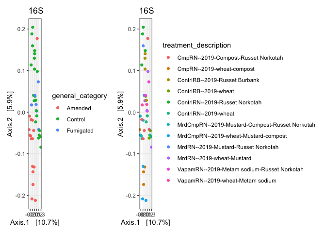

General treatment-related trends for all SCRI Objective 1 microbiomes
================
Scott Klasek
2024-01-02

## Purpose

Answer some basic microbiome structure questions for all our field
sites. Including: Do communities vary more by year than by organic
matter/microbiome-improving treatment? Does fumigation structure
communities significantly or reduce alpha diversity?

Merge phyloseq data from different years for each amplicon type and
field site- and then also merge phyloseq data from different sites so
that ASV numbers correspond to the same samples across sites.

## Setup

#### load libraries

#### define functions

``` r
# import phyloseqs from a specified directory that contain character substrings in the filename and combine them into a list
# it assumes all phyloseq files have a .ps extension
# print.stats is TRUE or FALSE, TRUE (default) prints stats of each phyloseq object in the list
import.phyloseqs <- function(directory, chr_string, print.stats=TRUE){
  
  # set the wd to the directory specified
  setwd(directory) 
  
  # get a character vector of the files to import
  its.files <- list.files(pattern="*.ps")[startsWith(list.files(pattern="*.ps"), chr_string)] 
  
  # import the phyloseq files as a list
  its.ps.list <- lapply(its.files, readRDS) 
  
  # name the elements of the list according to their filenames
  names(its.ps.list) <- its.files 
  
  # print stats of each phyloseq object if print.stats = TRUE
  if(print.stats){print(its.ps.list)}

  # return list
  return(its.ps.list)
}

# investigate sequence depth distribution from samples in a phyloseq object
plot.libsize <- function(ps){
  libsizes <- as.data.frame(sample_data(ps)) # make data frame
  libsizes$LibrarySize <- sample_sums(ps) # obtain library size
  libsizes <- libsizes[order(libsizes$LibrarySize),] # order data frame
  libsizes$Index <- seq(nrow(libsizes)) # index samples for plotting
  gg <- ggplot(libsizes, aes(x=Index, y=LibrarySize)) + # make plot
    geom_point() + 
    geom_hline(yintercept=10000,linetype=2)
  return(gg)
}

# assign ASV numbers cuz i'm sick of the sequences as the rownames
number.asvs <- function(ps){
  dna <- Biostrings::DNAStringSet(taxa_names(ps))
  names(dna) <- taxa_names(ps)
  ps <- merge_phyloseq(ps, dna)
  taxa_names(ps) <- paste0("ASV", seq(ntaxa(ps)))
  return(ps)
}

# hell.bc.ord takes a phyloseq object, transforms the OTU table to hellinger, 
# then creates a Bray-Curtis distance matrix with it, and returns a PCoA ordination object for use in plotting
hell.bc.ord <- function(ps){
  
  # hellinger transformation
  otu.ps3hell <- otu_table(decostand(otu_table(ps), method = "hellinger"), taxa_are_rows=FALSE)
  ps.hel <- phyloseq(tax_table(ps),
                    sample_data(ps),
                    otu_table(otu.ps3hell),
                    refseq(ps))
  
  # make bray-curtis distance matrix
  hel.bc <- phyloseq::distance(ps.hel, method = "bray") 
  
  # PCoA ordination
  ord <- ordinate(ps.hel, method = "PCoA", distance = hel.bc) 
  
  return(ord)
}

# drop_ghost_asvs drops ASVs that are not present in any samples- but are still kept 
# because you've subsetted samples within a larger phyloseq object. This returns the phyloseq object with the subsetted count table.
drop_ghost_asvs <- function(ps){
  
  # extract the count table from the phyloseq, with ASVs as columns
    if(taxa_are_rows(ps)){counts <- t(ps@otu_table)} else{ # write count table with ASVs as rows
    counts <- ps@otu_table
    }
  # remove empty rows corresponding to ASVs that are present in 0 samples
  counts <- counts[,colSums(counts)>0]
  
  # write the count table back in
  ps@otu_table <- counts
  return(ps)
}
```

## ITS Workflow

### Data processing

#### Minnesota (interactively)

``` r
# import phyloseqs
mn.its.list <- import.phyloseqs("/Users/klas0061/Desktop/UMN/phyloseqs/ITS_metadata_added", "MN", print.stats = F)

# to merge them together, you need to painstakingly specify each element of the list. there appears to be no other way
mn.its <- merge_phyloseq(mn.its.list$MN_ITS_2019_m.ps, mn.its.list$MN_ITS_2020_m.ps, 
                         mn.its.list$MN_ITS_2021_m.ps, mn.its.list$MN_ITS_2022_m.ps)

# inspect sample data
view(mn.its@sam_data)

# omit sequences belonging to true plants 
mn.its <- subset_taxa(mn.its, (Phylum!="Anthophyta")) 

# plot library sizes
plot.libsize(mn.its)+ggtitle("MN ITS library sizes")
```

<!-- -->

``` r
# prune samples below 10k reads
mn.its <- subset_samples(mn.its, sample_sums(mn.its) > 10000) 
```

Unfortunately, there are still a lot of samples that are dropped due to
low sequence depth.

#### All other sites

``` r
### CO
# import
co.its.list <- import.phyloseqs("/Users/klas0061/Desktop/UMN/phyloseqs/ITS_metadata_added", "CO", print.stats = F)

# merge
co.its <- merge_phyloseq(co.its.list$CO_ITS_2019_m.ps, co.its.list$CO_ITS_2020_m.ps, 
                         co.its.list$CO_ITS_2021_m.ps, co.its.list$CO_ITS_2022_m.ps)

# omit plant sequences and prune samples
co.its <- co.its %>% 
  subset_taxa(Phylum!="Anthophyta") %>% 
  subset_samples(sample_sums(co.its) > 10000)


### ID
# import
id.its.list <- import.phyloseqs("/Users/klas0061/Desktop/UMN/phyloseqs/ITS_metadata_added", "ID", print.stats = F)

# merge
id.its <- merge_phyloseq(id.its.list$ID_ITS_2019_most_samples_m.ps, id.its.list$ID_ITS_2020_m.ps, 
                         id.its.list$ID_ITS_2021_with_fall_2019_m.ps, id.its.list$ID_ITS_2022_m.ps)

# omit plant sequences and prune samples
id.its <- id.its %>% 
  subset_taxa(Phylum!="Anthophyta") %>% 
  subset_samples(sample_sums(id.its) > 10000)
  

### ME
# import
me.its.list <- import.phyloseqs("/Users/klas0061/Desktop/UMN/phyloseqs/ITS_metadata_added", "ME", print.stats = F)

# merge
me.its <- merge_phyloseq(me.its.list$ME_ITS_2019_m.ps, me.its.list$ME_ITS_2020_m.ps, 
                         me.its.list$ME_ITS_2021_m.ps, me.its.list$ME_ITS_2022_m.ps)

# omit plant sequences and prune samples
me.its <- me.its %>% 
  subset_taxa(Phylum!="Anthophyta") %>% 
  subset_samples(sample_sums(me.its) > 10000)
  

### MI
# import
mi.its.list <- import.phyloseqs("/Users/klas0061/Desktop/UMN/phyloseqs/ITS_metadata_added", "MI", print.stats = F)

# merge
mi.its <- merge_phyloseq(mi.its.list$MI_ITS_2019_m.ps, mi.its.list$MI_ITS_2020_m.ps, 
                         mi.its.list$MI_ITS_2021_m.ps, mi.its.list$MI_ITS_2022_m.ps)

# omit plant sequences and prune samples
mi.its <- mi.its %>% 
  subset_taxa(Phylum!="Anthophyta") %>% 
  subset_samples(sample_sums(mi.its) > 10000)


### ND
# import
nd.its.list <- import.phyloseqs("/Users/klas0061/Desktop/UMN/phyloseqs/ITS_metadata_added", "ND", print.stats = F)

# merge
nd.its <- merge_phyloseq(nd.its.list$ND_ITS_2019_m.ps, nd.its.list$ND_ITS_2020_m.ps, 
                         nd.its.list$ND_ITS_2021_m.ps, nd.its.list$ND_ITS_2022_m.ps)

# omit plant sequences and prune samples
nd.its <- nd.its %>% 
  subset_taxa(Phylum!="Anthophyta") %>% 
  subset_samples(sample_sums(nd.its) > 10000)
  

### OR
# import
or.its.list <- import.phyloseqs("/Users/klas0061/Desktop/UMN/phyloseqs/ITS_metadata_added", "OR", print.stats = F)

# merge
or.its <- merge_phyloseq(or.its.list$OR_ITS_2019_m.ps, or.its.list$OR_ITS_2020_m.ps, 
                         or.its.list$OR_ITS_2021_with_some_2019_m.ps, or.its.list$OR_ITS_2022_m.ps)

# omit plant sequences and prune samples
or.its <- or.its %>% 
  subset_taxa(Phylum!="Anthophyta") %>% 
  subset_samples(sample_sums(or.its) > 10000)


### WI
# import
wi.its.list <- import.phyloseqs("/Users/klas0061/Desktop/UMN/phyloseqs/ITS_metadata_added", "WI", print.stats = F)

# merge
wi.its <- merge_phyloseq(wi.its.list$WI_ITS_2019_m.ps, wi.its.list$WI_ITS_2020_m.ps, 
                         wi.its.list$WI_ITS_2021_m.ps, wi.its.list$WI_ITS_2022_m.ps)

# omit plant sequences and prune samples
wi.its <- wi.its %>% 
  subset_taxa(Phylum!="Anthophyta") %>% 
  subset_samples(sample_sums(wi.its) > 10000)


### USDA (Larkin)
# import
us.its.list <- import.phyloseqs("/Users/klas0061/Desktop/UMN/phyloseqs/ITS_metadata_added", "US", print.stats = F)

# merge
us.its <- merge_phyloseq(us.its.list$US_ITS_2019_m.ps, us.its.list$US_ITS_2020_m.ps, 
                         us.its.list$US_ITS_2021_m.ps, us.its.list$US_ITS_2022_m.ps)

# omit plant sequences and prune samples
us.its <- us.its %>% 
  subset_taxa(Phylum!="Anthophyta") %>% 
  subset_samples(sample_sums(us.its) > 10000)
```

#### Merge all ITS phyloseqs together

Make ASV numbers consistent across states, with ASV numbers
corresponding to their ranked abundance across the entire continental
platform (ASV1 = most abundant). Then re-export phyloseq objects.
Remember here that THIS IS NOT WHAT I GAVE PEOPLE TO ANALYZE. What I
gave people to work with were the state ID.its phyloseqs above.

TLDR: ASV numbers cannot be compared across field sites, except from the
objects I create in this chunk below:

``` r
# merge
all.its <- merge_phyloseq(co.its, id.its, me.its, mi.its, mn.its, nd.its, or.its, wi.its, us.its)
all.its
```

    ## phyloseq-class experiment-level object
    ## otu_table()   OTU Table:          [ 33085 taxa and 2878 samples ]:
    ## sample_data() Sample Data:        [ 2878 samples by 21 sample variables ]:
    ## tax_table()   Taxonomy Table:     [ 33085 taxa by 7 taxonomic ranks ]:
    ## taxa are columns

``` r
# order ASVs by decreasing number of counts across ALL samples
ordered <- order(colSums(all.its@otu_table), decreasing = TRUE)

# overwrite the phyloseq object with the new order
all.its@otu_table <- all.its@otu_table[,ordered]

# now you can number the ASVs
all.its <- number.asvs(all.its)

# plot decreasing abundances
rank <- 1:ntaxa(all.its)
sumcounts <- colSums(all.its@otu_table)
countrank <- data.frame(rank, sumcounts)
ggplot(countrank[1:100,], aes(rank, sumcounts))+
  geom_point()+
  ggtitle("ITS counts across ALL samples")+
  theme_bw()
```

<!-- -->

``` r
# write out 
saveRDS(all.its, "/Users/klas0061/Desktop/UMN/phyloseqs/all_obj1_by_site/all.ITS.ps") 

# re-subset and rewrite ITS out
CO.ITS.ps <- subset_samples(all.its, state == "CO") %>% drop_ghost_asvs()
saveRDS(CO.ITS.ps, "/Users/klas0061/Desktop/UMN/phyloseqs/all_obj1_by_site/CO.ITS.ps")

ID.ITS.ps <- subset_samples(all.its, state == "ID") %>% drop_ghost_asvs()
saveRDS(ID.ITS.ps, "/Users/klas0061/Desktop/UMN/phyloseqs/all_obj1_by_site/ID.ITS.ps")

ME.ITS.ps <- subset_samples(all.its, state == "ME") %>% drop_ghost_asvs()
saveRDS(ME.ITS.ps, "/Users/klas0061/Desktop/UMN/phyloseqs/all_obj1_by_site/ME.ITS.ps")

MI.ITS.ps <- subset_samples(all.its, state == "MI") %>% drop_ghost_asvs()
saveRDS(MI.ITS.ps, "/Users/klas0061/Desktop/UMN/phyloseqs/all_obj1_by_site/MI.ITS.ps")

MN.ITS.ps <- subset_samples(all.its, state == "MN") %>% drop_ghost_asvs()
saveRDS(MN.ITS.ps, "/Users/klas0061/Desktop/UMN/phyloseqs/all_obj1_by_site/MN.ITS.ps")

ND.ITS.ps <- subset_samples(all.its, state == "ND") %>% drop_ghost_asvs()
saveRDS(ND.ITS.ps, "/Users/klas0061/Desktop/UMN/phyloseqs/all_obj1_by_site/ND.ITS.ps")

OR.ITS.ps <- subset_samples(all.its, state == "OR") %>% drop_ghost_asvs()
saveRDS(OR.ITS.ps, "/Users/klas0061/Desktop/UMN/phyloseqs/all_obj1_by_site/OR.ITS.ps")

WI.ITS.ps <- subset_samples(all.its, state == "WI") %>% drop_ghost_asvs()
saveRDS(WI.ITS.ps, "/Users/klas0061/Desktop/UMN/phyloseqs/all_obj1_by_site/WI.ITS.ps")

US.ITS.ps <- subset_samples(all.its, state == "US") %>% drop_ghost_asvs()
saveRDS(US.ITS.ps, "/Users/klas0061/Desktop/UMN/phyloseqs/all_obj1_by_site/US.ITS.ps")
```

### Ordinations by year and treatment

#### MN1

``` r
# number the ASVs
mn.its <- number.asvs(mn.its)

# hellinger-transformed Bray-Curtis PCoA: 
mn.its.ord <- hell.bc.ord(mn.its)

# variation by year
plot_ordination(mn.its, mn.its.ord, color="year", title="MN1 ITS")+
  scale_colour_gradientn(colors = natparks.pals("Acadia", 9)[c(2,3,4,6,9)])+
  theme_bw()
```

<!-- -->

``` r
# variation by treatment, 2022 only
mn.its.ord.2022 <- hell.bc.ord(subset_samples(mn.its, year == 22))
ord1 <- plot_ordination(subset_samples(mn.its, year == 22), mn.its.ord.2022, color="rotation", title="MN1 ITS, 2022")+theme_bw()
ord2 <- plot_ordination(subset_samples(mn.its, year == 22), mn.its.ord.2022, color="rotation_comparison", title="MN1 ITS, 2022")+theme_bw()
ord1+ord2
```

<!-- -->

``` r
# when does it start to change?
mn.its.ord.2020 <- hell.bc.ord(subset_samples(mn.its, year == 20))
ord3 <- plot_ordination(subset_samples(mn.its, year == 20), mn.its.ord.2020, color="season", title="MN1 ITS, 2020")+theme_bw()
ord4 <- plot_ordination(subset_samples(mn.its, year == 20), mn.its.ord.2020, color="rotation_comparison", title="MN1 ITS, 2020")+theme_bw()
ord3+ord4
```

<!-- -->

MN1 Fall 2018: One cluster of ITS communities. In 2019, they vary
seasonally (spring vs summer differences within potato, which are
distinct from the fall not in potato). Over the 2020 growing season,
communities begin to vary by treatment: in the spring, controls are
distinct from fumigated plots. 60 days after planting, we begin to see
separation between fumigated and amended plots. By the fall, amended
plots are nearly all separated from the non-amended ones (controls and
fumigated plots have re-grouped). By 2021, there are four clusters that
correspond to amended vs non-amended and 2- or 3-year rotations, a
pattern that holds in 2022.

#### other sites

``` r
me.its <- number.asvs(me.its)
id.its <- number.asvs(id.its)
us.its <- number.asvs(us.its)

# hellinger-transformed Bray-Curtis PCoA: 
id.its.ord <- hell.bc.ord(id.its)

# variation by year
plot_ordination(id.its, id.its.ord, color="year", title="ITS")+
  scale_colour_gradientn(colors = natparks.pals("Acadia", 9)[c(2,3,6,9)])+
  theme_bw()
```

<!-- -->

``` r
# variation by treatment, 2022 only
id.its.ord.2022 <- hell.bc.ord(subset_samples(id.its, year == 22))
ord5 <- plot_ordination(subset_samples(id.its, year == 22), id.its.ord.2022, color="season", title="ITS, 2022")+theme_bw()
ord6 <- plot_ordination(subset_samples(id.its, year == 22), id.its.ord.2022, color="amendment", title="ITS, 2022")+theme_bw()
ord5+ord6
```

<!-- -->

``` r
# when does it start to change?
# me.its.ord.1919 <- hell.bc.ord(subset_samples(me.its, year == 19))
# ord7 <- plot_ordination(subset_samples(me.its, year == 19), me.its.ord.1919, color="rotation", title="ITS, 1919")+theme_bw()
# ord8 <- plot_ordination(subset_samples(me.its, year == 19), me.its.ord.1919, color="treatment_category", title="ITS, 1919")+theme_bw()
# ord7+ord8

# only three-year rotations to get treatment effect
us.its.ord.3yr <- hell.bc.ord(subset_samples(us.its, rotation == 3 & year == 22))
plot_ordination(subset_samples(us.its, rotation == 3 & year == 22), us.its.ord.3yr, color="treatment_category", title="treatments (3-yr rotations only)")+theme_bw()
```

<!-- -->

CO ITS communities changed by year and season, but not really by
rotation or treatment.

ID ITS communities change by year and rotation (not season or cultivar),
maybe VERY slightly by organic amendment starting during the 2020
growing season.

Maine ITS communities change by year, but not directionally. Rotation
didn’t matter too much. Treatments don’t have much effect.

Michigan ITS communities change by year, season, and rotation (not
cultivar). In 2022, amendments with chicken manure impacted community
structure, but only after 60 days- no effect seen in spring.

North Dakota ITS communities change by year, season, and rotation (not
cultivar). Treatments don’t seem to have an effect.

In Oregon ITS communities, changes with year were the most evident, but
looking within 2022, rotation effects were obvious and mustard
treatments seemed to change community structure (and compost alone may
have had a smaller effect). As in MN1, effects were noted as soon as the
2020 growing season, with mustard treatment eliciting the most change.
Interestingly, compost addition and fumigation changed Norkotah
communities in similar ways relative to controls.

WI ITS varies by year- in an interesting way. One cluster in 2019 turns
to two clusters in each of the subsequent years, which appear to be
driven by rotation (field effects?) and then season, to a lesser extent.
No cultivar effect. Treatment effects are subtle but fumigations appear
most distinct from other treatments by the 2022 growing season.

US aka USDA aka Larkin- always the outlier: little variation by year,
instead most of the variation seems to be driven by rotation length
(confounded by treatment category). Within the different treatments of
the three-year rotations, soil improving treatment seemed to be distinct
from the other two, across most years (very little effect seen in 2022).

## 16S Workflow

### Data Processing

#### Minnesota (interactively)

``` r
# import phyloseqs
MN.16S.list <- import.phyloseqs("/Users/klas0061/Desktop/UMN/phyloseqs/16S_metadata_added", "MN", print.stats = T)
```

    ## $MN_16S_2019_m.ps
    ## phyloseq-class experiment-level object
    ## otu_table()   OTU Table:          [ 70851 taxa and 133 samples ]:
    ## sample_data() Sample Data:        [ 133 samples by 21 sample variables ]:
    ## tax_table()   Taxonomy Table:     [ 70851 taxa by 7 taxonomic ranks ]:
    ## taxa are columns
    ## 
    ## $MN_16S_2020_m.ps
    ## phyloseq-class experiment-level object
    ## otu_table()   OTU Table:          [ 36893 taxa and 90 samples ]:
    ## sample_data() Sample Data:        [ 90 samples by 21 sample variables ]:
    ## tax_table()   Taxonomy Table:     [ 36893 taxa by 7 taxonomic ranks ]:
    ## taxa are columns
    ## 
    ## $MN_16S_2021_m.ps
    ## phyloseq-class experiment-level object
    ## otu_table()   OTU Table:          [ 23058 taxa and 60 samples ]:
    ## sample_data() Sample Data:        [ 60 samples by 21 sample variables ]:
    ## tax_table()   Taxonomy Table:     [ 23058 taxa by 7 taxonomic ranks ]:
    ## taxa are columns
    ## 
    ## $MN_16S_2022_m.ps
    ## phyloseq-class experiment-level object
    ## otu_table()   OTU Table:          [ 45995 taxa and 120 samples ]:
    ## sample_data() Sample Data:        [ 120 samples by 21 sample variables ]:
    ## tax_table()   Taxonomy Table:     [ 45995 taxa by 7 taxonomic ranks ]:
    ## taxa are columns

``` r
# to merge them together, you need to painstakingly specify each element of the list. there appears to be no other way
MN.16S <- merge_phyloseq(MN.16S.list$MN_16S_2019_m.ps, MN.16S.list$MN_16S_2020_m.ps, 
                         MN.16S.list$MN_16S_2021_m.ps, MN.16S.list$MN_16S_2022_m.ps)

# inspect sample data
view(MN.16S@sam_data)

# plot library sizes
plot.libsize(MN.16S)+ggtitle("MN 16S library sizes")
```

<!-- -->

``` r
# prune samples below 10k reads
MN.16S <- subset_samples(MN.16S, sample_sums(MN.16S) > 10000) 
```

#### All other sites

``` r
### CO
# import
CO.16S.list <- import.phyloseqs("/Users/klas0061/Desktop/UMN/phyloseqs/16S_metadata_added", "CO", print.stats = F)

# merge
CO.16S <- merge_phyloseq(CO.16S.list$CO_16S_2019_m.ps, CO.16S.list$CO_16S_2020_m.ps, 
                         CO.16S.list$CO_16S_2021_m.ps, CO.16S.list$CO_16S_2022_m.ps)
# prune 
CO.16S <- subset_samples(CO.16S, sample_sums(CO.16S) > 10000) 
  

### ID
# import
ID.16S.list <- import.phyloseqs("/Users/klas0061/Desktop/UMN/phyloseqs/16S_metadata_added", "ID", print.stats = F)

# merge
ID.16S <- merge_phyloseq(ID.16S.list$ID_16S_2019_most_samples_m.ps, ID.16S.list$ID_16S_2020_m.ps, 
                         ID.16S.list$ID_16S_2021_with_fall_2019_m.ps, ID.16S.list$ID_16S_2022_m.ps)
# prune 
ID.16S <- subset_samples(ID.16S, sample_sums(ID.16S) > 10000) 
  

### ME
# import
ME.16S.list <- import.phyloseqs("/Users/klas0061/Desktop/UMN/phyloseqs/16S_metadata_added", "ME", print.stats = F)

# merge
ME.16S <- merge_phyloseq(ME.16S.list$ME_16S_2019_m.ps, ME.16S.list$ME_16S_2020_m.ps, 
                         ME.16S.list$ME_16S_2021_m.ps, ME.16S.list$ME_16S_2022_m.ps)
# prune 
ME.16S <- subset_samples(ME.16S, sample_sums(ME.16S) > 10000) 
  

### MI
# import
MI.16S.list <- import.phyloseqs("/Users/klas0061/Desktop/UMN/phyloseqs/16S_metadata_added", "MI", print.stats = F)

# merge
MI.16S <- merge_phyloseq(MI.16S.list$MI_16S_2019_m.ps, MI.16S.list$MI_16S_2020_m.ps, 
                         MI.16S.list$MI_16S_2021_m.ps, MI.16S.list$MI_16S_2022_m.ps)
# prune 
MI.16S <- subset_samples(MI.16S, sample_sums(MI.16S) > 10000) 
  

### ND
# import
ND.16S.list <- import.phyloseqs("/Users/klas0061/Desktop/UMN/phyloseqs/16S_metadata_added", "ND", print.stats = F)

# merge
ND.16S <- merge_phyloseq(ND.16S.list$ND_16S_2019_m.ps, ND.16S.list$ND_16S_2020_m.ps, 
                         ND.16S.list$ND_16S_2021_m.ps, ND.16S.list$ND_16S_2022_m.ps)
# prune 
ND.16S <- subset_samples(ND.16S, sample_sums(ND.16S) > 10000) 
  

### OR
# import
OR.16S.list <- import.phyloseqs("/Users/klas0061/Desktop/UMN/phyloseqs/16S_metadata_added", "OR", print.stats = F)

# merge
OR.16S <- merge_phyloseq(OR.16S.list$OR_16S_2019_m.ps, OR.16S.list$OR_16S_2020_m.ps, 
                         OR.16S.list$OR_16S_2021_with_some_2019_m.ps, OR.16S.list$OR_16S_2022_m.ps)
# prune 
OR.16S <- subset_samples(OR.16S, sample_sums(OR.16S) > 10000) 


### WI
# import
WI.16S.list <- import.phyloseqs("/Users/klas0061/Desktop/UMN/phyloseqs/16S_metadata_added", "WI", print.stats = F)

# merge
WI.16S <- merge_phyloseq(WI.16S.list$WI_16S_2019_m.ps, WI.16S.list$WI_16S_2020_m.ps, 
                         WI.16S.list$WI_16S_2021_m.ps, WI.16S.list$WI_16S_2022_m.ps)
# prune 
WI.16S <- subset_samples(WI.16S, sample_sums(WI.16S) > 10000) 
  

### US - USDA - Larkin
# import
US.16S.list <- import.phyloseqs("/Users/klas0061/Desktop/UMN/phyloseqs/16S_metadata_added", "US", print.stats = F)

# merge
US.16S <- merge_phyloseq(US.16S.list$US_16S_2019_m.ps, US.16S.list$US_16S_2020_m.ps, 
                         US.16S.list$US_16S_2021_m.ps, US.16S.list$US_16S_2022_m.ps)
# prune 
US.16S <- subset_samples(US.16S, sample_sums(US.16S) > 10000) 
```

#### Merge all 16S phyloseqs together

I could not do this locally as I got a “vector memory exhausted (limit
reached?)” error, but here’s the code I used:

``` r
# merge
all.16S <- merge_phyloseq(CO.16S, ID.16S, ME.16S, MI.16S, MN.16S, ND.16S, OR.16S, WI.16S, US.16S)
all.16S

# order ASVs by decreasing number of counts across ALL samples
ordered <- order(colSums(all.16S@otu_table), decreasing = TRUE)

# overwrite the phyloseq object with the new order
all.16S@otu_table <- all.16S@otu_table[,ordered]

# now you can number the ASVs
all.16S <- number.asvs(all.16S)

# plot decreasing abundances
rank <- 1:ntaxa(all.16S)
sumcounts <- colSums(all.16S@otu_table)
countrank <- data.frame(rank, sumcounts)
ggplot(countrank[1:100,], aes(rank, sumcounts))+
  geom_point()+
  ggtitle("16S counts across ALL samples")+
  theme_bw()

# write out 
saveRDS(all.16S, "/Users/klas0061/Desktop/UMN/phyloseqs/all_obj1_by_site/all.16S.ps") 

# re-subset and rewrite ITS out
CO.16S.ps <- subset_samples(all.16S, state == "CO") %>% drop_ghost_asvs()
saveRDS(CO.16S.ps, "CO.16S.ps")

ID.16S.ps <- subset_samples(all.16S, state == "ID") %>% drop_ghost_asvs()
saveRDS(ID.16S.ps, "ID.16S.ps")

ME.16S.ps <- subset_samples(all.16S, state == "ME") %>% drop_ghost_asvs()
saveRDS(ME.16S.ps, "ME.16S.ps")

MI.16S.ps <- subset_samples(all.16S, state == "MI") %>% drop_ghost_asvs()
saveRDS(MI.16S.ps, "MI.16S.ps")

MN.16S.ps <- subset_samples(all.16S, state == "MN") %>% drop_ghost_asvs()
saveRDS(MN.16S.ps, "MN.16S.ps")

ND.16S.ps <- subset_samples(all.16S, state == "ND") %>% drop_ghost_asvs()
saveRDS(ND.16S.ps, "ND.16S.ps")

OR.16S.ps <- subset_samples(all.16S, state == "OR") %>% drop_ghost_asvs()
saveRDS(OR.16S.ps, "OR.16S.ps")

WI.16S.ps <- subset_samples(all.16S, state == "WI") %>% drop_ghost_asvs()
saveRDS(WI.16S.ps, "WI.16S.ps")

US.16S.ps <- subset_samples(all.16S, state == "US") %>% drop_ghost_asvs()
saveRDS(US.16S.ps, "US.16S.ps")
```

### Ordinations by year, treatment

#### Minnesota

``` r
MN.16S <- number.asvs(MN.16S)

# hellinger-transformed Bray-Curtis PCoA: 
MN.16S.ord <- hell.bc.ord(MN.16S)

# variation by year
plot_ordination(MN.16S, MN.16S.ord, color="year", title="MN1 16S")+
  scale_colour_gradientn(colors = natparks.pals("Acadia", 9)[c(2,3,4,6,9)])+
  theme_bw()
```

<!-- -->

``` r
# variation by treatment, 2022 only
MN.16S.ord.2022 <- hell.bc.ord(subset_samples(MN.16S, year == 22))
ord9 <- plot_ordination(subset_samples(MN.16S, year == 22), MN.16S.ord.2022, color="season", title="MN1 16S, 2022")+theme_bw()
ord10 <- plot_ordination(subset_samples(MN.16S, year == 22), MN.16S.ord.2022, color="rotation", title="MN1 16S, 2022")+theme_bw()
ord9+ord10
```

<!-- -->
MN: year and season influence 16S, but rotation and treatments do not.

#### Other sites

``` r
US.16S <- number.asvs(US.16S)
OR.16S <- number.asvs(OR.16S)

# hellinger-transformed Bray-Curtis PCoA: 
US.16S.ord <- hell.bc.ord(US.16S)

# variation by year
yearplot <- plot_ordination(US.16S, US.16S.ord, color="year", title="ITS")+
  scale_colour_gradientn(colors = natparks.pals("Acadia", 9)[c(2,3,6,9)])+
  theme_bw()

# variation by treatment, 2022 only
US.16S.ord.2022 <- hell.bc.ord(subset_samples(US.16S, year == 19 & rotation == 3))
ord11 <- plot_ordination(subset_samples(US.16S, year == 22), US.16S.ord.2022, color="rotation", title="16S, 2022")+theme_bw()
```

    ## Warning in plot_ordination(subset_samples(US.16S, year == 22), US.16S.ord.2022,
    ## : `Ordination site/sample coordinate indices did not match `physeq` index
    ## names. Setting corresponding coordinates to NULL.

    ## Warning in plot_ordination(subset_samples(US.16S, year == 22), US.16S.ord.2022, : Could not obtain coordinates from the provided `ordination`. 
    ## Please check your ordination method, and whether it is supported by `scores` or listed by phyloseq-package.

``` r
ord12 <- plot_ordination(subset_samples(US.16S, year == 19 & rotation == 3), US.16S.ord.2022, color="treatment_category", title="16S, 2019")+theme_bw()
ord11+ord12
```

    ## NULL

``` r
# pull out the different amounts of compost added
# ID.16S@sam_data$compost_added <- as.numeric(str_sub(ID.16S@sam_data$treatment_category, 25, 25))

# when does it start to change?
OR.16S.ord <- hell.bc.ord(subset_samples(OR.16S, year == 21))
ord13 <- plot_ordination(subset_samples(OR.16S, year == 21), OR.16S.ord, color="general_category", title="16S")+theme_bw()
ord14 <- plot_ordination(subset_samples(OR.16S, year == 21), OR.16S.ord, color="treatment_description", title="16S")+theme_bw()
ord13+ord14
```

<!-- -->

CO: 16S communities vary by year, and by *something* else, but it does
not appear to be rotation, season, cultivar, or treatment. ID: Varies by
year and by rotation, but not season, cultivar, or treatment.  
ME: Varies by year, and the one fumigated treatment is somewhat distinct
from all others. Nothing with regard to rotation, season, or cultivar.  
MI: Unusual variation by year, also variation by season and rotation,
with some effect from the chicken manure amendments seen by summer 2022
(same overall patterns as ITS). ND: Varies by year and season. OR:
Varies by year, and rotation, though the effect of the amended treatment
is stronger than rotation. Amended treatments are distinct from others
by fall 2021, and there is no effect of mustard specifically. WI: Varies
by year, cultivar, and season but not treatment. US: Year effect kinda
weak but I’d bet still significant, clear rotation effect (confounded
with treatments of course) but no seasonal effect. In three of the four
years, the soil improving treatment was distinct from the other two (not
2022).

## Conclusions

Different potato fields respond to different treatments differently- but
it is exciting that some treatments elicited effects after just 2 or 3
years!

Eukaryotic communities vary more by season, rotation, and treatment than
bacterial communities, but all show year-to-year variation. Cultivar
doesn’t really influence microbiome.

Many of the treatments that affected yields did not affect microbiomes
(all cultivar effects, as well as fumigation in MI and OR). Likewise,
many treatments that affected microbiomes did not affect yields (organic
amendments in ID, MI, MN, OR, fumigations in WI). Rotations had mixed
results on both yields and microbiomes (also variable between 16S and
ITS).

So where did treatments impact both yields and microbiomes? Maine. At
ME1, the one fumigated treatment increased yields and changed both
ITS/16S. Larkin/ME2: the soil improving treatment also increased yields
and changed both ITS/16S.

#### session info

``` r
sessionInfo()
```

    ## R version 4.4.3 (2025-02-28)
    ## Platform: x86_64-apple-darwin20
    ## Running under: macOS Sonoma 14.7.5
    ## 
    ## Matrix products: default
    ## BLAS:   /Library/Frameworks/R.framework/Versions/4.4-x86_64/Resources/lib/libRblas.0.dylib 
    ## LAPACK: /Library/Frameworks/R.framework/Versions/4.4-x86_64/Resources/lib/libRlapack.dylib;  LAPACK version 3.12.0
    ## 
    ## locale:
    ## [1] en_US.UTF-8/en_US.UTF-8/en_US.UTF-8/C/en_US.UTF-8/en_US.UTF-8
    ## 
    ## time zone: America/Chicago
    ## tzcode source: internal
    ## 
    ## attached base packages:
    ## [1] stats     graphics  grDevices utils     datasets  methods   base     
    ## 
    ## other attached packages:
    ##  [1] NatParksPalettes_0.2.0 vegan_2.6-10           lattice_0.22-6        
    ##  [4] permute_0.9-7          patchwork_1.3.0        speedyseq_0.5.3.9021  
    ##  [7] phyloseq_1.50.0        lubridate_1.9.4        forcats_1.0.0         
    ## [10] stringr_1.5.1          dplyr_1.1.4            purrr_1.0.4           
    ## [13] readr_2.1.5            tidyr_1.3.1            tibble_3.2.1          
    ## [16] ggplot2_3.5.1          tidyverse_2.0.0       
    ## 
    ## loaded via a namespace (and not attached):
    ##  [1] ade4_1.7-23             tidyselect_1.2.1        farver_2.1.2           
    ##  [4] Biostrings_2.74.1       fastmap_1.2.0           digest_0.6.36          
    ##  [7] timechange_0.3.0        lifecycle_1.0.4         cluster_2.1.8          
    ## [10] survival_3.8-3          magrittr_2.0.3          compiler_4.4.3         
    ## [13] rlang_1.1.4             tools_4.4.3             igraph_2.1.4           
    ## [16] utf8_1.2.4              yaml_2.3.8              data.table_1.17.0      
    ## [19] knitr_1.47              labeling_0.4.3          plyr_1.8.9             
    ## [22] withr_3.0.2             BiocGenerics_0.52.0     grid_4.4.3             
    ## [25] stats4_4.4.3            fansi_1.0.6             multtest_2.62.0        
    ## [28] biomformat_1.34.0       colorspace_2.1-1        Rhdf5lib_1.28.0        
    ## [31] scales_1.3.0            iterators_1.0.14        MASS_7.3-64            
    ## [34] cli_3.6.3               rmarkdown_2.27          crayon_1.5.3           
    ## [37] generics_0.1.3          rstudioapi_0.17.1       httr_1.4.7             
    ## [40] reshape2_1.4.4          tzdb_0.4.0              ape_5.8-1              
    ## [43] rhdf5_2.50.2            zlibbioc_1.52.0         splines_4.4.3          
    ## [46] parallel_4.4.3          XVector_0.46.0          vctrs_0.6.5            
    ## [49] Matrix_1.7-2            jsonlite_1.8.8          IRanges_2.40.1         
    ## [52] hms_1.1.3               S4Vectors_0.44.0        foreach_1.5.2          
    ## [55] glue_1.7.0              codetools_0.2-20        stringi_1.8.4          
    ## [58] gtable_0.3.6            GenomeInfoDb_1.42.3     UCSC.utils_1.2.0       
    ## [61] munsell_0.5.1           pillar_1.9.0            htmltools_0.5.8.1      
    ## [64] rhdf5filters_1.18.1     GenomeInfoDbData_1.2.13 R6_2.5.1               
    ## [67] evaluate_1.0.3          Biobase_2.66.0          highr_0.11             
    ## [70] Rcpp_1.0.14             nlme_3.1-167            mgcv_1.9-1             
    ## [73] xfun_0.45               pkgconfig_2.0.3
