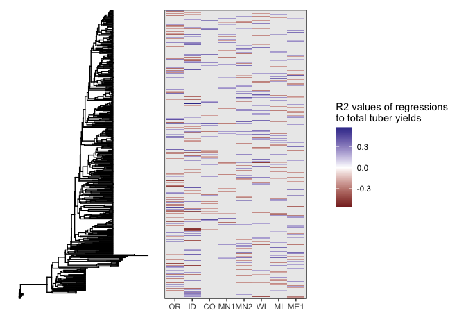
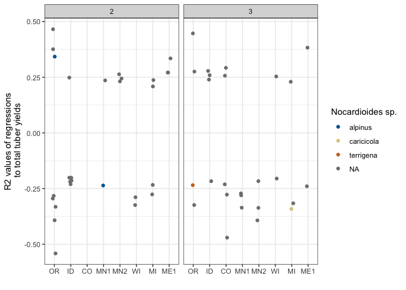

Variance Partitioning visuals
================
Scott Klasek
15 May, 2025

## Purpose

Make plots showing variance by treatment and other factors, and ASVs by
treatments.  
Redoing in June after re-classifying some green manure treatments as
controls (not amendments).

## Setup

#### load libraries

``` r
packages <- c("tidyverse", "phyloseq", "speedyseq", "patchwork", "NatParksPalettes", "DECIPHER", 
              "phangorn", "ape", "ggtree", "treeio", "hexbin", "lme4")
invisible(lapply(packages, require, character.only = TRUE))
```

#### load functions

drop_ghost_asvs, subset_occupancy, plot_biomarkers, add_taxa,
clean_up_variance, build_tree, get_intersection

``` r
# drop_ghost_asvs drops ASVs that are not present in any samples- but are still kept 
# because you've subsetted samples within a larger phyloseq object. This returns the phyloseq object with the subsetted count table.
drop_ghost_asvs <- function(ps){
  
  # extract the count table from the phyloseq, with ASVs as columns
    if(taxa_are_rows(ps)){counts <- t(ps@otu_table)} else{ # write count table with ASVs as rows
    counts <- ps@otu_table
    }
  # remove empty rows corresponding to ASVs that are present in 0 samples
  counts <- counts[,colSums(counts)>0]
  
  # write the count table back in
  otu_table(ps) <- counts # this way drops all zero-count ASVs from the tax table and refseq as well, in contrast to 'ps@otu_table <- counts'
  return(ps)
}

# subset_occupancy drops ASVs below a certain occupancy: 8.33%
# why this number? modeling ASV abundances seems useless if ASVs are in fewer than 50% of the samples,
# and considering that some treatment categories are used once across six treatment x rotations,
# 1/6 x 0.5 = 8.33%
# all it takes is a phyloseq object. it drops the ASVs below 8.33% occupancy, and moves their counts to 
# a "summing" column. Tax table now has a summing column as well. Output is a phyloseq object. 
subset_occupancy <- function(ps){
  
# first, calculate occupancy of each ASV (proportion of samples detected in, from 0 to 1)
occ <- vector("numeric")
  for (i in 1:ncol(ps@otu_table)) {
    occ[i] <- sum(ps@otu_table[,i] != 0)/nrow(ps@otu_table[,i])
  }
# write ASV names
names(occ) <- colnames(ps@otu_table)
  
# select ASVs to keep based on occupancy 
keep.asvs <- occ[which(occ >= (1/12))] # occupancy must be over 8.33%

# print some useful information
cat((length(keep.asvs)), "features are kept. \n")

# subset the count table to maintain compositionality
keep.table <- ps@otu_table[,names(keep.asvs)] # the kept ASVs, which does not include a summing column
drop.table <- ps@otu_table[,setdiff(colnames(ps@otu_table), names(keep.asvs))] # the dropped ASVs
summing <- rowSums(drop.table) # add up counts for dropped features to make a summing column
keep.new <- cbind(keep.table, summing) # add new summing to the keep table

# make a subsetted tax_table
taxa <- tax_table(ps)[names(keep.asvs),] # with only the kept ASVs over the occupancy cutoff
summing <- c("Fungi", rep(NA, times = ncol(taxa)-1))
taxa2 <- rbind(taxa, summing)
  
# put the new count table and tax table into a new ps object
# we must say goodbye to our refseq here because "summing" doesn't have a sequence associated with it.
new.ps <- phyloseq(sample_data(ps),
                   otu_table(keep.new, taxa_are_rows = FALSE),
                   tax_table(taxa2))
return(new.ps)
}

# plot_biomarkers plots a vector of ASVs or taxa and allows you to facet by category
# takes a phyloseq object (an original one used as input in during the filtering/transforming steps)
# as well as a character vector of ASVs/taxa to plot and a taxonomic level to plot them at
plot_biomarkers <- function(ps.orig, biomarkerlist, taxlevel){
  
  # subset original phyloseq object, and transform to PERCENT abundance
  ps <- ps.orig %>% 
    subset_samples(year == 22) %>% 
    drop_ghost_asvs() %>%
    subset_occupancy() %>%
    transform_sample_counts(function(x) x / sum(x) * 100) 
  
  # calculate mean percent abundances for all biomarker ASVs
  num <- vector("numeric") # define a numeric vector
  for (i in biomarkerlist) {num[i] <- mean(otu_table(ps)[,i])} 
  
  # obtain the row numbers corresponding to biomarker ASVs
  asvs.to.subset <- vector("integer") # define an integer vector
  for (i in names(num)) {asvs.to.subset[i] <- which(rownames(tax_table(ps))==i)} 
  
  # subset the taxonomy and ASV table and make a new phyloseq
  bmtt <- tax_table(ps)[asvs.to.subset,] 
  bmasvt <- otu_table(ps)[,names(num)] 
  ps.bm <- phyloseq(tax_table(bmtt), 
                 sample_data(ps),
                 otu_table(bmasvt, taxa_are_rows = FALSE)) 
  
  # plot bar graphs % abundances across all samples
  bm.barplot <- plot_bar(ps.bm, fill=taxlevel)+
    geom_bar(stat="identity", position="stack")+
    scale_y_continuous("% Abundance")+
    theme(axis.text.x = element_blank()) 
  
  # returns the plot
  return(bm.barplot) 
}

# add_taxa takes a dataframe containing a column "ASV" with ASV numbers
# it adds taxonomy to the ASVs and also returns a closest_tax column showing the most specific taxonomy for each ASV
add_taxa <- function(df, ps){
  
  # get tax_table from all ITS data
  df2 <- data.frame(ps@tax_table)
  
  # add ASV numbers to it
  df2$ASV <- rownames(df2)
  
  # left-join it by ASV with the input dataframe
  df3 <- left_join(df, df2, by = "ASV")
  
  # add the closest taxonomic level specified as a new column
  df3$closest_tax <- ifelse(!is.na(df3$Species), paste(df3$Genus, df3$Species), 
                      ifelse(!is.na(df3$Genus), paste(df3$Genus, "sp."),     
                      ifelse(!is.na(df3$Family), paste("Fam.", df3$Family),
                      ifelse(!is.na(df3$Order), paste("Ord.", df3$Order),
                      ifelse(!is.na(df3$Class), paste("Cl.", df3$Class),
                      ifelse(!is.na(df3$Phylum), paste("Phy.", df3$Phylum),
                      NA))))))
  return(df3)
}

# clean_up_variance_df takes a dataframe from a list of ASV-variance dataframes.
# for each ASV, it calculates the sum variance, number of sites it is detected in, and mean variance across sites
# it also adds taxonomy based on the amplicon (16S or ITS), returning a dataframe with all this info added.
clean_up_variance_df <- function(df, amplicon){
  
  # retitle site and variance colnames
  colnames(df)[c(1,3)] <- c("site", "variance")
  
  # for each ASV, calculate the sum variance, number of sites it is detected in, and mean variance across sites
  df1 <- df %>% 
    group_by(ASV) %>% 
    dplyr::mutate(sum_var = sum(variance),
                  num_sites = length(unique(site)),
                  mean_var = sum_var / num_sites)
  
  # factor order by site
  df1$site <- factor(df1$site, levels = c("OR", "ID", "CO", "MN1", "MN2", "WI", "MI", "ME1", "ME2"))

  # use amplicon parameter to get tax table from 16S or ITS phyloseq object containing all sequences across all sites
  if (amplicon == "16S"){
    tax <- bact.all.ps@tax_table
  } else if (amplicon == "ITS"){
      tax <- its.all.ps@tax_table
    } else {stop("Error: Choose either 16S or ITS to obtain taxonomy from.")}
  
  # get tax_table from all ITS data
  df2 <- data.frame(tax)
  
  # add ASV numbers to it
  df2$ASV <- rownames(df2)
  
  # left-join it by ASV with the input dataframe
  df3 <- left_join(df1, df2, by = "ASV")
  
  # add the closest taxonomic level specified as a new column
  df3$closest_tax <- ifelse(!is.na(df3$Species), paste(df3$Genus, df3$Species), 
                      ifelse(!is.na(df3$Genus), paste(df3$Genus, "sp."),     
                      ifelse(!is.na(df3$Family), paste("Fam.", df3$Family),
                      ifelse(!is.na(df3$Order), paste("Ord.", df3$Order),
                      ifelse(!is.na(df3$Class), paste("Cl.", df3$Class),
                      ifelse(!is.na(df3$Phylum), paste("Phy.", df3$Phylum),
                      NA))))))
  return(df3)
  
}

# build_tree takes a dataframe with an ASV column, and an amplicon (16S or ITS).
# it takes the unique sequences from those ASVs from phyloseq objects corresponding to the amplicon type,
# and builds a simple phylogenetic tree using UPGMA with phangorn, returning a ggtree object
build_tree <- function(df, amplicon, outgroup_asv){
  
  # extract the ASVs from the dataframe
  asvs <- unique(df$ASV) 
  
  # use amplicon parameter to get reference sequences from 16S or ITS phyloseq object
  if (amplicon == "16S"){
    seqs <- refseq(bact.all.ps)[asvs]
  } else if (amplicon == "ITS"){
      seqs <- refseq(its.all.ps)[asvs]
  } else {stop("Error: Choose either 16S or ITS to obtain reference sequences from.")}
  
  # make the tree
  align.seqs <- AlignSeqs(seqs, anchor=NA) # align sequences with DECIPHER
  phy <- phyDat(as.DNAbin(align.seqs), type = "DNA", levels = NULL) # convert this into a phyDat object 
  dna_dist <- dist.ml(phy, model="JC69") # model testing distance matrices
  tree <- upgma(dna_dist) # make a UPGMA tree
  
  # reroot the tree based on an outgroup ASV if provided
  if (missing(outgroup_asv)){
    tree2 <- ggtree(tree)} else{ 
      tree2 <- ape::root(tree, outgroup = outgroup_asv, edgelabel = TRUE) # reroot the tree
      tree2 <- ggtree(tree2) # and convert to a ggtree
  } 
  return(tree2)
}

### phangorn maximum-likelihood trees use the function pml_bb() which creates an object of class pml
### instead of class phylo, and this apparently can't be coerced back to class phylo 
# seqs <- refseq(its.all.ps)[unique(amended.filt.df$ASV)] # grab the sequences from the refseq within the ps object
# align.seqs <- AlignSeqs(seqs, anchor=NA) # align sequences with DECIPHER
# phy <- phyDat(as.DNAbin(align.seqs), type = "DNA", levels = NULL) # convert this into a phyDat object 
# test.this <- modelTest(phy) # JC model was recommended here
# mltree <- pml_bb(phy, model = "JC") # make a maximum likelihood tree, object is class pml
# mltree[[17]][[2]]

### another possible approach would be to make a phyloseq object from the ASVs in the input dataframe for build_tree,
### then treat each field site as a sample and variance as counts/abundances. Then construct a phylogenetic tree and plot
### the tree next to the heatmap. 
### However, I'm not seeing an easy way to reroot a tree within a phyloseq object according to a specific tip.

# get_intersection finds the intersection of ASVs that are treatment-influenced and yield-associated within a particular site.
# give it a dataframe of treatment-ASVs and a dataframe of yield-associations.
# it performs filtering on variance of treatment-ASVs, but does not do so for yield-ASVs because it's assumed you've done that already.
get_intersection <- function(treatment.df, yield.df){
  
    # filter the treatment df to include only ASVs that had significant variation (default 10%) and omit ME2
    treatment.df2 <- treatment.df %>% filter(variance >= 0.1 & site != "ME2")
    
    # get the site-ASV combinations for treatment
    treatment.asvs <- paste(treatment.df2$site, treatment.df2$ASV, sep = "_")
    
    # get the site-ASV combinations for yield
    yield.asvs <- paste(yield.df$site, yield.df$ASV, sep = "_")
    
    # return the intersection
    return(intersect(treatment.asvs, yield.asvs))
}

# get_treatment_yield_asv_info smooshes the treatment and yield dfs together to get only ASVs in sites 
# where they were treatment- and yield-associated, returning a row for each ASV-site. 
get_treatment_yield_asv_info <- function(treatment.df, yield.df){
  
  # take only the ASVs with 10% or more variance explained by treatment
  df1 <- treatment.df %>% filter(variance >= 0.1) # 
  
  # select columns from the yield dataframe
  df2 <- yield.df %>% 
    dplyr::select(site, ASV, season, rotation, lm_mult_r_sq, lm_adj_r_sq, estimate, statistic, p)
  
  # inner join the two dfs to get only the info for the ASVs affected by treatment and assoc w yield in the same site
  # some ASVs had multiple hits for the same site (ie in spring and in summer), 
  # so we mutate to get mean yield-association statistics 
  df3 <- inner_join(df1, df2, by = c("site", "ASV")) %>% 
    group_by(site, ASV) %>% 
    mutate(mean_mult_R2 = mean(lm_mult_r_sq),
           mean_statistic = mean(statistic),
           mean_p = mean(p)) %>% 
    select(-season, -rotation, -lm_mult_r_sq, -lm_adj_r_sq, -estimate, -statistic, -p) %>% distinct()
  
  return(df3)
}
```

#### load data

``` r
### import phyloseq object lists from 39.Rmd, where metadata has been added already
# lists of phyloseq objects
# these include metadata updated in doc 39.Rmd
# they are ALL years, ASVs and samples NOT subsetted or transformed
its.ps.list <- readRDS(file = "/Users/klas0061/Desktop/UMN/treatment_variance_modeling/its.ps.list")
bact.ps.list <- readRDS(file = "/Users/klas0061/Desktop/UMN/treatment_variance_modeling/bact.ps.list")

### variancePartition objects from 39.Rmd
bact.var.list <- readRDS(file = "/Users/klas0061/Desktop/UMN/treatment_variance_modeling/bact.variances.list")
its.var.list <- readRDS(file = "/Users/klas0061/Desktop/UMN/treatment_variance_modeling/its.variances.list")

# variancePartition objects from MI after redoing due to 
mi.redo.bact.var <- readRDS(file = "/Users/klas0061/Desktop/UMN/treatment_variance_modeling/updated.MI.bact.variances")
mi.redo.its.var <- readRDS(file = "/Users/klas0061/Desktop/UMN/treatment_variance_modeling/updated.MI.its.variances")

### variancePartition objects from 39.Rmd BUT WITH MEAN PERCENT ABUNDANCE AND OCCUPANCY FOR EACH ASV 
bact.var.abund.occ.df <- read.csv(file = "/Users/klas0061/Desktop/UMN/treatment_variance_modeling/16S.ASV.abund.occ.var.all.sites.csv")
its.var.abund.occ.df <- read.csv(file = "/Users/klas0061/Desktop/UMN/treatment_variance_modeling/ITS.ASV.abund.occ.var.all.sites.csv")

### variances by factor
var.fact.df <- read.csv(file = "/Users/klas0061/Desktop/UMN/treatment_variance_modeling/variance.by.factor.csv")
var.fact.mi.df <- read.csv(file = "/Users/klas0061/Desktop/UMN/treatment_variance_modeling/updated.MI.variance.by.factor.csv")

### lm results of ASVs with yield, from 43.Rmd
its.yield.df <- read.csv(file = "/Users/klas0061/Desktop/UMN/treatment_variance_modeling/its.yield.lm.results.txt")
bact.yield.df <- read.csv(file = "/Users/klas0061/Desktop/UMN/treatment_variance_modeling/bact.yield.lm.results.txt")

### phyloseq objects across all sites
its.all.ps <- readRDS(file = "/Users/klas0061/Desktop/UMN/phyloseqs/all_obj1_by_site/all.ITS.ps")
bact.all.ps <- readRDS(file = "/Users/klas0061/Desktop/UMN/phyloseqs/all_obj1_by_site/all.16S.ps") # this is HUGE

### curated yield data 
good.yt <- read.csv(file = "/Users/klas0061/Desktop/UMN/jim_info/yields/curated_yield_data_from_doc_34.csv") # all but Larkin's field
larkin.yields <- read.csv(file = "/Users/klas0061/Desktop/UMN/jim_info/yields/curated_larkin_yield_data_from_doc_34.csv") # Larkin
```

## Figure 1

#### Variance plots by site, for bacteria and eukaryotes

``` r
# color palette
factorpalette <- c('#8dd3c7','#ffffb3','#bebada','#80b1d3','#fdb462','#b3de69','#fb8072')

# add in the updated MI variances because I had to recategorize some amendments as fumigated as well
var.fact.df <- rbind(var.fact.df %>% filter(site != "MI"), var.fact.mi.df)

# relabel brassica as mustard
var.fact.df[which(var.fact.df$factor == "Brassica"),"factor"] <- "Mustard"

# order factors
var.fact.df$factor <- factor(var.fact.df$factor, 
                             levels = c("Block", "Cultivar", "Season", "Rotation", "Residuals",
                                        "Amendment", "Mustard", "Fumigation"))
var.fact.df$site <- factor(var.fact.df$site, levels = c("OR", "ID", "CO", "MN1", "MN2", "WI", "MI", "ME1", "ME2"))

# plot
varplot.gg <- var.fact.df %>% 
  filter(factor != "Residuals" & site != "ME2") %>% 
  ggplot(aes(site, variance_pct, fill = factor))+
    geom_bar(position = "stack", stat = "identity")+
    facet_grid(amplicon~.)+
    scale_x_discrete("")+
    scale_y_continuous("Percent of variance explained")+
    scale_fill_manual("", values = factorpalette)+
    theme_bw()+ggtitle("C")
varplot.gg
```

    ## Warning: Removed 14 rows containing missing values or values outside the scale range
    ## (`geom_bar()`).

<!-- -->

#### table to indicate which sites had which treatments and other factors

``` r
# make a table of logical values by each treatment factor
Site <- levels(var.fact.df$site)
Site <- factor(Site, levels = c("OR", "ID", "CO", "MN1", "MN2", "WI", "MI", "ME1", "ME2"))
Block_design <- c(TRUE, TRUE, FALSE, rep(TRUE, times = 6))
Multiple_cultivars <- rep(TRUE, times = 9)
Org_amendment <- c(rep(TRUE, times = 5), FALSE, rep(TRUE, times = 3))
Mustard <- c(TRUE, FALSE, FALSE, FALSE, TRUE, FALSE, FALSE, TRUE, TRUE)
Fumigation <- c(TRUE, TRUE, FALSE, rep(TRUE, times = 5), FALSE)
design.table <- data.frame(Site, Block_design, Multiple_cultivars, Org_amendment, Mustard, Fumigation)

# plot it
design.gg <- design.table %>% 
  filter(Site != "ME2") %>% 
  pivot_longer(-Site, names_to = "factor", values_to = "truefalse") %>% 
  ggplot(aes(Site, factor(factor, levels = c("Fumigation", "Mustard", "Org_amendment", "Multiple_cultivars", "Block_design"),
                          labels = c("Fumigation", "Mustard", "Org. amendment", "Multiple cultivars", "Block design")), 
             fill = factor(truefalse, levels = c(TRUE, FALSE))))+
    geom_tile()+
    scale_fill_manual("", values = c("#00BFC4", "#F8766D"))+
    scale_x_discrete("")+
    scale_y_discrete("")+
    theme_bw()+ggtitle("A")+theme(legend.position = "right")
design.gg
```

<!-- -->

Remember there are irregularities. MN1 did actually use brassicas, but
they were confounded with organic amendment. ME2 used two cultivars, but
put both of them in each plot. Might also need to confirm with CO that
they didn’t use a block design.

#### yields and how they changed across treatments

First re-format the yield data.

``` r
# take only the 2022 data and remove NAs in yield
yield <- good.yt %>% filter(yr == 2022) %>% drop_na(total_yield)

# change amended/fumigated back into amended: in both cases, they were fumigated only at the start of the 4 years
yield[which(yield$general.category == "Amended/Fumigated"),"general.category"] <- "Amended"

# change green manure treatments in ME and ID back to controls
yield[which(yield$State %in% c("ID", "ME") & yield$amendment == "Green Manure"),"general.category"] <- "Control"

# get some summary stats on all measurements of yield
all.meas.yield <- yield
summary(aov(total_yield ~ State * Rotation, all.meas.yield)) # anova
```

    ##                 Df   Sum Sq Mean Sq F value   Pr(>F)    
    ## State            7 11451206 1635887 324.894  < 2e-16 ***
    ## Rotation         1    55075   55075  10.938  0.00102 ** 
    ## State:Rotation   7   188279   26897   5.342 6.99e-06 ***
    ## Residuals      437  2200354    5035                     
    ## ---
    ## Signif. codes:  0 '***' 0.001 '**' 0.01 '*' 0.05 '.' 0.1 ' ' 1

``` r
t.test(all.meas.yield %>% filter(Rotation == 2) %>% pull(total_yield),
       all.meas.yield %>% filter(Rotation == 3) %>% pull(total_yield))
```

    ## 
    ##  Welch Two Sample t-test
    ## 
    ## data:  all.meas.yield %>% filter(Rotation == 2) %>% pull(total_yield) and all.meas.yield %>% filter(Rotation == 3) %>% pull(total_yield)
    ## t = -1.4759, df = 450.93, p-value = 0.1407
    ## alternative hypothesis: true difference in means is not equal to 0
    ## 95 percent confidence interval:
    ##  -56.621169   8.052338
    ## sample estimates:
    ## mean of x mean of y 
    ##  337.8645  362.1489

``` r
### choosing only the most common cultivars across each field site
# out west it was Norkotah
yield.cult1 <- yield %>% filter(Cultivar == "Russet Norkotah" & State %in% c("OR", "ID", "CO"))
# in MI it was Superior
yield.cult2 <- yield %>% filter(Cultivar == "Superior" & State == "MI")
# everywhere else it was Burbank
yield.cult3 <- yield %>% filter(Cultivar == "Russet Burbank" & State %in% c("MN", "ND", "WI", "ME"))
# bind all together
yield.cult <- rbind(yield.cult1, yield.cult2, yield.cult3)

### t-tests conducted here to determine whether yields changed with treatments (within sites, using dominant cultivars)
### testing for brassica effects is trickier, had to sort by treatment numbers 
# didn't end up seeing anything significant between corresponding mustard and non-mustard (non-fumigated) treatments of the same cultivar, for any site. 

# get mean yield and 95% confidence intervals for each non-larkin state, by category and rotation
yield <- yield.cult %>% 
  group_by(State, Rotation, general.category) %>% 
  summarize(mean_yield = mean(total_yield),
            lower_ci = t.test(total_yield)$conf.int[1],
            upper_ci = t.test(total_yield)$conf.int[2])
```

    ## `summarise()` has grouped output by 'State', 'Rotation'. You can override using
    ## the `.groups` argument.

``` r
# do the same for larkin
# get 2022 mean yields across different categories
larkin.yields[which(larkin.yields$trt_category == "disease_suppressive"),"trt_category"] <- "soil_conserving" #  soil conserving and disease suppressive trts are both controls
larkin.means <- larkin.yields %>% filter(Year == 2022) %>% 
  dplyr::select(State, trt_category, Total.yield) %>% 
  group_by(trt_category) %>% 
  summarize(mean_yield = mean(Total.yield),
            lower_ci = t.test(Total.yield)$conf.int[1],
            upper_ci = t.test(Total.yield)$conf.int[2])

# add in more info
larkin.means <- data.frame("State" = rep("US", times = 4),
                           "Rotation" = c(2,1,3,3),
                           "general.category" = c(rep("Control", times = 3), "Amended"),
                          larkin.means)

# select and filter
larkin.means <- larkin.means %>% filter(Rotation > 1) %>% dplyr::select(-trt_category)

# add in larkin data to the rest of the yields
yield <- rbind(yield, larkin.means) 

# correct the labels and levels
yield$site <- factor(yield$State, labels = c("CO", "ID", "ME1", "MI", "MN1", "MN2", "OR", "ME2", "WI"))
yield$site <- factor(yield$site, levels = c("OR", "ID", "CO", "MN1", "MN2", "WI", "MI", "ME1", "ME2"))

# add in asterisks for treatments that changed yields
yield$signif <- NA
yield[which(yield$site == "OR" & yield$Rotation == 2 & yield$general.category == "Amended"),"signif"] <- "*"
yield[which(yield$site == "WI" & yield$Rotation == 2 & yield$general.category == "Fumigated"),"signif"] <- "*"
yield[which(yield$site == "ME1" & yield$Rotation == 2 & yield$general.category == "Amended"),"signif"] <- "*"
yield[which(yield$site == "ID" & yield$Rotation == 3 & yield$general.category == "Amended"),"signif"] <- "*"
yield[which(yield$site == "ID" & yield$Rotation == 3 & yield$general.category == "Fumigated"),"signif"] <- "*"
yield[which(yield$site == "WI" & yield$Rotation == 3 & yield$general.category == "Fumigated"),"signif"] <- "*"
yield[which(yield$site == "MN2" & yield$Rotation == 3 & yield$general.category == "Amended"),"signif"] <- "*"
yield[which(yield$site == "ME1" & yield$Rotation == 3 & yield$general.category == "Amended"),"signif"] <- "*"

# fix label aesthetics
yield$Rotation <- paste(yield$Rotation, "yr.")

# convert cwt values to Mg/ha
cons <- 2.471*0.0508 # 2.471 acres in a hectare, 0.0508 Mg in a cwt
yield$mean_yield_Mgha <- yield$mean_yield * cons
yield$lower_ci_Mgha <- yield$lower_ci * cons
yield$upper_ci_Mgha <- yield$upper_ci * cons

# plot
yield.gg <- yield %>% 
  filter(site != "ME2") %>% 
  ggplot(aes(site, mean_yield_Mgha, fill = general.category))+
    geom_bar(position = "dodge", stat = "identity")+
    geom_text(aes(label = signif), position = position_dodge(0.9), size = 5, vjust = 0.2)+
    geom_errorbar(aes(ymin = lower_ci_Mgha, ymax = upper_ci_Mgha), width = 0.2, position=position_dodge(.9))+
    facet_grid(Rotation~.)+
    scale_fill_manual("", values = c('#fdb462','gray70','#fb8072'))+
    scale_x_discrete("")+
    scale_y_continuous("Total yield (Mg/ha)")+
    theme_bw()+ggtitle("B")
yield.gg
```

    ## Warning: Removed 35 rows containing missing values or values outside the scale range
    ## (`geom_text()`).

<!-- -->

All the figures

``` r
fig1 <- design.gg / yield.gg / varplot.gg + plot_layout(heights = c(1, 2, 2))
fig1
```

    ## Warning: Removed 35 rows containing missing values or values outside the scale range
    ## (`geom_text()`).

    ## Warning: Removed 14 rows containing missing values or values outside the scale range
    ## (`geom_bar()`).

<!-- -->

Re yield: these are 2022 yields split by general treatment category and
rotation. Fumigation and Amendment could be disentangled from one
another, but Brassica could not, so I’m omitting it here.

Significant differences within yields: Control \< both Fumigated and
Amended for OR 2-yr and ID 3-yr rotations. Control \< Amended for ME1
and ME2 3-yr rotations.

I’ve removed ME2 from this analysis because their treatments have been
going on for more than 4 years.

## Treatment-influenced ASVs across sites

[A way to plot Genus names on a second y-axis
scale???](https://github.com/tidyverse/ggplot2/issues/3171)  
\### ITS \#### Amended

``` r
# fold in the redone MI variances
its.var.list$MI <- mi.redo.its.var

# extract variances of ASVs by amendment, from all relevant sites (not WI)
amended.df <- plyr::ldply(its.var.list[which(names(its.var.list) != "WI")], 
                          function(df) data.frame("ASV" = rownames(df), df$AmendedTRUE))
```

    ## Loading required package: variancePartition

    ## Loading required package: limma

    ## 
    ## Attaching package: 'limma'

    ## The following object is masked from 'package:BiocGenerics':
    ## 
    ##     plotMA

    ## Loading required package: BiocParallel

    ## 
    ## Attaching package: 'variancePartition'

    ## The following object is masked from 'package:limma':
    ## 
    ##     topTable

``` r
# filter and clean up the dataframe
amended.filt.df <- amended.df %>% 
  clean_up_variance_df(amplicon = "ITS") %>% #  calculates stats and adds taxonomy
  filter(mean_var > 0.10 & num_sites > 1) # filter for highly-variant ASVs detected across 2 or more sites

# build a simple phylogenetic tree from the sequences of the treatment-impacted ITS ASVs
# view(data.frame(its.all.ps@tax_table[unique(amended.filt.df$ASV),]) %>% filter(Kingdom != "Fungi")) # find an outgroup
# amended.its.tree <- build_tree(amended.filt.df, "ITS", "ASV1380")

# create a tree + heatmap plot, keeping the order of the ASVs in the tree consistent
# amended.filt.df$taxlabel <- paste(amended.filt.df$ASV, amended.filt.df$closest_tax, sep = " ")
# amend.gg <- amended.filt.df %>% 
#    ggplot(aes(site, factor(ASV, levels = rev(get_taxa_name(amended.its.tree))), fill = variance, text = Genus))+
#      scale_x_discrete("")+
#      scale_y_discrete("", position = "right")+
#      scale_fill_viridis_c("Proportion of \n Amendment-associated \n variance", option = "viridis")+
#      geom_tile()+theme_bw()+
#      theme(axis.text.y = element_blank(), axis.ticks.y = element_blank())
      
# amended.its.tree + amend.gg 
```

Problems with this figure: Wish the tree were maximum-likelihood but
technical difficulties. Wanted to indicate genera on the right, but I
don’t think you can plot by another axis (UNLESS WAIT:
<https://github.com/tidyverse/ggplot2/issues/3171>). Need to plot by ASV
so that the tips of the tree line up with correspondingly with the rows
of the heatmap.

``` r
### look for signals in taxonomy
amended.filt.df %>% 
  select(ASV, sum_var, num_sites, mean_var, Phylum, Genus, Species, closest_tax) %>% # select cols specific to ASVs across sites
  distinct() %>% # dereplicate rows
  arrange(-sum_var) # sort by highest sum variance 
```

    ## # A tibble: 48 × 8
    ## # Groups:   ASV [48]
    ##    ASV     sum_var num_sites mean_var Phylum           Genus Species closest_tax
    ##    <chr>     <dbl>     <int>    <dbl> <chr>            <chr> <chr>   <chr>      
    ##  1 ASV75     1.34          3    0.446 Mortierellomyco… Mort… indohii Mortierell…
    ##  2 ASV59     1.17          6    0.195 Ascomycota       Botr… atrogr… Botryotric…
    ##  3 ASV80     1.12          6    0.187 Ascomycota       Botr… spirot… Botryotric…
    ##  4 ASV148    1.02          7    0.146 Ascomycota       <NA>  <NA>    Fam. Pseud…
    ##  5 ASV179    0.956         7    0.137 Ascomycota       Scop… cordiae Scopulario…
    ##  6 ASV93     0.936         8    0.117 Monoblepharomyc… <NA>  <NA>    Fam. Sanch…
    ##  7 ASV161    0.909         5    0.182 Ascomycota       Kern… column… Kernia col…
    ##  8 ASV630    0.875         2    0.437 Ascomycota       Petr… musisp… Petriella …
    ##  9 ASV158    0.793         6    0.132 Ascomycota       Kern… column… Kernia col…
    ## 10 ASV1198   0.774         2    0.387 Ascomycota       Ward… inflat… Wardomyces…
    ## # ℹ 38 more rows

``` r
# plot mortierella in MN2 where the change was drastic:
mort.mn2.asvs <- amended.filt.df %>% 
  filter(Genus == "Mortierella" & site == "MN2") %>% distinct(ASV) %>% pull(ASV)

plot_biomarkers(its.ps.list[["ND.ITS.ps"]], mort.mn2.asvs, "Species")+
  facet_grid(~Amended, scales = "free", space = "free")+
  scale_x_discrete("")+scale_y_continuous("% ITS community abundance")+
  theme_bw()+
  theme(legend.position = "bottom", axis.text.x = element_blank())+
  ggtitle("Mortierella, MN2, 2022, by amendment")
```

    ## 2224 features are kept.

    ## Scale for y is already present.
    ## Adding another scale for y, which will replace the existing scale.

<!-- -->

``` r
# plot Kernia in MN1 where the change was drastic:
kern.mn1.asvs <- amended.filt.df %>% 
  filter(Genus == "Kernia" & site == "MN1") %>% distinct(ASV) %>% pull(ASV)

plot_biomarkers(its.ps.list[["MN.ITS.ps"]], kern.mn1.asvs, "Species")+
  facet_grid(~Amended, scales = "free", space = "free")+
  scale_x_discrete("")+scale_y_continuous("% ITS community abundance")+
  theme_bw()+
  theme(legend.position = "bottom", axis.text.x = element_blank())+
  ggtitle("Kernia, MN1, 2022, by amendment")
```

    ## 1965 features are kept.

    ## Scale for y is already present.
    ## Adding another scale for y, which will replace the existing scale.

<!-- -->

I used my add_taxa() function to filter amendment-associated ASVs by
Genus, and there was only one that contained several ASVs: Kernia. All
were sp. columnaris. Also notable were Mortierella, Acaulium,
Botryotrichum, and Chytrids.

#### Fumigated

``` r
# extract variances of ASVs by fumigated, from all relevant sites (not CO or US)
fumigated.df <- plyr::ldply(its.var.list[which(! names(its.var.list) %in% c("CO", "ME2"))], 
                          function(df) data.frame("ASV" = rownames(df), df$FumigatedTRUE))

# filter and clean up the dataframe
fumigated.filt.df <- fumigated.df %>% 
  clean_up_variance_df(amplicon = "ITS") %>% #  calculates stats and adds taxonomy
  filter(mean_var > 0.10 & num_sites > 1) # filter for highly-variant ASVs detected across 2 or more sites

# build a simple phylogenetic tree from the sequences of the treatment-impacted ITS ASVs
# view(data.frame(its.all.ps@tax_table[unique(fumigated.filt.df$ASV),]) %>% filter(Kingdom != "Fungi")) # find an outgroup
# fumigated.its.tree <- build_tree(fumigated.filt.df, "ITS", "ASV4413")
# 
# # create a tree + heatmap plot, keeping the order of the ASVs in the tree consistent
# fum.gg <- fumigated.filt.df %>% 
#     ggplot(aes(site, factor(ASV, levels = rev(get_taxa_name(fumigated.its.tree))), fill = variance, text = Genus))+
#       scale_x_discrete("")+
#       scale_y_discrete("", position = "right")+
#       # facet_grid(Genus~., scales = "free", space = "free")+
#       scale_fill_viridis_c("Proportion of \n Fumigation-associated \n variance", option = "viridis")+
#       geom_tile()+theme_bw()+
#       theme(axis.text.y = element_blank(), axis.ticks.y = element_blank())
#       
# fumigated.its.tree + fum.gg 
```

I can see some regional and phylogenetic groupings here: MN/WI, and
MI/ME1.

#### Brassica

``` r
# extract variances of ASVs by brassica, from all relevant sites (ID, ME1, ME2, MN2, OR)
brassica.df <- plyr::ldply(its.var.list[which(names(its.var.list) %in% c("ME1", "ME2", "MN2", "OR"))], 
                          function(df) data.frame("ASV" = rownames(df), df$BrassicaTRUE))

# filter and clean up the dataframe
brassica.filt.df <- brassica.df %>% 
  clean_up_variance_df(amplicon = "ITS") %>% #  calculates stats and adds taxonomy
  filter(mean_var > 0.10 & num_sites > 1) # filter for highly-variant ASVs detected across 2 or more sites

# build a simple phylogenetic tree from the sequences of the treatment-impacted ITS ASVs
# view(data.frame(its.all.ps@tax_table[unique(brassica.filt.df$ASV),]) %>% filter(Kingdom != "Fungi")) # find an outgroup
# brassica.its.tree <- build_tree(brassica.filt.df, "ITS", "ASV1152")
# 
# # create a tree + heatmap plot, keeping the order of the ASVs in the tree consistent
# brassica.gg <- brassica.filt.df %>% 
#     ggplot(aes(site, factor(ASV, levels = rev(get_taxa_name(brassica.its.tree))), fill = variance, text = Genus))+
#       scale_x_discrete("")+
#       scale_y_discrete("", position = "right")+
#       scale_fill_viridis_c("Proportion of \n Brassica-associated \n variance", option = "viridis")+
#       geom_tile()+theme_bw()+
#       theme(axis.text.y = element_blank(), axis.ticks.y = element_blank())
#       
# brassica.its.tree + brassica.gg 
```

Brassica influenced taxa in Oregon far more in the other sites,
particularly members of Tausonia (sp. pullulans), Plectosphaerella,
Coelastrella, and Mortierella. Several of these Brassica-influenced ASVs
are distributed across all, or most, sites where there were Brassica
treatments.

### 16S

#### Amended

``` r
# fold in the redone MI variances
bact.var.list$MI <- mi.redo.bact.var

# extract variances of ASVs by amendment, from all relevant sites (not WI)
amended.bact.df <- plyr::ldply(bact.var.list[which(names(bact.var.list) != "WI")], 
                          function(df) data.frame("ASV" = rownames(df), df$AmendedTRUE))

# filter and clean up the dataframe
amended.bact.filt.df <- amended.bact.df %>% 
  clean_up_variance_df(amplicon = "16S") %>% #  calculates stats and adds taxonomy
  filter(mean_var > 0.10 & num_sites > 1) # filter for highly-variant ASVs detected across 3 or more sites

# build a simple phylogenetic tree from the sequences of the treatment-impacted ITS ASVs
#view(data.frame(bact.all.ps@tax_table[unique(amended.bact.filt.df$ASV),])) # find an outgroup
# amended.bact.tree <- build_tree(amended.bact.filt.df, "16S")
# 
# # plot
# amend.bact.gg <- amended.bact.filt.df %>% 
#     ggplot(aes(site, ASV, fill = variance))+
#       scale_x_discrete("")+
#       scale_y_discrete("")+
#       scale_fill_viridis_c("Proportion of \n Amendment-associated \n variance", option = "viridis")+
#       geom_tile()+theme_bw()+
#       theme(axis.text.y = element_blank(), axis.ticks.y = element_blank())
# amended.bact.tree + amend.bact.gg
```

#### Fumigated

``` r
# extract variances of ASVs by fumigated, from all relevant sites (not CO or US)
fumigated.bact.df <- plyr::ldply(bact.var.list[which(! names(bact.var.list) %in% c("CO", "ME2"))], 
                          function(df) data.frame("ASV" = rownames(df), df$FumigatedTRUE))

# filter and clean up the dataframe
fumigated.bact.filt.df  <- fumigated.bact.df  %>% 
  clean_up_variance_df(amplicon = "16S") %>% #  calculates stats and adds taxonomy
  filter(mean_var > 0.10 & num_sites > 1) # filter for highly-variant ASVs detected across 3 or more sites

# build a simple phylogenetic tree from the sequences of the treatment-impacted ITS ASVs
#view(data.frame(bact.all.ps@tax_table[unique(amended.bact.filt.df$ASV),])) # find an outgroup
#fumigated.bact.tree <- build_tree(fumigated.bact.filt.df, "16S")
#
### plot
#fum.bact.gg <- fumigated.bact.filt.df %>% 
#    ggplot(aes(site, ASV, fill = variance))+
#      scale_x_discrete("")+
#      scale_y_discrete("")+
#      scale_fill_viridis_c("Proportion of \n Fumigation-associated \n variance", option = "viridis")+
#      geom_tile()+theme_bw()+
#      theme(axis.text.y = element_blank(), axis.ticks.y = element_blank())
#fumigated.bact.tree + fum.bact.gg
```

#### Brassica

``` r
# extract variances of ASVs by brassica, from all relevant sites (ID, ME1, ME2, MN2, OR)
brassica.bact.df <- plyr::ldply(bact.var.list[which(names(bact.var.list) %in% c("ME1", "ME2", "MN2", "OR"))], 
                          function(df) data.frame("ASV" = rownames(df), df$BrassicaTRUE))

# filter and clean up the dataframe
brassica.bact.filt.df  <- brassica.bact.df  %>% 
  clean_up_variance_df(amplicon = "16S") %>% #  calculates stats and adds taxonomy
  filter(mean_var > 0.10 & num_sites > 1) # filter for highly-variant ASVs detected across 3 or more sites

# build a simple phylogenetic tree from the sequences of the treatment-impacted ITS ASVs
# view(data.frame(bact.all.ps@tax_table[unique(amended.bact.filt.df$ASV),])) # find an outgroup
# brassica.bact.tree <- build_tree(brassica.bact.filt.df, "16S")
# 
# # plot
# brass.bact.gg <- brassica.bact.filt.df %>% 
#     ggplot(aes(site, ASV, fill = variance))+
#       scale_x_discrete("")+
#       scale_y_discrete("")+
#       scale_fill_viridis_c("Proportion of \n Brassica-associated \n variance", option = "viridis")+
#       geom_tile()+theme_bw()+
#       theme(axis.text.y = element_blank(), axis.ticks.y = element_blank())
# brassica.bact.tree + brass.bact.gg
```

## Abundance / Occupancy relationships with % Variance explained by treatments

### ITS

``` r
cols.alphabetical <- c("#236192", "#B3A369", "#B0D7FF", "#18453B", "#7A0019", "#FFC72A", "#DC4405", "gray", "#C5050C")

# percent abundance on amended
its.var.abund.occ.df %>% 
  ggplot(aes(log10(mean_pct_abundance), log10(AmendedTRUE), color = site))+
    geom_point(size = 0.1)+
    scale_y_continuous(limits = c(-8,1))+
    scale_color_manual(values = cols.alphabetical)+
    facet_wrap(~site)+theme_bw()+ggtitle("ITS")
```

    ## Warning: Removed 2103 rows containing missing values or values outside the scale range
    ## (`geom_point()`).

<!-- -->

``` r
# occupancy on amended
its.var.abund.occ.df %>% 
  ggplot(aes(occupancy, AmendedTRUE, color = site))+
    geom_point(size = 0.1)+
    scale_color_manual(values = cols.alphabetical)+
    facet_wrap(~site)+theme_bw()+ggtitle("ITS")
```

    ## Warning: Removed 2090 rows containing missing values or values outside the scale range
    ## (`geom_point()`).

<!-- -->

Hmm, looking at the ITS there’s not as much of a difference as I
suspected, and it doesn’t seem to vary with the type of treatment. But
for the treatments that had particularly strong effects on the
microbiome, the more highly abundant ASVs were more influenced by the
treatment (here, see how Amendment was strong in MN, ND).

### 16S

``` r
# percent abundance on amended
bact.var.abund.occ.df %>% 
  ggplot(aes(log10(mean_pct_abundance), log10(AmendedTRUE)))+
    geom_hex()+
    scale_y_continuous()+
    scale_color_manual(values = cols.alphabetical)+
    facet_wrap(~site)+theme_bw()+ggtitle("16S")
```

    ## Warning: Removed 16957 rows containing non-finite outside the scale range
    ## (`stat_binhex()`).

<!-- -->

``` r
# occupancy on amended
bact.var.abund.occ.df %>% 
  ggplot(aes(occupancy, AmendedTRUE, color = site))+
    geom_point(size = 0.1)+
    scale_color_manual(values = cols.alphabetical)+
    facet_wrap(~site)+theme_bw()+ggtitle("16S")
```

    ## Warning: Removed 16957 rows containing missing values or values outside the scale range
    ## (`geom_point()`).

<!-- -->

## Yield-associated ASVs across sites

### ITS

#### heatmap plot

``` r
# filter out the not-so-great regressions by R2 >= 0.2. 
# and for every ASV-site combo, check if the sign of the association is the same. (it was for all but 29/1104 associations)
# and when there are multiple hits to the same ASV-site (from different seasons or rotations) take the mean R2.
# finally, multiply the mean R2 by the sign of the estimate to show + or - associations.  
its.yield.df2 <- its.yield.df %>% 
  filter(lm_mult_r_sq >= 0.2) %>% 
  group_by(ASV, site) %>% 
  mutate("consistent_trend_by_site" = length(unique(sign(estimate))) == 1, 
         "mean_r2" = mean(lm_mult_r_sq),
         "mean_estimate" = mean(estimate)) %>% 
  filter(consistent_trend_by_site == TRUE) %>% 
  group_by(ASV, site) %>% 
  mutate("r2_sign" = sign(mean_estimate)*mean_r2)  

# factor order by site
its.yield.df2$site <- factor(its.yield.df2$site, 
                            levels = c("OR", "ID", "CO", "MN", "ND", "WI", "MI", "ME"),
                            labels = c("OR", "ID", "CO", "MN1", "MN2", "WI", "MI", "ME1"))

# build a simple phylogenetic tree from the sequences of the treatment-impacted ITS ASVs
view(data.frame(its.all.ps@tax_table[unique(its.yield.df$ASV),]) %>% filter(Kingdom != "Fungi")) # find an outgroup
its.yield.tree <- build_tree(its.yield.df2, "ITS", "ASV1110") # a Chlorophyta
```

    ## Determining distance matrix based on shared 8-mers:
    ## ================================================================================
    ## 
    ## Time difference of 2.11 secs
    ## 
    ## Clustering into groups by similarity:
    ## ================================================================================
    ## 
    ## Time difference of 0.08 secs
    ## 
    ## Aligning Sequences:
    ## ================================================================================
    ## 
    ## Time difference of 3.6 secs
    ## 
    ## Iteration 1 of 2:
    ## 
    ## Determining distance matrix based on alignment:
    ## ================================================================================
    ## 
    ## Time difference of 0.35 secs
    ## 
    ## Reclustering into groups by similarity:
    ## ================================================================================
    ## 
    ## Time difference of 0.08 secs
    ## 
    ## Realigning Sequences:
    ## ================================================================================
    ## 
    ## Time difference of 1.79 secs
    ## 
    ## Iteration 2 of 2:
    ## 
    ## Determining distance matrix based on alignment:
    ## ================================================================================
    ## 
    ## Time difference of 0.44 secs
    ## 
    ## Reclustering into groups by similarity:
    ## ================================================================================
    ## 
    ## Time difference of 0.09 secs
    ## 
    ## Realigning Sequences:
    ## ================================================================================
    ## 
    ## Time difference of 1.49 secs
    ## 
    ## Refining the alignment:
    ## ================================================================================
    ## 
    ## Time difference of 1.85 secs

    ## Found more than one class "phylo" in cache; using the first, from namespace 'phyloseq'

    ## Also defined by 'tidytree'

``` r
# make a plot of the heatmap (change to a diverging color scale)
its.yield.gg <- its.yield.df2 %>%  
  ggplot(aes(site, factor(ASV, levels = rev(get_taxa_name(its.yield.tree))), fill = r2_sign))+ 
      scale_x_discrete("")+
      scale_y_discrete("", position = "right")+
      scale_fill_gradient2("R2 values of regressions \nto total tuber yields")+
      geom_tile()+theme_bw()+
      theme(axis.text.y = element_blank(), axis.ticks.y = element_blank())

# show the plot
its.yield.tree + its.yield.gg
```

<!-- -->
There were a lot more yield-associations in ME2 (Larkin) than in any of
the others, so I decided to drop that site. I also increased the
threshold R2 to 0.3 to inspect only the strongest results. Still it
looks like there’s very little pattern to be seen here.

I could do something clever like calculate the average R2 for each
genus-site combination, but I suspect this wouldn’t do too much since
there still look to be so many distinct genera.

#### intersection ASVs

Remember part of the point of all of this was to look for more ASVs that
are both treatment-influenced and yield-associated.

``` r
# ITS amendment ASVs:
get_intersection(amended.filt.df, its.yield.df2)
```

    ## [1] "ME1_ASV501"  "ME1_ASV1642" "ME1_ASV1906" "MI_ASV80"    "MI_ASV161"  
    ## [6] "MI_ASV1099"  "MI_ASV1194"  "MN1_ASV657"  "MN2_ASV493"

``` r
# ITS fumigation ASVs:
get_intersection(fumigated.filt.df, its.yield.df2)
```

    ## [1] "ME1_ASV308" "ME1_ASV479" "OR_ASV416"  "OR_ASV2495"

``` r
# ITS brassica ASVs:
get_intersection(brassica.filt.df, its.yield.df2)
```

    ## [1] "OR_ASV1705"

ASVs 161 and 1099 (both Kernia columnaris) were amendment-influenced and
positively associated with yield in MI. Besides Kernia, several other
members of Class Sordariomycetes were amendment and yield-associated. (6
of the 9 unique ASVs found). All of these 8 ASVs were positively
associated with yield in the sites they were treatment-influenced.

Two of the four Fumigation-yield ASVs were from Phy. Chytridiomycota,
and they were both positively associated with yields. The other two,
ASV479 and ASV416, were negatively associated with yields.

A Mucor (ASV1705) was influenced by Brassica and negatively associated
with yields in OR.

#### Make a plot showing treatment- and yield-associated ASVs.

``` r
# get the intersection of the treatment- and yield-associated ITS ASVs, for all treatments
its.amend.yld <- get_treatment_yield_asv_info(amended.filt.df, its.yield.df2) 
its.amend.yld$treatment <- "Amended"

its.fumig.yld <- get_treatment_yield_asv_info(fumigated.filt.df, its.yield.df2) 
its.fumig.yld$treatment <- "Fumigated"

its.brass.yld <- get_treatment_yield_asv_info(brassica.filt.df, its.yield.df2) 
its.brass.yld$treatment <- "Brassica"

# rbind them all together
its.trt.yld <- rbind(its.amend.yld, its.fumig.yld, its.brass.yld)

# multiply the R2 by the sign of the estimate to distinguish positive from negative yield associations
its.trt.yld$mean_mult_R2 <- sign(its.trt.yld$mean_statistic)*its.trt.yld$mean_mult_R2

# make informative taxonomy labels
its.trt.yld$tax_label <- paste(its.trt.yld$closest_tax, its.trt.yld$ASV, sep = " ")
its.trt.yld$class_cat <- ifelse(its.trt.yld$Class == "Sordariomycetes", "Sordariomycetes", "Other Classes")
its.trt.yld$class_cat[which(is.na(its.trt.yld$class_cat))] <- "Other Classes"
its.trt.yld$class_cat <- factor(its.trt.yld$class_cat, levels = c("Sordariomycetes", "Other Classes"))

# omit the ASVs that were enriched in controls relative to the treatments
# I manually inspected these using code in doc 45.Rmd
its.trt.yld <- its.trt.yld %>% filter(! ASV %in% c("ASV416", "ASV657", "ASV479"))

# plot it
its.trt.yld.gg <- its.trt.yld %>% 
  ggplot(aes(site, tax_label, size = variance, fill = mean_mult_R2))+
    geom_point(color="black",pch=21)+
    facet_grid(class_cat~treatment, scales = "free", space = "free")+
    scale_fill_gradient2("R2 values of regressions \nto total tuber yields")+  
    scale_size_area("Proportion of ASV variance \nexplained by treatment")+
    scale_x_discrete("")+scale_y_discrete("", limits=rev)+
    theme_bw()
its.trt.yld.gg
```

<!-- -->

``` r
# write out
write_csv(its.trt.yld, file = "/Users/klas0061/Desktop/UMN/treatment_variance_modeling/its.asvs.treatment.and.yield.associated.csv")
```

In ITS, several members of Ascomycota class Sordariomycetes were
influenced by organic amendments, and positively associated with yields.
Brassica and Fumigation treatments influenced fewer yield-associated
ASVs.

#### Genus-level patterns

``` r
# the 20 genera with the most yield-associations
sort(table(its.yield.df2$Genus), decreasing = TRUE)[1:20]
```

    ## 
    ##      Mortierella  Allovahlkampfia      Trichoderma      Coniochaeta 
    ##               31               16               14               13 
    ##      Talaromyces      Aspergillus         Fusarium      Penicillium 
    ##               12               11               11               10 
    ##    Schizothecium    Solicoccozyma     Tetracladium    Chrysosporium 
    ##                9                9                9                8 
    ##     Clonostachys Plectosphaerella        Podospora Pseudogymnoascus 
    ##                8                8                8                8 
    ##      Chordomyces         Humicola     Phialemonium     Arthrobotrys 
    ##                7                7                7                6

``` r
top.20.its.genera <- names(sort(table(its.yield.df2$Genus), decreasing = TRUE)[1:20])

# plot one genus
mortierella.yields.gg <- its.yield.df2 %>%  
  filter(Genus == "Mortierella") %>% 
    ggplot(aes(site, r2_sign, color = Species))+
      geom_jitter(width = 0.1)+
      facet_grid(~rotation)+
      scale_x_discrete("")+
      scale_y_continuous("R2 values of regressions\n to total tuber yields")+
      scale_color_manual("Mortierella sp.", values = natparks.pals("Yellowstone", 11))+
      theme_bw()
mortierella.yields.gg
```

<!-- -->

``` r
# plot many genera
cols.order <- c("#DC4405", "#B3A369", "#236192", "#7A0019", "#FFC72A", "#C5050C", "#18453B", "#B0D7FF", "gray")
its.yield.df2 %>% 
  filter(Genus %in% top.20.its.genera) %>% 
  ggplot(aes(Genus, r2_sign, color = site))+
    geom_jitter(width = 0.2)+
    coord_flip()+
    scale_x_discrete("Genus", limits = rev)+ # guide = guide_axis(angle = 60)
    scale_y_continuous("R2 and direction of association to total yield")+
    scale_color_manual("Site", values = cols.order)+
    theme_bw()
```

<!-- -->
Not surprised to see Mortierella as the most yield-associated fungal
genus.  
When plotting hits to yield by genus, nearly all genera have positive
and negative associations. A few noteable exceptions: Chordomyces &
Colletotrichum (all positive) and Metarhizium (all but one positive).

#### by season and rotation

``` r
# counts of associations
its.yield.counts.gg <- its.yield.df2 %>% 
  ggplot(aes(season, fill = site))+
    geom_bar(position = "dodge")+
    facet_grid(~rotation)+  
    scale_fill_manual("Site", values = cols.order)+
    scale_y_continuous("Number of associations\n to total yield")+
    theme_bw()

# strengths and directions of lm R2s
its.yield.strengths.gg <- its.yield.df2 %>% 
  ggplot(aes(season, r2_sign, color = site, group = site))+
    geom_jitter(alpha = 0.3, position=position_dodge(width=0.5))+
    facet_grid(~rotation)+  
    scale_color_manual("Site", values = cols.order)+
    scale_y_continuous("R2 and direction of\n association to total yield")+
    theme_bw()

its.yield.counts.gg / its.yield.strengths.gg
```

<!-- -->

### 16S

#### heatmap plot

``` r
# filter out the not-so-great regressions by R2 >= 0.2. 
# and for every ASV-site combo, check if the sign of the association is the same. (it was for all but 29/1104 associations)
# and when there are multiple hits to the same ASV-site (from different seasons or rotations) take the mean R2.
# finally, multiply the mean R2 by the sign of the estimate to show + or - associations.  
bact.yield.df2 <- bact.yield.df %>% 
  filter(lm_mult_r_sq >= 0.2) %>% 
  group_by(ASV, site) %>% 
  mutate("consistent_trend_by_site" = length(unique(sign(estimate))) == 1, 
         "mean_r2" = mean(lm_mult_r_sq),
         "mean_estimate" = mean(estimate)) %>% 
  filter(consistent_trend_by_site == TRUE) %>% 
  group_by(ASV, site) %>% 
  mutate("r2_sign" = sign(mean_estimate)*mean_r2)  

# factor order by site
bact.yield.df2$site <- factor(bact.yield.df2$site, 
                            levels = c("OR", "ID", "CO", "MN", "ND", "WI", "MI", "ME"),
                            labels = c("OR", "ID", "CO", "MN1", "MN2", "WI", "MI", "ME1"))

# any extra filtering, such as filtering out results from sites that have a lot
# bact.yield.df2 <- bact.yield.df2 %>% filter(site != "ME2" & site != "OR")

# maybe just skip building a tree for bacteria

# make a plot of the heatmap (change to a diverging color scale)
bact.yield.gg <- bact.yield.df2 %>%  
  ggplot(aes(site, ASV, fill = r2_sign))+ 
      scale_x_discrete("")+
      scale_y_discrete("", position = "right")+
      scale_fill_gradient2("R2 values of regressions \nto total tuber yields")+
      geom_tile()+theme_bw()+
      theme(axis.text.y = element_blank(), axis.ticks.y = element_blank())

# show the plot
bact.yield.gg
```

<!-- -->

#### intersection ASVs

``` r
# ITS amendment ASVs:
get_intersection(amended.bact.filt.df, bact.yield.df2)
```

    ##  [1] "ID_ASV2340"  "ID_ASV2345"  "ID_ASV2589"  "ID_ASV3781"  "ID_ASV4416" 
    ##  [6] "ID_ASV4825"  "ID_ASV4830"  "ID_ASV12474" "ID_ASV17047" "ME1_ASV1497"
    ## [11] "ME1_ASV4373" "MI_ASV534"   "MI_ASV1426"  "MN1_ASV792"  "MN2_ASV534" 
    ## [16] "OR_ASV171"   "OR_ASV792"   "OR_ASV1254"  "OR_ASV1486"  "OR_ASV2399" 
    ## [21] "OR_ASV3573"  "OR_ASV3632"  "OR_ASV3680"  "OR_ASV4603"  "OR_ASV4604" 
    ## [26] "OR_ASV4948"  "OR_ASV5076"  "OR_ASV5259"  "OR_ASV6264"  "OR_ASV6880" 
    ## [31] "OR_ASV7094"  "OR_ASV7919"  "OR_ASV8162"  "OR_ASV11985" "OR_ASV21630"
    ## [36] "OR_ASV24754" "OR_ASV25317"

``` r
bact.amd.yield.asvs <- gsub(".*_", "", get_intersection(amended.bact.filt.df, bact.yield.df2))
bact.yield.df2 %>% 
  filter(ASV %in% bact.amd.yield.asvs & Class == "Bacilli") 
```

    ## # A tibble: 4 × 25
    ## # Groups:   ASV, site [4]
    ##   ASV     loglik dfree lm_mult_r_sq lm_adj_r_sq estimate statistic       p  padj
    ##   <chr>    <dbl> <int>        <dbl>       <dbl>    <dbl>     <dbl>   <dbl> <dbl>
    ## 1 ASV124…  -118.    22        0.202       0.165     28.6      2.88 0.00876 0.522
    ## 2 ASV170…  -117.    22        0.261       0.227     29.8      2.47 0.0219  0.598
    ## 3 ASV2345  -116.    22        0.270       0.237     29.9      2.58 0.0169  0.574
    ## 4 ASV4825  -118.    22        0.201       0.164     19.7      2.37 0.0270  0.615
    ## # ℹ 16 more variables: site <fct>, amplicon <chr>, season <chr>,
    ## #   rotation <int>, Kingdom <chr>, Phylum <chr>, Class <chr>, Order <chr>,
    ## #   Family <chr>, Genus <chr>, Species <chr>, closest_tax <chr>,
    ## #   consistent_trend_by_site <lgl>, mean_r2 <dbl>, mean_estimate <dbl>,
    ## #   r2_sign <dbl>

``` r
# ITS fumigation ASVs:
get_intersection(fumigated.bact.filt.df, bact.yield.df2)
```

    ## [1] "ID_ASV1428" "ME1_ASV2"   "MN1_ASV2"   "MN1_ASV331" "MN2_ASV44" 
    ## [6] "OR_ASV7460"

``` r
# ITS brassica ASVs:
get_intersection(brassica.bact.filt.df, bact.yield.df2)
```

    ## [1] "OR_ASV270"   "OR_ASV574"   "OR_ASV2640"  "OR_ASV2762"  "OR_ASV3009" 
    ## [6] "OR_ASV3745"  "OR_ASV17079"

``` r
bact.brass.yield.asvs <- gsub(".*_", "", get_intersection(brassica.bact.filt.df, bact.yield.df2))
bact.yield.df2 %>% 
  filter(ASV %in% bact.brass.yield.asvs)
```

    ## # A tibble: 12 × 25
    ## # Groups:   ASV, site [11]
    ##    ASV    loglik dfree lm_mult_r_sq lm_adj_r_sq estimate statistic       p  padj
    ##    <chr>   <dbl> <int>        <dbl>       <dbl>    <dbl>     <dbl>   <dbl> <dbl>
    ##  1 ASV17…  -80.5    12        0.404       0.354   -143.      -3.71 0.00298 0.441
    ##  2 ASV26… -154.     27        0.219       0.190    -38.7     -3.47 0.00178 0.435
    ##  3 ASV26…  -82.1    12        0.241       0.178   -123.      -2.43 0.0318  0.562
    ##  4 ASV270  -85.3    13        0.285       0.230    -44.6     -2.28 0.0403  0.737
    ##  5 ASV270 -118.     21        0.245       0.209     45.2      2.70 0.0135  0.680
    ##  6 ASV27…  -98.4    18        0.262       0.221    -40.5     -3.08 0.00650 0.545
    ##  7 ASV27…  -84.5    13        0.363       0.314    -68.7     -2.72 0.0174  0.730
    ##  8 ASV27…  -96.4    20        0.213       0.174     16.9      2.14 0.0447  0.849
    ##  9 ASV30…  -85.5    13        0.268       0.212    -44.1     -2.18 0.0482  0.777
    ## 10 ASV37…  -84.0    13        0.403       0.357    -52.0     -2.76 0.0161  0.730
    ## 11 ASV574  -84.3    13        0.374       0.326    -54.0     -2.44 0.0300  0.737
    ## 12 ASV574  -71.7    11        0.390       0.335    -60.0     -2.65 0.0224  0.863
    ## # ℹ 16 more variables: site <fct>, amplicon <chr>, season <chr>,
    ## #   rotation <int>, Kingdom <chr>, Phylum <chr>, Class <chr>, Order <chr>,
    ## #   Family <chr>, Genus <chr>, Species <chr>, closest_tax <chr>,
    ## #   consistent_trend_by_site <lgl>, mean_r2 <dbl>, mean_estimate <dbl>,
    ## #   r2_sign <dbl>

ASVs belonging to class Bacilli were some of the most common
yield-associated ASVs, and they were present across multiple sites. They
have both positive and negative associations with yields, and sometimes
the same ASV has a different relationship to yield in different sites.
(The same can be said about the class Actinobacteria).

Most of the fumigation-yield bacterial ASVs belonged to Order
Micrococcales (3 of 5). Yield trends were in both directions.

ASVs belonging to Gens. Chthoniobacter, Rhodococcus, and Fam.
Nannocystaceae were influenced by Brassica in OR.

#### Make a plot showing treatment- and yield-associated ASVs.

``` r
# get the intersection of the treatment- and yield-associated ITS ASVs, for all treatments
bact.amend.yld <- get_treatment_yield_asv_info(amended.bact.filt.df, bact.yield.df2) 
bact.amend.yld$treatment <- "Amended"

bact.fumig.yld <- get_treatment_yield_asv_info(fumigated.bact.filt.df, bact.yield.df2) 
bact.fumig.yld$treatment <- "Fumigated"

bact.brass.yld <- get_treatment_yield_asv_info(brassica.bact.filt.df, bact.yield.df2) 
bact.brass.yld$treatment <- "Brassica"

# rbind them all together
bact.trt.yld <- rbind(bact.amend.yld, bact.fumig.yld, bact.brass.yld)

# multiply the R2 by the sign of the estimate to distinguish positive from negative yield associations
bact.trt.yld$mean_mult_R2 <- sign(bact.trt.yld$mean_statistic)*bact.trt.yld$mean_mult_R2

# make informative taxonomy labels
bact.trt.yld$tax_label <- paste(bact.trt.yld$closest_tax, bact.trt.yld$ASV, sep = " ")
bact.trt.yld$phy_cat <- ifelse(bact.trt.yld$Phylum == "Actinobacteriota", "Actinobacteriota", "Other Phyla")
# bact.trt.yld$class_cat[which(is.na(bact.trt.yld$class_cat))] <- "Other Classes"

# omit the ASVs that were enriched in controls relative to the treatments
# I manually inspected these using code in doc 45.Rmd
discard.asvs <- c("ASV1428", "ASV2640", # the non-OR-ID amended-associated ASVs
                  "ASV8162", "ASV3573", "ASV7094", "ASV24754", "ASV1486", # the OR-amended-associated ASVs
                  "ASV4604", "ASV4603", "ASV171", "ASV3680", "ASV5259",
                  "ASV6", "ASV6880") # all the ID ones deserved to be kept

# plot it
bact.trt.yld.gg <- bact.trt.yld %>% 
  filter(! ASV %in% discard.asvs) %>% 
  ggplot(aes(site, tax_label, size = variance, fill = mean_mult_R2))+
    geom_point(color="black",pch=21)+
    facet_grid(phy_cat~treatment, scales = "free", space = "free")+
    scale_fill_gradient2("R2 values of regressions \nto total tuber yields")+  
    scale_size_area("Proportion of ASV variance \nexplained by treatment")+
    scale_x_discrete("")+scale_y_discrete("", limits=rev)+
    theme_bw()
bact.trt.yld.gg
```

<!-- -->

``` r
# write out
write_csv(bact.trt.yld, file = "/Users/klas0061/Desktop/UMN/treatment_variance_modeling/bact.asvs.treatment.and.yield.associated.csv")
```

#### both its and bacteria together

``` r
# fix column names and give taxonomic entries more specific labels
colnames(its.trt.yld)[20] <- "tax_cat"
colnames(bact.trt.yld)[20] <- "tax_cat"

bact.trt.yld[which(bact.trt.yld$tax_cat == "Other Phyla"),"tax_cat"] <- "Other bacterial phyla"
its.trt.yld$tax_cat <- as.character(its.trt.yld$tax_cat)
its.trt.yld[which(its.trt.yld$tax_cat == "Other Classes"),"tax_cat"] <- "Other eukaryotic classes"

# rbind both together, removing bacteria that didn't increase in the corresponding treatments
all.trt.yld <- rbind(bact.trt.yld %>% filter(! ASV %in% discard.asvs), its.trt.yld)

# rename mustard treatment
all.trt.yld$treatment[which(all.trt.yld$treatment == "Brassica")] <- "Must."

# adjust taxonomy categories so they fit in the label boxes
all.trt.yld$tax_cat[which(all.trt.yld$tax_cat == "Sordariomycetes")] <- "Sordario\nmycetes"
all.trt.yld$tax_cat[which(all.trt.yld$tax_cat == "Other eukaryotic classes")] <- "Other euk. \n classes"
all.trt.yld$tax_cat <- factor(all.trt.yld$tax_cat, 
                       levels = c("Actinobacteriota", "Other bacterial phyla", "Sordario\nmycetes", "Other euk. \n classes"))

# plot
all.trt.yld.gg <- all.trt.yld %>% 
  ggplot(aes(site, tax_label, size = variance, fill = mean_mult_R2))+
    geom_point(color="black",pch=21)+
    facet_grid(tax_cat~treatment, scales = "free", space = "free")+
    scale_fill_gradient2("R2 values of regressions \nto total tuber yields")+  
    scale_size_area("Proportion of ASV variance \nexplained by treatment")+
    scale_x_discrete("")+scale_y_discrete("", limits=rev)+
    theme_bw()
all.trt.yld.gg
```

<!-- -->

``` r
# write out
write_csv(all.trt.yld, file = "/Users/klas0061/Desktop/UMN/treatment_variance_modeling/all.asvs.treatment.and.yield.associated.filtered.csv")
```

#### Genus-level patterns

``` r
# the 20 genera with the most yield-associations
sort(table(bact.yield.df2$Genus), decreasing = TRUE)[1:20]
```

    ## 
    ##                   RB41           Sphingomonas             Bryobacter 
    ##                     62                     60                     54 
    ##           Nocardioides           Gemmatimonas               Bacillus 
    ##                     54                     49                     47 
    ##        Solirubrobacter  Candidatus Solibacter            Acidibacter 
    ##                     46                     45                     39 
    ##           Streptomyces          Mycobacterium          Paenibacillus 
    ##                     38                     33                     31 
    ##           Conexibacter             Haliangium         Pseudonocardia 
    ##                     29                     28                     28 
    ##               Massilia Candidatus Udaeobacter             Microvirga 
    ##                     27                     25                     21 
    ##              Ellin6067        Flavisolibacter 
    ##                     20                     20

``` r
top.20.bact.genera <- names(sort(table(bact.yield.df2$Genus), decreasing = TRUE)[1:20])

# plot one genus
nocard.yields.gg <- bact.yield.df2 %>%  
  filter(Genus == "Nocardioides") %>% 
    ggplot(aes(site, r2_sign, color = Species))+
      geom_jitter(width = 0.1)+
      facet_grid(~rotation)+
      scale_x_discrete("")+
      scale_y_continuous("R2 values of regressions\n to total tuber yields")+
      scale_color_manual("Nocardioides sp.", values = natparks.pals("Yellowstone", 4))+
      theme_bw()
nocard.yields.gg
```

<!-- -->

``` r
# plot many genera
bact.yield.df2 %>% 
  filter(Genus %in% top.20.bact.genera) %>% 
  ggplot(aes(Genus, r2_sign, color = site))+
    geom_jitter(width = 0.2)+
    coord_flip()+
    scale_x_discrete("Genus", limits = rev)+ # guide = guide_axis(angle = 60)
    scale_y_continuous("R2 and direction of association to total yield")+
    scale_color_manual("Site", values = cols.order)+
    theme_bw()
```

<!-- -->
Bacterial genera are even more variable in their yield-associations than
ITS.

#### by season and rotation

``` r
# counts of associations
bact.yield.counts.gg <- bact.yield.df2 %>% 
  ggplot(aes(season, fill = site))+
    geom_bar(position = "dodge")+
    facet_grid(~rotation)+  
    scale_fill_manual("Site", values = cols.order)+
    scale_y_continuous("Number of associations\n to total yield")+
    theme_bw()

# strengths and directions of lm R2s
bact.yield.strengths.gg <- bact.yield.df2 %>% 
  ggplot(aes(season, r2_sign, color = site, group = site))+
    geom_jitter(alpha = 0.3, position=position_dodge(width=0.5))+
    facet_grid(~rotation)+  
    scale_color_manual("Site", values = cols.order)+
    scale_y_continuous("R2 and direction of\n association to total yield")+
    theme_bw()

bact.yield.counts.gg / bact.yield.strengths.gg
```

<!-- -->

## Conclusions

Treatments had varying effects on microbiome composition across field
sites. Possibly because the treatments were not standardized, Or due to
soil chemistry, etc?

Oregon: large effect of Brassica treatments on both 16S and ITS, and
Amendment on 16S.

A preliminary glance suggests little phylogenetic signal associated with
treatment influence.

Some phylogenetic signal associated with occupancy across sites (Not
that surprising).

Now that “Amendment” has been fixed to mean “compost or manure
addition”, there is little change in the treatment-yield-associated
ASVs. If anything, just a couple more ASVs found in ID and ME after
fixing these classifications.

#### session info

``` r
sessionInfo()
```

    ## R version 4.4.3 (2025-02-28)
    ## Platform: x86_64-apple-darwin20
    ## Running under: macOS Sonoma 14.7.5
    ## 
    ## Matrix products: default
    ## BLAS:   /Library/Frameworks/R.framework/Versions/4.4-x86_64/Resources/lib/libRblas.0.dylib 
    ## LAPACK: /Library/Frameworks/R.framework/Versions/4.4-x86_64/Resources/lib/libRlapack.dylib;  LAPACK version 3.12.0
    ## 
    ## locale:
    ## [1] en_US.UTF-8/en_US.UTF-8/en_US.UTF-8/C/en_US.UTF-8/en_US.UTF-8
    ## 
    ## time zone: America/Chicago
    ## tzcode source: internal
    ## 
    ## attached base packages:
    ## [1] stats4    stats     graphics  grDevices utils     datasets  methods  
    ## [8] base     
    ## 
    ## other attached packages:
    ##  [1] variancePartition_1.36.3 BiocParallel_1.40.0      limma_3.62.2            
    ##  [4] lme4_1.1-37              Matrix_1.7-2             hexbin_1.28.5           
    ##  [7] treeio_1.30.0            ggtree_3.14.0            phangorn_2.12.1         
    ## [10] ape_5.8-1                DECIPHER_3.2.0           Biostrings_2.74.1       
    ## [13] GenomeInfoDb_1.42.3      XVector_0.46.0           IRanges_2.40.1          
    ## [16] S4Vectors_0.44.0         BiocGenerics_0.52.0      NatParksPalettes_0.2.0  
    ## [19] patchwork_1.3.0          speedyseq_0.5.3.9021     phyloseq_1.50.0         
    ## [22] lubridate_1.9.4          forcats_1.0.0            stringr_1.5.1           
    ## [25] dplyr_1.1.4              purrr_1.0.4              readr_2.1.5             
    ## [28] tidyr_1.3.1              tibble_3.2.1             ggplot2_3.5.1           
    ## [31] tidyverse_2.0.0         
    ## 
    ## loaded via a namespace (and not attached):
    ##   [1] rstudioapi_0.17.1       jsonlite_1.8.8          magrittr_2.0.3         
    ##   [4] farver_2.1.2            nloptr_2.2.1            rmarkdown_2.27         
    ##   [7] fs_1.6.4                zlibbioc_1.52.0         vctrs_0.6.5            
    ##  [10] multtest_2.62.0         minqa_1.2.8             htmltools_0.5.8.1      
    ##  [13] broom_1.0.7             Rhdf5lib_1.28.0         rhdf5_2.50.2           
    ##  [16] gridGraphics_0.5-1      KernSmooth_2.23-26      pbkrtest_0.5.4         
    ##  [19] plyr_1.8.9              igraph_2.1.4            lifecycle_1.0.4        
    ##  [22] iterators_1.0.14        pkgconfig_2.0.3         R6_2.5.1               
    ##  [25] fastmap_1.2.0           GenomeInfoDbData_1.2.13 rbibutils_2.3          
    ##  [28] digest_0.6.36           numDeriv_2016.8-1.1     aplot_0.2.5            
    ##  [31] colorspace_2.1-1        vegan_2.6-10            labeling_0.4.3         
    ##  [34] fansi_1.0.6             timechange_0.3.0        httr_1.4.7             
    ##  [37] mgcv_1.9-1              compiler_4.4.3          bit64_4.6.0-1          
    ##  [40] aod_1.3.3               withr_3.0.2             backports_1.5.0        
    ##  [43] DBI_1.2.3               highr_0.11              gplots_3.2.0           
    ##  [46] MASS_7.3-64             corpcor_1.6.10          biomformat_1.34.0      
    ##  [49] gtools_3.9.5            caTools_1.18.3          permute_0.9-7          
    ##  [52] tools_4.4.3             remaCor_0.0.18          glue_1.7.0             
    ##  [55] quadprog_1.5-8          nlme_3.1-167            rhdf5filters_1.18.1    
    ##  [58] grid_4.4.3              cluster_2.1.8           reshape2_1.4.4         
    ##  [61] ade4_1.7-23             generics_0.1.3          gtable_0.3.6           
    ##  [64] tzdb_0.4.0              data.table_1.17.0       hms_1.1.3              
    ##  [67] utf8_1.2.4              foreach_1.5.2           pillar_1.9.0           
    ##  [70] vroom_1.6.5             yulab.utils_0.2.0       splines_4.4.3          
    ##  [73] lattice_0.22-6          bit_4.6.0               survival_3.8-3         
    ##  [76] tidyselect_1.2.1        knitr_1.47              reformulas_0.4.1       
    ##  [79] RhpcBLASctl_0.23-42     xfun_0.45               Biobase_2.66.0         
    ##  [82] statmod_1.5.0           matrixStats_1.5.0       stringi_1.8.4          
    ##  [85] UCSC.utils_1.2.0        lazyeval_0.2.2          ggfun_0.1.8            
    ##  [88] yaml_2.3.8              boot_1.3-31             evaluate_1.0.3         
    ##  [91] codetools_0.2-20        ggplotify_0.1.2         cli_3.6.3              
    ##  [94] Rdpack_2.6.4            munsell_0.5.1           Rcpp_1.0.14            
    ##  [97] EnvStats_3.1.0          parallel_4.4.3          bitops_1.0-9           
    ## [100] mvtnorm_1.3-3           tidytree_0.4.6          lmerTest_3.1-3         
    ## [103] scales_1.3.0            crayon_1.5.3            fANCOVA_0.6-1          
    ## [106] rlang_1.1.4             fastmatch_1.1-6
