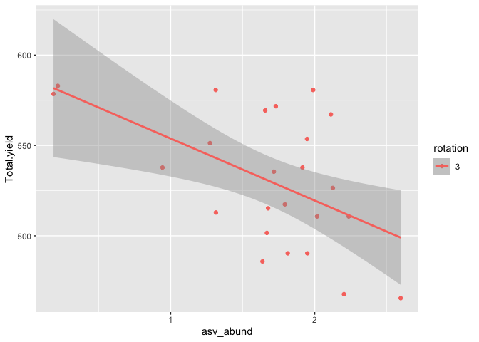
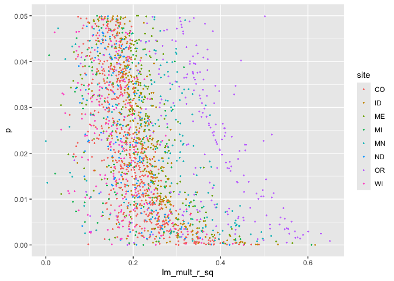

inclusive ASV-yield regressions
================
Scott Klasek
2024-04-22

### Purpose

In 41.Rmd, we used feature selection to identify some ASVs that are
associated with tuber yields. We know the LASSO approach only selects
the ASVs most strongly correlated with yields.

- Would a more inclusive approach identify more ASVs associated with
  yields?
- Would this allow us to identify yield-associated taxa across sites?
  (The previous approach found that all ASVs were specific to a single
  site with one exception). This might allow us to better identify
  taxonomic trends as well.

This doc uses a lot of code from 41.Rmd.

### Setup

#### load libraries

``` r
packages <- c("tidyverse", "phyloseq", "speedyseq", "compositions", "glmnet", "data.table", "patchwork", "Matrix", "MASS", "broom", "edgeR", "ggpmisc")
invisible(lapply(packages, require, character.only = TRUE))
```

#### define functions

``` r
# drop_ghost_asvs drops ASVs that are not present in any samples- but are still kept because you've 
# subsetted samples within a larger phyloseq object. This returns the phyloseq object with the subsetted count table.
drop_ghost_asvs <- function(ps){
  
  # extract the count table from the phyloseq, with ASVs as columns
    if(taxa_are_rows(ps)){counts <- t(ps@otu_table)} else{ # write count table with ASVs as rows
    counts <- ps@otu_table
    }
  # remove empty rows corresponding to ASVs that are present in 0 samples
  counts <- counts[,colSums(counts)>0]
  
  # write the count table back in
  otu_table(ps) <- counts # drops all zero-count ASVs from the tax table and refseq as well, in contrast to 'ps@otu_table <- counts'
  return(ps)
}

# subset_occupancy drops ASVs detected in less than a certain proportion of the samples
# all it takes is a phyloseq object. it drops the ASVs below the occupancy cutoff, and moves their counts to 
# a "summing" column. Tax table now has a summing column as well. Output is a phyloseq object. 
subset_occupancy <- function(ps, occ_cutoff){
  
  # first, calculate occupancy of each ASV (proportion of samples detected in, from 0 to 1)
  occ <- vector("numeric")
    for (i in 1:ncol(ps@otu_table)) {
      occ[i] <- sum(ps@otu_table[,i] != 0)/nrow(ps@otu_table[,i])
    }
  # write ASV names
  names(occ) <- colnames(ps@otu_table)
    
  # select ASVs to keep based on occupancy 
  keep.asvs <- occ[which(occ >= (occ_cutoff))] # keep only the ASVs above the cutoff
  
  # print some useful information
  cat((length(keep.asvs)), "features are kept. \n")
  
  # subset the count table to maintain compositionality
  keep.table <- ps@otu_table[,names(keep.asvs)] # the kept ASVs, which does not include a summing column
  drop.table <- ps@otu_table[,setdiff(colnames(ps@otu_table), names(keep.asvs))] # the dropped ASVs
  summing <- rowSums(drop.table) # add up counts for dropped features to make a summing column
  keep.new <- cbind(keep.table, summing) # add new summing to the keep table
  
  # make a subsetted tax_table
  taxa <- tax_table(ps)[names(keep.asvs),] # with only the kept ASVs over the occupancy cutoff
  summing <- c("Summing", rep(NA, times = ncol(taxa)-1))
  taxa2 <- rbind(taxa, summing)
    
  # put the new count table and tax table into a new ps object
  # we must say goodbye to our refseq here because "summing" doesn't have a sequence associated with it.
  new.ps <- phyloseq(sample_data(ps),
                     otu_table(keep.new, taxa_are_rows = FALSE),
                     tax_table(taxa2))
  return(new.ps)
}

# transform_clr takes a phyloseq object and transforms the count table using a centered-log-ratio
# it spits out a phyloseq object with transformed counts.
transform_clr <- function(ps){
  counts.clr <- as.matrix(clr(ps@otu_table))
  ps.new <- phyloseq(otu_table(counts.clr, taxa_are_rows = FALSE),
                     tax_table(ps),
                     sample_data(ps))
  cat("Counts transformed with CLR. \n")
  return(ps.new)
}

# lm_free takes a phyloseq object and a metadata variable within its sample_data. 
# it assumes you've filtered and transformed your count table already.
# it performs lm models of response ~ ASV abundance, reporting stats and p-values for both rotations. 
lm_free <- function(ps, response){
  
# make a dataframe in long-form with the response variable, and clr-transformed rpkm abundances of all ASVs
  df <- cbind(ps@sam_data[,c(response, "season", "rotation")], ps@otu_table) %>% 
    dplyr::select(-summing) %>% 
    pivot_longer(-c(response, "season", "rotation"), names_to = "ASV", values_to = "abund") 
  df$rotation <- as.factor(df$rotation) # rotation needs to be a factor or otherwise the model will be incorrect
  colnames(df)[1] <- "response" # literally call the response variable column "response" to reduce any trouble

 # grouping by ASV, run lm of response ~ ASV abundance 
  just_lms <- df %>% group_by(ASV) %>% do(model = suppressWarnings(lm(response ~ abund, data = .)))
  ASV <- just_lms$ASV # extract the ASV names
  
  # extract lm model info: R2 values, p-values for slopes, and estimate
  lm_mult_r_sq <- vector("numeric")
  for (i in 1:nrow(just_lms)){lm_mult_r_sq[i] <- summary(just_lms[[i,2]][[1]])$r.squared} # multiple R2 values from lms
  lm_adj_r_sq <- vector("numeric")
  for (i in 1:nrow(just_lms)){lm_adj_r_sq[i] <- summary(just_lms[[i,2]][[1]])$adj.r.squared} # adjusted R2 values from lms
  p_abund <- vector("numeric")
  for (i in 1:nrow(just_lms)){p_abund[i] <- summary(just_lms[[i,2]][[1]])[[4]][2,4]} # p-value of the slope 
  estimate <- vector("numeric")
  for (i in 1:nrow(just_lms)){estimate[i] <- summary(just_lms[[i,2]][[1]])[[4]][2,1]} # slope estimate value 
  
  # bind RLM model info with lm R2 values together
  rlms.df <- data.frame(ASV, estimate, lm_mult_r_sq, lm_adj_r_sq, p_abund) 

  # p-value correction for false discovery rates
  rlms.df$padj_abund <- p.adjust(rlms.df$p_abund, method = "fdr")

  # arrange by lowest p-value first
  filt.df <- rlms.df %>% arrange(padj_abund)
  return(filt.df)
} 

# run_rlms replaces lm_free by running robust linear models instead of regular ones. 
# it takes the same inputs as lm_free and returns a dataframe, but in this df, all stats are from rlms except
# the R2 values. it also includes loglikelihood, degrees of freedom, and test statistic and filters out non-converged models.
run_rlms <- function(ps, response){
  
  # make a dataframe in long-form with the response variable, and clr-transformed rpkm abundances of all ASVs
  df <- cbind(ps@sam_data[,c(response, "season", "rotation")], ps@otu_table) %>% 
    dplyr::select(-summing) %>% 
    pivot_longer(-c(response, "season", "rotation"), names_to = "ASV", values_to = "abund") 
  df$rotation <- as.factor(df$rotation) # rotation needs to be a factor or otherwise the model will be incorrect
  colnames(df)[1] <- "response" # literally call the response variable column "response" to reduce any trouble
  
  # grouping by MAG, run rlm and lm of response ~ MAG abundance 
  rlms <- df %>% group_by(ASV) %>% do(model = suppressWarnings(rlm(response ~ abund, data = .))) 
  just_lms <- df %>% group_by(ASV) %>% do(model = suppressWarnings(lm(response ~ abund, data = .)))
  ASV <- rlms$ASV # extract the GC names
  
  # extract RLM model info the old-fashioned way, since broom::glance doesn't function for rlm models in tibble form
  converged <- vector("logical") 
  for (i in 1:nrow(rlms)){converged[i] <- rlms[[i,2]][[1]]$converged} # write logical vector, whether the model converged
  loglik <- vector("numeric")
  for (i in 1:nrow(rlms)){loglik[i] <- logLik(rlms[[i,2]][[1]])} # log likelihood of the model 
  dfree <- vector("numeric")
  for (i in 1:nrow(rlms)){dfree[i] <- length(rlms[[i,2]][[1]]$residuals)-2} # degrees of freedom
  
  # extract LM model info
  lm_mult_r_sq <- vector("numeric")
  for (i in 1:nrow(just_lms)){lm_mult_r_sq[i] <- summary(just_lms[[i,2]][[1]])$r.squared} # multiple R2 values from lms
  lm_adj_r_sq <- vector("numeric")
  for (i in 1:nrow(just_lms)){lm_adj_r_sq[i] <- summary(just_lms[[i,2]][[1]])$adj.r.squared} # adjusted R2 values from lms
  
  # bind RLM model info with lm R2 values together
  rlm <- data.frame(ASV, converged, loglik, dfree, lm_mult_r_sq, lm_adj_r_sq) 
  
  # extract slope estimates, t- and p-statistics
  info2 <- suppressWarnings(rlms %>% 
                              summarise(broom::tidy(model)) %>% 
                              filter(term == "abund") %>% 
                              dplyr::select(estimate, statistic)) 
  rlms.df <- cbind(rlm, info2) # bind these all together into a new df

  # extract p-value from the t-statistic of the rlm
  rlms.df$p <- 2*(1-pt(abs(rlms.df$statistic), rlms.df$dfree))  
  rlms.df$padj <- p.adjust(rlms.df$p, method = "fdr") # do a p-value correction for false discovery rate

  # drop bad models, report and write out
  filt.df <- rlms.df %>% filter(converged == TRUE) # drop 
  cat((nrow(rlms.df) - nrow(filt.df)), "ASVs were omitted because robust linear models didn't converge. \n")
  filt.df <- filt.df %>% dplyr::select(-converged) %>% arrange(p) # omit converged column and sort by p-values lowest to highest
  return(filt.df) # return 
}

# inspect_regression takes a phyloseq object (processed, subsetted, transformed) and an ASV to plot abundances of
# it returns a ggplot with linear regressions shown for both rotations.
inspect_regression <- function(ps, asv){
  
  # make a dataframe of the phyloseq count table, yield, season, and rotation
  df <- cbind(ps@otu_table[,asv], 
                 data.frame(ps@sam_data) %>% dplyr::select(Total.yield, season, rotation))
  df$rotation <- as.factor(df$rotation)
  colnames(df)[1] <- "asv_abund"
  
  # plot the linear regression, separating by rotation
  gg <- ggplot(df, aes(asv_abund, Total.yield, color = rotation))+
    geom_point()+
    geom_smooth(method = "lm")
  
  return(gg)
}

# add_taxa takes a dataframe containing a column "ASV" with ASV numbers
# it adds taxonomy to the ASVs and also returns a closest_tax column showing the most specific taxonomy for each ASV
# i suppose i should define it before lasso_free if I want to use it in lasso_free
add_taxa <- function(df, ps){
  
  # left-join the taxonomy table to the dataframe in one easy step
  df3 <- left_join(df, rownames_to_column(data.frame(ps@tax_table)), by = c("ASV" = "rowname"))
  
  # add the closest taxonomic level specified as a new column
  df3$closest_tax <- ifelse(!is.na(df3$Species), paste(df3$Genus, df3$Species), 
                      ifelse(!is.na(df3$Genus), paste(df3$Genus, "sp."),     
                      ifelse(!is.na(df3$Family), paste("Fam.", df3$Family),
                      ifelse(!is.na(df3$Order), paste("Ord.", df3$Order),
                      ifelse(!is.na(df3$Class), paste("Cl.", df3$Class),
                      ifelse(!is.na(df3$Phylum), paste("Phy.", df3$Phylum),
                      NA))))))
  return(df3)
}
```

#### load data

``` r
### import phyloseq object lists from 39.Rmd, where metadata has been added already
# lists of phyloseq objects
# these include metadata updated in doc 39.Rmd
# they are ALL years, ASVs and samples NOT subsetted or transformed
its.ps.list <- readRDS(file = "/Users/klas0061/Desktop/UMN/treatment_variance_modeling/its.ps.list")
bact.ps.list <- readRDS(file = "/Users/klas0061/Desktop/UMN/treatment_variance_modeling/bact.ps.list")

# larkin yields
larkin.yields <- read_csv(file = "/Users/klas0061/Desktop/UMN/jim_info/yields/larkin.yields.csv")
```

    ## New names:
    ## Rows: 198 Columns: 31
    ## ── Column specification
    ## ──────────────────────────────────────────────────────── Delimiter: "," chr
    ## (2): State, Treatment dbl (27): Year, Plot, Block, USno1_4_6oz, USno1_6_10oz,
    ## USno1_10_14oz, USno1... lgl (2): ...30, ...31
    ## ℹ Use `spec()` to retrieve the full column specification for this data. ℹ
    ## Specify the column types or set `show_col_types = FALSE` to quiet this message.
    ## • `` -> `...30`
    ## • `` -> `...31`

``` r
### phyloseq objects across all sites
its.all.ps <- readRDS(file = "/Users/klas0061/Desktop/UMN/phyloseqs/all_obj1_by_site/all.ITS.ps")
bact.all.ps <- readRDS(file = "/Users/klas0061/Desktop/UMN/phyloseqs/all_obj1_by_site/all.16S.ps") # this is HUGE
```

#### process Larkin data

``` r
# clean up larkin yields dataframe
larkin.yields$Year <- larkin.yields$Year - 2000
larkin.y <- larkin.yields %>% dplyr::select(Year, Plot, Treatment, Total.yield, Marketable.yield)
larkin.y$Plot <- as.character(larkin.y$Plot)

# get averages of yields from A and B sides of each plot that correspond to different cultivars
larkin.y <- larkin.y %>% group_by(Year, Plot) %>% 
  summarize(ty = mean(Total.yield),
            my = mean(Marketable.yield)) # 

# add_larkin_yield_data takes a phyloseq object and adds larkin's yield data (above) to its sam_data.
# the output is a phyloseq object
add_larkin_yield_data <- function(ps){
  
  # remove the yield columns- they contain all NAs anyway
  replace.data <- data.frame(ps@sam_data) %>% dplyr::select(-Total.yield, -Marketable.yield)

  # left join to add in the plot A/B averaged yields
  fixed.data <- left_join(replace.data, larkin.y, by = c("year" = "Year", "plot" = "Plot"))
  
  # reorder the columns so that they match all other ps sam_data
  fixed.data <- cbind(fixed.data[,1:24], fixed.data[,30:31], fixed.data[,25:29])
  
  # reset the sam_data column names so that they match all other ps sam_data
  colnames(fixed.data)[25:26] <- c("Total.yield", "Marketable.yield")
  
  # put the new sample data back into the ps object and return it
  rownames(fixed.data) <- rownames(ps@sam_data)
  sample_data(ps) <- fixed.data
  return(ps)
}
 
# add the data in
US.ITS.ps <- add_larkin_yield_data(its.ps.list[[8]])
US.16S.ps <- add_larkin_yield_data(bact.ps.list[[8]])

# rewrite the lists with the new Larkin phyloseqs so that they are updated
its.ps.list <- append(its.ps.list[c(1:7,9)], US.ITS.ps, after = 7)
names(its.ps.list)[8] <- "US.ITS.ps"

bact.ps.list <- append(bact.ps.list[c(1:7,9)], US.16S.ps, after = 7)
names(bact.ps.list)[8] <- "US.16S.ps"
```

### Linear modeling workflow

The workflow performs these steps: - phyloseq::subset_samples: Subset
samples from 2022 by season, rotation, while removing any sample without
a yield measurement.  
- drop_ghost_asvs: Drop ASVs that are not detected in these subsetted
samples (drop_ghost_asvs).  
- subset_occupancy: Subset ASVs, keeping only those that are in at least
50% of the samples (and moving counts of the rest to a summing column to
preserve compositionality).  
- transform_clr(): transform the count table using centered-log-ratio. -
lm_free(): for each ASV, run a linear model of its transformed abundance
against total yield, and extract stats

Originally, I wanted to run different rotations within the same model
and extract interaction terms. However, this did not work when ASVs were
detected in samples from one rotation but not the other. This was only
really an issue for ITS in Larkin’s field, but I suspect it would be
more common in 16S.

#### ITS first

``` r
# subset its.ps to remove ME2
its.ps.list <- its.ps.list[c(1:7,9)]

# subset the list: spring, 2-yr rotation
subset_these <- function(ps){
  ps.out <- subset_samples(ps, year == 22 & season == "Spring" & rotation == 2 & !is.na(Total.yield))
}
its.ps.spr.2yr.list <- map(its.ps.list, subset_these)

# after subsetting, drop asvs, subset by occupancy, transform, and get lms
do_all <- function(ps){
  df.out <- ps %>% 
    drop_ghost_asvs() %>%
    subset_occupancy(0.5) %>% 
    transform_clr() %>% 
    run_rlms("Total.yield")
  return(df.out)
}  

# run workflow and bind rows of dataframes together
its.spr.2yr.lm.df <- map(its.ps.spr.2yr.list, do_all) %>% 
  bind_rows(.id = "ps.object")
```

    ## 496 features are kept. 
    ## Counts transformed with CLR.

    ## Warning: Using an external vector in selections was deprecated in tidyselect 1.1.0.
    ## ℹ Please use `all_of()` or `any_of()` instead.
    ##   # Was:
    ##   data %>% select(response)
    ## 
    ##   # Now:
    ##   data %>% select(all_of(response))
    ## 
    ## See <https://tidyselect.r-lib.org/reference/faq-external-vector.html>.
    ## This warning is displayed once every 8 hours.
    ## Call `lifecycle::last_lifecycle_warnings()` to see where this warning was
    ## generated.

    ## 0 ASVs were omitted because robust linear models didn't converge. 
    ## 585 features are kept. 
    ## Counts transformed with CLR. 
    ## 3 ASVs were omitted because robust linear models didn't converge. 
    ## 798 features are kept. 
    ## Counts transformed with CLR. 
    ## 0 ASVs were omitted because robust linear models didn't converge. 
    ## 1120 features are kept. 
    ## Counts transformed with CLR. 
    ## 0 ASVs were omitted because robust linear models didn't converge. 
    ## 557 features are kept. 
    ## Counts transformed with CLR. 
    ## 0 ASVs were omitted because robust linear models didn't converge. 
    ## 748 features are kept. 
    ## Counts transformed with CLR. 
    ## 0 ASVs were omitted because robust linear models didn't converge. 
    ## 640 features are kept. 
    ## Counts transformed with CLR. 
    ## 0 ASVs were omitted because robust linear models didn't converge. 
    ## 461 features are kept. 
    ## Counts transformed with CLR. 
    ## 0 ASVs were omitted because robust linear models didn't converge.

``` r
# add more data
its.spr.2yr.lm.df$site <- str_sub(its.spr.2yr.lm.df$ps.object, 1,2)
its.spr.2yr.lm.df$amplicon <- str_sub(its.spr.2yr.lm.df$ps.object, 4,6)
its.spr.2yr.lm.df <- its.spr.2yr.lm.df %>% 
  add_column(season = "spring", rotation = 2)

# subset the list: spring, 3-yr rotation
subset_these <- function(ps){
  ps.out <- subset_samples(ps, year == 22 & season == "Spring" & rotation == 3 & !is.na(Total.yield))
}
its.ps.spr.3yr.list <- map(its.ps.list, subset_these)

# run workflow and bind rows of dataframes together
its.spr.3yr.lm.df <- map(its.ps.spr.3yr.list, do_all) %>% 
  bind_rows(.id = "ps.object")
```

    ## 512 features are kept. 
    ## Counts transformed with CLR. 
    ## 0 ASVs were omitted because robust linear models didn't converge. 
    ## 521 features are kept. 
    ## Counts transformed with CLR. 
    ## 3 ASVs were omitted because robust linear models didn't converge. 
    ## 764 features are kept. 
    ## Counts transformed with CLR. 
    ## 0 ASVs were omitted because robust linear models didn't converge. 
    ## 1065 features are kept. 
    ## Counts transformed with CLR. 
    ## 0 ASVs were omitted because robust linear models didn't converge. 
    ## 613 features are kept. 
    ## Counts transformed with CLR. 
    ## 0 ASVs were omitted because robust linear models didn't converge. 
    ## 655 features are kept. 
    ## Counts transformed with CLR. 
    ## 0 ASVs were omitted because robust linear models didn't converge. 
    ## 854 features are kept. 
    ## Counts transformed with CLR. 
    ## 1 ASVs were omitted because robust linear models didn't converge. 
    ## 646 features are kept. 
    ## Counts transformed with CLR. 
    ## 1 ASVs were omitted because robust linear models didn't converge.

``` r
# add more data
its.spr.3yr.lm.df$site <- str_sub(its.spr.3yr.lm.df$ps.object, 1,2)
its.spr.3yr.lm.df$amplicon <- str_sub(its.spr.3yr.lm.df$ps.object, 4,6)
its.spr.3yr.lm.df <- its.spr.3yr.lm.df %>% 
  add_column(season = "spring", rotation = 3)

# subset the list: summer, 2-yr rotation
subset_these <- function(ps){
  ps.out <- subset_samples(ps, year == 22 & season == "Summer" & rotation == 2 & !is.na(Total.yield))
}
its.ps.sum.2yr.list <- map(its.ps.list, subset_these)

# run workflow and bind rows of dataframes together
its.sum.2yr.lm.df <- map(its.ps.sum.2yr.list, do_all) %>% 
  bind_rows(.id = "ps.object")
```

    ## 432 features are kept. 
    ## Counts transformed with CLR. 
    ## 1 ASVs were omitted because robust linear models didn't converge. 
    ## 500 features are kept. 
    ## Counts transformed with CLR. 
    ## 2 ASVs were omitted because robust linear models didn't converge. 
    ## 865 features are kept. 
    ## Counts transformed with CLR. 
    ## 0 ASVs were omitted because robust linear models didn't converge. 
    ## 890 features are kept. 
    ## Counts transformed with CLR. 
    ## 0 ASVs were omitted because robust linear models didn't converge. 
    ## 543 features are kept. 
    ## Counts transformed with CLR. 
    ## 1 ASVs were omitted because robust linear models didn't converge. 
    ## 705 features are kept. 
    ## Counts transformed with CLR. 
    ## 0 ASVs were omitted because robust linear models didn't converge. 
    ## 774 features are kept. 
    ## Counts transformed with CLR. 
    ## 0 ASVs were omitted because robust linear models didn't converge. 
    ## 437 features are kept. 
    ## Counts transformed with CLR. 
    ## 0 ASVs were omitted because robust linear models didn't converge.

``` r
# add more data
its.sum.2yr.lm.df$site <- str_sub(its.sum.2yr.lm.df$ps.object, 1,2)
its.sum.2yr.lm.df$amplicon <- str_sub(its.sum.2yr.lm.df$ps.object, 4,6)
its.sum.2yr.lm.df <- its.sum.2yr.lm.df %>% 
  add_column(season = "summer", rotation = 2)

# subset the list: summer, 3-yr rotation
subset_these <- function(ps){
  ps.out <- subset_samples(ps, year == 22 & season == "Summer" & rotation == 3 & !is.na(Total.yield))
}
its.ps.sum.3yr.list <- map(its.ps.list, subset_these)

# run workflow and bind rows of dataframes together
its.sum.3yr.lm.df <- map(its.ps.sum.3yr.list, do_all) %>% 
  bind_rows(.id = "ps.object")
```

    ## 456 features are kept. 
    ## Counts transformed with CLR. 
    ## 0 ASVs were omitted because robust linear models didn't converge. 
    ## 535 features are kept. 
    ## Counts transformed with CLR. 
    ## 3 ASVs were omitted because robust linear models didn't converge. 
    ## 819 features are kept. 
    ## Counts transformed with CLR. 
    ## 0 ASVs were omitted because robust linear models didn't converge. 
    ## 820 features are kept. 
    ## Counts transformed with CLR. 
    ## 0 ASVs were omitted because robust linear models didn't converge. 
    ## 632 features are kept. 
    ## Counts transformed with CLR. 
    ## 0 ASVs were omitted because robust linear models didn't converge. 
    ## 778 features are kept. 
    ## Counts transformed with CLR. 
    ## 1 ASVs were omitted because robust linear models didn't converge. 
    ## 736 features are kept. 
    ## Counts transformed with CLR. 
    ## 0 ASVs were omitted because robust linear models didn't converge. 
    ## 622 features are kept. 
    ## Counts transformed with CLR. 
    ## 3 ASVs were omitted because robust linear models didn't converge.

``` r
# add more data
its.sum.3yr.lm.df$site <- str_sub(its.sum.3yr.lm.df$ps.object, 1,2)
its.sum.3yr.lm.df$amplicon <- str_sub(its.sum.3yr.lm.df$ps.object, 4,6)
its.sum.3yr.lm.df <- its.sum.3yr.lm.df %>% 
  add_column(season = "summer", rotation = 3)

# bind all the ITS results together and add taxonomy
its.yield.df <- rbind(its.spr.2yr.lm.df, its.spr.3yr.lm.df, its.sum.2yr.lm.df, its.sum.3yr.lm.df) %>% 
  filter(p < 0.05) %>% # don't filter aggressively for now
  dplyr::select(-ps.object) %>% 
  arrange(ASV) %>% 
  add_taxa(its.all.ps)

# write it out
write_csv(its.yield.df, file = "/Users/klas0061/Desktop/UMN/treatment_variance_modeling/its.yield.lm.results.txt")

# here's what it contains
its.yield.df[1:4,]
```

    ##      ASV     loglik dfree lm_mult_r_sq lm_adj_r_sq  estimate statistic
    ## 1   ASV1 -162.82178    24   0.07549295  0.03697182  65.39355  2.091931
    ## 2   ASV1 -161.08982    26   0.20739533  0.17691054  35.34075  2.371908
    ## 3 ASV100  -81.41734    15   0.40328253  0.36350136  19.54823  3.132287
    ## 4 ASV100 -113.15219    21   0.18945690  0.15085961 -17.34274 -2.215526
    ##             p      padj site amplicon season rotation Kingdom     Phylum
    ## 1 0.047200884 0.6294121   WI      ITS spring        3   Fungi Ascomycota
    ## 2 0.025383531 0.8097045   CO      ITS summer        2   Fungi Ascomycota
    ## 3 0.006850019 0.3498299   ID      ITS spring        3   Fungi Ascomycota
    ## 4 0.037907798 0.7925777   ID      ITS summer        3   Fungi Ascomycota
    ##             Class        Order           Family            Genus  Species
    ## 1   Leotiomycetes Thelebolales Pseudeurotiaceae Pseudogymnoascus pannorum
    ## 2   Leotiomycetes Thelebolales Pseudeurotiaceae Pseudogymnoascus pannorum
    ## 3 Sordariomycetes  Hypocreales     Hypocreaceae      Trichoderma     <NA>
    ## 4 Sordariomycetes  Hypocreales     Hypocreaceae      Trichoderma     <NA>
    ##                 closest_tax
    ## 1 Pseudogymnoascus pannorum
    ## 2 Pseudogymnoascus pannorum
    ## 3           Trichoderma sp.
    ## 4           Trichoderma sp.

``` r
# don't filter at all
its.yield.unfiltered.df <- rbind(its.spr.2yr.lm.df, its.spr.3yr.lm.df, its.sum.2yr.lm.df, its.sum.3yr.lm.df) %>% 
  dplyr::select(-ps.object) %>% 
  arrange(ASV) %>% 
  add_taxa(its.all.ps)

# write it out
write_csv(its.yield.unfiltered.df, file = "/Users/klas0061/Desktop/UMN/treatment_variance_modeling/its.yield.lm.results.UNFILTERED.txt")
```

#### 16S next

``` r
# subset its.ps to remove ME2
bact.ps.list <- bact.ps.list[c(1:7,9)]

# subset the list: spring, 2-yr rotation
subset_these <- function(ps){
  ps.out <- subset_samples(ps, year == 22 & season == "Spring" & rotation == 2 & !is.na(Total.yield))
}
bact.ps.spr.2yr.list <- map(bact.ps.list, subset_these)

# run workflow and bind rows of dataframes together
bact.spr.2yr.lm.df <- map(bact.ps.spr.2yr.list, do_all) %>% 
  bind_rows(.id = "ps.object")
```

    ## 4916 features are kept. 
    ## Counts transformed with CLR. 
    ## 0 ASVs were omitted because robust linear models didn't converge. 
    ## 4420 features are kept. 
    ## Counts transformed with CLR. 
    ## 12 ASVs were omitted because robust linear models didn't converge. 
    ## 3084 features are kept. 
    ## Counts transformed with CLR. 
    ## 1 ASVs were omitted because robust linear models didn't converge. 
    ## 5572 features are kept. 
    ## Counts transformed with CLR. 
    ## 1 ASVs were omitted because robust linear models didn't converge. 
    ## 2985 features are kept. 
    ## Counts transformed with CLR. 
    ## 1 ASVs were omitted because robust linear models didn't converge. 
    ## 3202 features are kept. 
    ## Counts transformed with CLR. 
    ## 11 ASVs were omitted because robust linear models didn't converge. 
    ## 3930 features are kept. 
    ## Counts transformed with CLR. 
    ## 7 ASVs were omitted because robust linear models didn't converge. 
    ## 2942 features are kept. 
    ## Counts transformed with CLR. 
    ## 2 ASVs were omitted because robust linear models didn't converge.

``` r
# add more data
bact.spr.2yr.lm.df$site <- str_sub(bact.spr.2yr.lm.df$ps.object, 1,2)
bact.spr.2yr.lm.df$amplicon <- str_sub(bact.spr.2yr.lm.df$ps.object, 4,6)
bact.spr.2yr.lm.df <- bact.spr.2yr.lm.df %>% 
  add_column(season = "spring", rotation = 2)

# subset the list: spring, 3-yr rotation
subset_these <- function(ps){
  ps.out <- subset_samples(ps, year == 22 & season == "Spring" & rotation == 3 & !is.na(Total.yield))
}
bact.ps.spr.3yr.list <- map(bact.ps.list, subset_these)

# run workflow and bind rows of dataframes together
bact.spr.3yr.lm.df <- map(bact.ps.spr.3yr.list, do_all) %>% 
  bind_rows(.id = "ps.object")
```

    ## 5094 features are kept. 
    ## Counts transformed with CLR. 
    ## 2 ASVs were omitted because robust linear models didn't converge. 
    ## 3835 features are kept. 
    ## Counts transformed with CLR. 
    ## 7 ASVs were omitted because robust linear models didn't converge. 
    ## 3037 features are kept. 
    ## Counts transformed with CLR. 
    ## 2 ASVs were omitted because robust linear models didn't converge. 
    ## 4224 features are kept. 
    ## Counts transformed with CLR. 
    ## 1 ASVs were omitted because robust linear models didn't converge. 
    ## 3464 features are kept. 
    ## Counts transformed with CLR. 
    ## 0 ASVs were omitted because robust linear models didn't converge. 
    ## 2929 features are kept. 
    ## Counts transformed with CLR. 
    ## 6 ASVs were omitted because robust linear models didn't converge. 
    ## 4501 features are kept. 
    ## Counts transformed with CLR. 
    ## 17 ASVs were omitted because robust linear models didn't converge. 
    ## 3486 features are kept. 
    ## Counts transformed with CLR. 
    ## 4 ASVs were omitted because robust linear models didn't converge.

``` r
# add more data
bact.spr.3yr.lm.df$site <- str_sub(bact.spr.3yr.lm.df$ps.object, 1,2)
bact.spr.3yr.lm.df$amplicon <- str_sub(bact.spr.3yr.lm.df$ps.object, 4,6)
bact.spr.3yr.lm.df <- bact.spr.3yr.lm.df %>% 
  add_column(season = "spring", rotation = 3)

# subset the list: summer, 2-yr rotation
subset_these <- function(ps){
  ps.out <- subset_samples(ps, year == 22 & season == "Summer" & rotation == 2 & !is.na(Total.yield))
}
bact.ps.sum.2yr.list <- map(bact.ps.list, subset_these)

# run workflow and bind rows of dataframes together
bact.sum.2yr.lm.df <- map(bact.ps.sum.2yr.list, do_all) %>% 
  bind_rows(.id = "ps.object")
```

    ## 4456 features are kept. 
    ## Counts transformed with CLR. 
    ## 2 ASVs were omitted because robust linear models didn't converge. 
    ## 4518 features are kept. 
    ## Counts transformed with CLR. 
    ## 17 ASVs were omitted because robust linear models didn't converge. 
    ## 3099 features are kept. 
    ## Counts transformed with CLR. 
    ## 2 ASVs were omitted because robust linear models didn't converge. 
    ## 2817 features are kept. 
    ## Counts transformed with CLR. 
    ## 0 ASVs were omitted because robust linear models didn't converge. 
    ## 3037 features are kept. 
    ## Counts transformed with CLR. 
    ## 1 ASVs were omitted because robust linear models didn't converge. 
    ## 2954 features are kept. 
    ## Counts transformed with CLR. 
    ## 5 ASVs were omitted because robust linear models didn't converge. 
    ## 5772 features are kept. 
    ## Counts transformed with CLR. 
    ## 10 ASVs were omitted because robust linear models didn't converge. 
    ## 3424 features are kept. 
    ## Counts transformed with CLR. 
    ## 0 ASVs were omitted because robust linear models didn't converge.

``` r
# add more data
bact.sum.2yr.lm.df$site <- str_sub(bact.sum.2yr.lm.df$ps.object, 1,2)
bact.sum.2yr.lm.df$amplicon <- str_sub(bact.sum.2yr.lm.df$ps.object, 4,6)
bact.sum.2yr.lm.df <- bact.sum.2yr.lm.df %>% 
  add_column(season = "summer", rotation = 2)

# subset the list: summer, 3-yr rotation
subset_these <- function(ps){
  ps.out <- subset_samples(ps, year == 22 & season == "Summer" & rotation == 3 & !is.na(Total.yield))
}
bact.ps.sum.3yr.list <- map(bact.ps.list, subset_these)

# run workflow and bind rows of dataframes together
bact.sum.3yr.lm.df <- map(bact.ps.sum.3yr.list, do_all) %>% 
  bind_rows(.id = "ps.object")
```

    ## 5116 features are kept. 
    ## Counts transformed with CLR. 
    ## 0 ASVs were omitted because robust linear models didn't converge. 
    ## 4977 features are kept. 
    ## Counts transformed with CLR. 
    ## 1 ASVs were omitted because robust linear models didn't converge. 
    ## 3795 features are kept. 
    ## Counts transformed with CLR. 
    ## 1 ASVs were omitted because robust linear models didn't converge. 
    ## 2568 features are kept. 
    ## Counts transformed with CLR. 
    ## 5 ASVs were omitted because robust linear models didn't converge. 
    ## 3148 features are kept. 
    ## Counts transformed with CLR. 
    ## 10 ASVs were omitted because robust linear models didn't converge. 
    ## 2816 features are kept. 
    ## Counts transformed with CLR. 
    ## 0 ASVs were omitted because robust linear models didn't converge. 
    ## 4647 features are kept. 
    ## Counts transformed with CLR. 
    ## 71 ASVs were omitted because robust linear models didn't converge. 
    ## 3215 features are kept. 
    ## Counts transformed with CLR. 
    ## 11 ASVs were omitted because robust linear models didn't converge.

``` r
# add more data
bact.sum.3yr.lm.df$site <- str_sub(bact.sum.3yr.lm.df$ps.object, 1,2)
bact.sum.3yr.lm.df$amplicon <- str_sub(bact.sum.3yr.lm.df$ps.object, 4,6)
bact.sum.3yr.lm.df <- bact.sum.3yr.lm.df %>% 
  add_column(season = "summer", rotation = 3)

# bind all the 16S results together and add taxonomy
bact.yield.df <- rbind(bact.spr.2yr.lm.df, bact.spr.3yr.lm.df, bact.sum.2yr.lm.df, bact.sum.3yr.lm.df) %>% 
  filter(p < 0.05) %>% # don't filter aggressively for now
  dplyr::select(-ps.object) %>% 
  arrange(ASV) %>% 
  add_taxa(bact.all.ps)

# write it out
write_csv(bact.yield.df, file = "/Users/klas0061/Desktop/UMN/treatment_variance_modeling/bact.yield.lm.results.txt")

# here's what it contains
bact.yield.df[2:4,]
```

    ##      ASV    loglik dfree lm_mult_r_sq lm_adj_r_sq  estimate statistic
    ## 2   ASV1 -121.9144    21    0.2420334   0.2059397 -90.55643 -2.365697
    ## 3  ASV10 -154.7466    27    0.1583119   0.1271383  76.03952  2.137914
    ## 4 ASV100 -160.1094    25    0.4328650   0.4101796 140.74842  3.867443
    ##              p      padj site amplicon season rotation  Kingdom
    ## 2 0.0276934449 0.7102786   MN      16S summer        2 Bacteria
    ## 3 0.0417295792 0.6207573   MN      16S spring        2 Bacteria
    ## 4 0.0006958385 0.1588217   WI      16S spring        2 Bacteria
    ##             Phylum          Class            Order         Family
    ## 2 Actinobacteriota Actinobacteria    Micrococcales Micrococcaceae
    ## 3     Nitrospirota    Nitrospiria    Nitrospirales Nitrospiraceae
    ## 4  Acidobacteriota Acidobacteriae Acidobacteriales           <NA>
    ##               Genus Species           closest_tax
    ## 2 Pseudarthrobacter    <NA> Pseudarthrobacter sp.
    ## 3        Nitrospira    <NA>        Nitrospira sp.
    ## 4              <NA>    <NA> Ord. Acidobacteriales

``` r
# don't filter at all
bact.yield.unfiltered.df <- rbind(bact.spr.2yr.lm.df, bact.spr.3yr.lm.df, bact.sum.2yr.lm.df, bact.sum.3yr.lm.df) %>% 
  dplyr::select(-ps.object) %>% 
  arrange(ASV) %>% 
  add_taxa(bact.all.ps)

# write it out
write_csv(bact.yield.unfiltered.df, file = "/Users/klas0061/Desktop/UMN/treatment_variance_modeling/bact.yield.lm.results.UNFILTERED.txt")
```

### Inspect and filter results

With this many comparisons, unadjusted p-values will have a lot of false
positives, and adjusted p-values will have a lot of false negatives. So
I think adding an R2 filter makes sense, something like \> 0.25.

``` r
### Justifying a lm_mult_r_sq > 0.25 cutoff
# inspect regressions of random ASVs to justify my filtering criteria:
df1 <- bact.yield.df %>% filter(lm_mult_r_sq > 0.25 & season == "summer" & rotation == 3)

# randomly sample a few hits to plot 
df1[sample(nrow(df1), 3), ]
```

    ##          ASV     loglik dfree lm_mult_r_sq lm_adj_r_sq  estimate statistic
    ## 532  ASV6122 -155.17410    26    0.2578340   0.2292892  82.00365  2.563849
    ## 66  ASV12430  -95.80825    20    0.2544861   0.2172104  20.84460  2.473307
    ## 91  ASV13578  -86.91139    16    0.4345928   0.3992549 -46.77733 -3.222497
    ##               p      padj site amplicon season rotation  Kingdom
    ## 532 0.016480769 0.3267479   CO      16S summer        3 Bacteria
    ## 66  0.022476617 0.8413737   ME      16S summer        3 Bacteria
    ## 91  0.005320062 0.5052936   MN      16S summer        3 Bacteria
    ##               Phylum               Class               Order
    ## 532   Proteobacteria Gammaproteobacteria     Burkholderiales
    ## 66       Chloroflexi        Chloroflexia      Chloroflexales
    ## 91  Actinobacteriota     Thermoleophilia Solirubrobacterales
    ##                   Family           Genus Species         closest_tax
    ## 532     Methylophilaceae   Methylotenera    <NA>   Methylotenera sp.
    ## 66        Roseiflexaceae            <NA>    <NA> Fam. Roseiflexaceae
    ## 91  Solirubrobacteraceae Solirubrobacter    <NA> Solirubrobacter sp.

``` r
# or target hits with specific R2 values
# df1 %>% arrange(lm_mult_r_sq)

# follow up with plotting
test.regression.gg <- bact.ps.sum.3yr.list[["ID.16S.ps"]] %>% 
    drop_ghost_asvs() %>%
    subset_occupancy(0.5) %>% 
    transform_clr() %>% 
    inspect_regression("ASV416")
```

    ## 4977 features are kept. 
    ## Counts transformed with CLR.

``` r
test.regression.gg
```

    ## `geom_smooth()` using formula = 'y ~ x'

<!-- -->

``` r
### Summary Stats
# the number of hits by site 
table(bact.yield.df %>% filter(lm_mult_r_sq > 0.25) %>% pull(site))
```

    ## 
    ##  CO  ID  ME  MI  MN  ND  OR  WI 
    ## 205 422 149 169 212 218 966 143

``` r
# the number of UNIQUE yield-associated ASVs
length(unique(bact.yield.df %>% filter(lm_mult_r_sq > 0.25) %>% pull(ASV)))
```

    ## [1] 2267

``` r
# the number of unique ASV-site pairings
length(unique(paste(bact.yield.df %>% filter(lm_mult_r_sq > 0.25) %>% pull(site), 
    bact.yield.df %>% filter(lm_mult_r_sq > 0.25) %>% pull(ASV), sep = "_")))
```

    ## [1] 2417

``` r
# p-value and R2 relationship is a function of number of samples: higher n, steeper dropoffs 
bact.yield.df %>% filter(rotation == 3 & season == "summer") %>% 
  ggplot(aes(lm_mult_r_sq, p, color = site))+
    geom_point(size = 0.3)
```

<!-- -->

Increasing the R2 cutoff gives more of an “advantage” to the sites that
have low sample numbers, because fewer of their regressions will be
dropped. But I’m not sure of a good way to control for it. We don’t want
to throw away power by subsampling sites with more samples.

### Conclusions

By using robust linear models instead of the GLM/LASSO workflow, we are
able to identify far more ASVs that are significantly associated with
total yields. Because regular p-values are not stringent enough and
adjusted p-values are too stringent, I think applying a cutoff R2 value
of around 0.25 makes sense to filter out some bad regressions. Some ASVs
have different trends in different sites, so I’ll have to deal with this
issue in the next document as well. See 40.Rmd for plots of these
yield-associations.

#### session info

``` r
sessionInfo()
```

    ## R version 4.4.3 (2025-02-28)
    ## Platform: x86_64-apple-darwin20
    ## Running under: macOS Sonoma 14.7.5
    ## 
    ## Matrix products: default
    ## BLAS:   /Library/Frameworks/R.framework/Versions/4.4-x86_64/Resources/lib/libRblas.0.dylib 
    ## LAPACK: /Library/Frameworks/R.framework/Versions/4.4-x86_64/Resources/lib/libRlapack.dylib;  LAPACK version 3.12.0
    ## 
    ## locale:
    ## [1] en_US.UTF-8/en_US.UTF-8/en_US.UTF-8/C/en_US.UTF-8/en_US.UTF-8
    ## 
    ## time zone: America/Chicago
    ## tzcode source: internal
    ## 
    ## attached base packages:
    ## [1] stats     graphics  grDevices utils     datasets  methods   base     
    ## 
    ## other attached packages:
    ##  [1] broom_1.0.7          MASS_7.3-64          Matrix_1.7-2        
    ##  [4] patchwork_1.3.0      data.table_1.17.0    compositions_2.0-8  
    ##  [7] speedyseq_0.5.3.9021 phyloseq_1.50.0      lubridate_1.9.4     
    ## [10] forcats_1.0.0        stringr_1.5.1        dplyr_1.1.4         
    ## [13] purrr_1.0.4          readr_2.1.5          tidyr_1.3.1         
    ## [16] tibble_3.2.1         ggplot2_3.5.1        tidyverse_2.0.0     
    ## 
    ## loaded via a namespace (and not attached):
    ##  [1] ade4_1.7-23             tidyselect_1.2.1        farver_2.1.2           
    ##  [4] Biostrings_2.74.1       fastmap_1.2.0           tensorA_0.36.2.1       
    ##  [7] digest_0.6.36           timechange_0.3.0        lifecycle_1.0.4        
    ## [10] cluster_2.1.8           survival_3.8-3          magrittr_2.0.3         
    ## [13] compiler_4.4.3          rlang_1.1.4             tools_4.4.3            
    ## [16] igraph_2.1.4            utf8_1.2.4              yaml_2.3.8             
    ## [19] knitr_1.47              labeling_0.4.3          bit_4.6.0              
    ## [22] plyr_1.8.9              withr_3.0.2             BiocGenerics_0.52.0    
    ## [25] grid_4.4.3              stats4_4.4.3            fansi_1.0.6            
    ## [28] multtest_2.62.0         biomformat_1.34.0       colorspace_2.1-1       
    ## [31] Rhdf5lib_1.28.0         scales_1.3.0            iterators_1.0.14       
    ## [34] cli_3.6.3               rmarkdown_2.27          vegan_2.6-10           
    ## [37] crayon_1.5.3            generics_0.1.3          robustbase_0.99-4-1    
    ## [40] rstudioapi_0.17.1       httr_1.4.7              reshape2_1.4.4         
    ## [43] tzdb_0.4.0              bayesm_3.1-6            ape_5.8-1              
    ## [46] rhdf5_2.50.2            zlibbioc_1.52.0         splines_4.4.3          
    ## [49] parallel_4.4.3          XVector_0.46.0          vctrs_0.6.5            
    ## [52] jsonlite_1.8.8          IRanges_2.40.1          hms_1.1.3              
    ## [55] S4Vectors_0.44.0        bit64_4.6.0-1           foreach_1.5.2          
    ## [58] glue_1.7.0              DEoptimR_1.1-3-1        codetools_0.2-20       
    ## [61] stringi_1.8.4           gtable_0.3.6            GenomeInfoDb_1.42.3    
    ## [64] UCSC.utils_1.2.0        munsell_0.5.1           pillar_1.9.0           
    ## [67] htmltools_0.5.8.1       rhdf5filters_1.18.1     GenomeInfoDbData_1.2.13
    ## [70] R6_2.5.1                vroom_1.6.5             evaluate_1.0.3         
    ## [73] lattice_0.22-6          Biobase_2.66.0          highr_0.11             
    ## [76] backports_1.5.0         Rcpp_1.0.14             nlme_3.1-167           
    ## [79] permute_0.9-7           mgcv_1.9-1              xfun_0.45              
    ## [82] pkgconfig_2.0.3
