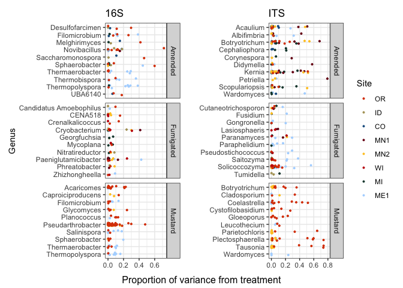
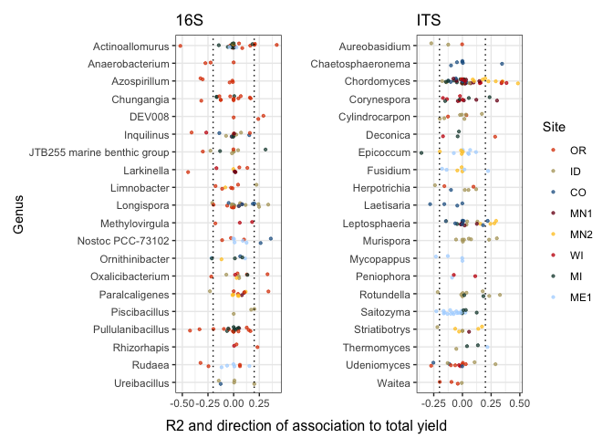
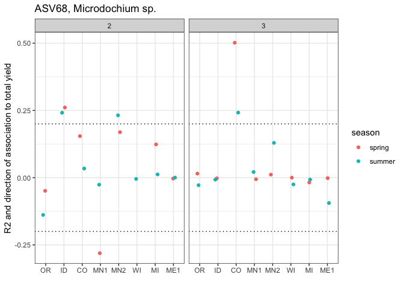

variance visuals II
================
Scott Klasek
15 May, 2025

## Purpose

Make more plots showing variance in ASVs by treatment, correlations with
yields, and how these patterns break down across space (site) and time
(rotation, season).

## Setup

#### load libraries

``` r
packages <- c("tidyverse", "phyloseq", "speedyseq", "patchwork", "NatParksPalettes", "hexbin", "compositions")
invisible(lapply(packages, require, character.only = TRUE))
```

    ## Loading required package: tidyverse

    ## ── Attaching core tidyverse packages ──────────────────────── tidyverse 2.0.0 ──
    ## ✔ dplyr     1.1.4     ✔ readr     2.1.5
    ## ✔ forcats   1.0.0     ✔ stringr   1.5.1
    ## ✔ ggplot2   3.5.1     ✔ tibble    3.2.1
    ## ✔ lubridate 1.9.4     ✔ tidyr     1.3.1
    ## ✔ purrr     1.0.4     
    ## ── Conflicts ────────────────────────────────────────── tidyverse_conflicts() ──
    ## ✖ dplyr::filter() masks stats::filter()
    ## ✖ dplyr::lag()    masks stats::lag()
    ## ℹ Use the conflicted package (<http://conflicted.r-lib.org/>) to force all conflicts to become errors
    ## Loading required package: phyloseq
    ## 
    ## Loading required package: speedyseq
    ## 
    ## 
    ## Attaching package: 'speedyseq'
    ## 
    ## 
    ## The following objects are masked from 'package:phyloseq':
    ## 
    ##     filter_taxa, plot_bar, plot_heatmap, plot_tree, psmelt, tax_glom,
    ##     tip_glom, transform_sample_counts
    ## 
    ## 
    ## Loading required package: patchwork
    ## 
    ## Loading required package: NatParksPalettes
    ## 
    ## Loading required package: hexbin
    ## 
    ## Loading required package: compositions
    ## 
    ## Welcome to compositions, a package for compositional data analysis.
    ## Find an intro with "? compositions"
    ## 
    ## 
    ## 
    ## Attaching package: 'compositions'
    ## 
    ## 
    ## The following objects are masked from 'package:stats':
    ## 
    ##     anova, cor, cov, dist, var
    ## 
    ## 
    ## The following object is masked from 'package:graphics':
    ## 
    ##     segments
    ## 
    ## 
    ## The following objects are masked from 'package:base':
    ## 
    ##     %*%, norm, scale, scale.default

#### load data

``` r
### variancePartition objects from 39.Rmd with MEAN PERCENT ABUNDANCE AND OCCUPANCY FOR EACH ASV 
bact.var.abund.occ.df <- read.csv(file = "/Users/klas0061/Desktop/UMN/treatment_variance_modeling/16S.ASV.abund.occ.var.all.sites.csv")
its.var.abund.occ.df <- read.csv(file = "/Users/klas0061/Desktop/UMN/treatment_variance_modeling/ITS.ASV.abund.occ.var.all.sites.csv")

## lm results of ASVs with yield, from 43.Rmd (not filtered by p < 0.05)
its.yield.all.df <- read.csv(file = "/Users/klas0061/Desktop/UMN/treatment_variance_modeling/its.yield.lm.results.UNFILTERED.txt")
bact.yield.all.df <- read.csv(file = "/Users/klas0061/Desktop/UMN/treatment_variance_modeling/bact.yield.lm.results.UNFILTERED.txt")

### phyloseq objects across all sites
its.all.ps <- readRDS(file = "/Users/klas0061/Desktop/UMN/phyloseqs/all_obj1_by_site/all.ITS.ps")
bact.all.ps <- readRDS(file = "/Users/klas0061/Desktop/UMN/phyloseqs/all_obj1_by_site/all.16S.ps") # this is HUGE

### import phyloseq object lists from 39.Rmd, where metadata has been added already
# lists of phyloseq objects
# these include metadata updated in doc 39.Rmd
# they are ALL years, ASVs and samples NOT subsetted or transformed
its.ps.list <- readRDS(file = "/Users/klas0061/Desktop/UMN/treatment_variance_modeling/its.ps.list")
bact.ps.list <- readRDS(file = "/Users/klas0061/Desktop/UMN/treatment_variance_modeling/bact.ps.list")

### treatment and yield associated ASVs
its.asvs <- read.csv(file = "/Users/klas0061/Desktop/UMN/treatment_variance_modeling/its.asvs.treatment.and.yield.associated.csv")
bact.asvs <- read.csv(file = "/Users/klas0061/Desktop/UMN/treatment_variance_modeling/bact.asvs.treatment.and.yield.associated.csv")
```

#### define functions

``` r
# add_taxa takes a dataframe containing a column "ASV" with ASV numbers
# it adds taxonomy to the ASVs and also returns a closest_tax column showing the most specific taxonomy for each ASV
add_taxa <- function(df, ps){
  
  # get tax_table from all ITS data
  df2 <- data.frame(ps@tax_table)
  
  # add ASV numbers to it
  df2$ASV <- rownames(df2)
  
  # left-join it by ASV with the input dataframe
  df3 <- left_join(df, df2, by = "ASV")
  
  # add the closest taxonomic level specified as a new column
  df3$closest_tax <- ifelse(!is.na(df3$Species), paste(df3$Genus, df3$Species), 
                      ifelse(!is.na(df3$Genus), paste(df3$Genus, "sp."),     
                      ifelse(!is.na(df3$Family), paste("Fam.", df3$Family),
                      ifelse(!is.na(df3$Order), paste("Ord.", df3$Order),
                      ifelse(!is.na(df3$Class), paste("Cl.", df3$Class),
                      ifelse(!is.na(df3$Phylum), paste("Phy.", df3$Phylum),
                      NA))))))
  return(df3)
}

# drop_ghost_asvs drops ASVs that are not present in any samples- but are still kept because you've 
# subsetted samples within a larger phyloseq object. This returns the phyloseq object with the subsetted count table.
drop_ghost_asvs <- function(ps){
  
  # extract the count table from the phyloseq, with ASVs as columns
    if(taxa_are_rows(ps)){counts <- t(ps@otu_table)} else{ # write count table with ASVs as rows
    counts <- ps@otu_table
    }
  # remove empty rows corresponding to ASVs that are present in 0 samples
  counts <- counts[,colSums(counts)>0]
  
  # write the count table back in
  otu_table(ps) <- counts # drops all zero-count ASVs from the tax table and refseq as well, in contrast to 'ps@otu_table <- counts'
  return(ps)
}

# subset_occupancy drops ASVs detected in less than a certain proportion of the samples
# all it takes is a phyloseq object. it drops the ASVs below the occupancy cutoff, and moves their counts to 
# a "summing" column. Tax table now has a summing column as well. Output is a phyloseq object. 
subset_occupancy <- function(ps, occ_cutoff){
  
  # first, calculate occupancy of each ASV (proportion of samples detected in, from 0 to 1)
  occ <- vector("numeric")
    for (i in 1:ncol(ps@otu_table)) {
      occ[i] <- sum(ps@otu_table[,i] != 0)/nrow(ps@otu_table[,i])
    }
  # write ASV names
  names(occ) <- colnames(ps@otu_table)
    
  # select ASVs to keep based on occupancy 
  keep.asvs <- occ[which(occ >= (occ_cutoff))] # keep only the ASVs above the cutoff
  
  # print some useful information
  cat((length(keep.asvs)), "features are kept. \n")
  
  # subset the count table to maintain compositionality
  keep.table <- ps@otu_table[,names(keep.asvs)] # the kept ASVs, which does not include a summing column
  drop.table <- ps@otu_table[,setdiff(colnames(ps@otu_table), names(keep.asvs))] # the dropped ASVs
  summing <- rowSums(drop.table) # add up counts for dropped features to make a summing column
  keep.new <- cbind(keep.table, summing) # add new summing to the keep table
  
  # make a subsetted tax_table
  taxa <- tax_table(ps)[names(keep.asvs),] # with only the kept ASVs over the occupancy cutoff
  summing <- c("Summing", rep(NA, times = ncol(taxa)-1))
  taxa2 <- rbind(taxa, summing)
    
  # put the new count table and tax table into a new ps object
  # we must say goodbye to our refseq here because "summing" doesn't have a sequence associated with it.
  new.ps <- phyloseq(sample_data(ps),
                     otu_table(keep.new, taxa_are_rows = FALSE),
                     tax_table(taxa2))
  return(new.ps)
}

# transform_clr takes a phyloseq object and transforms the count table using a centered-log-ratio
# it spits out a phyloseq object with transformed counts.
transform_clr <- function(ps){
  counts.clr <- as.matrix(clr(ps@otu_table))
  ps.new <- phyloseq(otu_table(counts.clr, taxa_are_rows = FALSE),
                     tax_table(ps),
                     sample_data(ps))
  cat("Counts transformed with CLR. \n")
  return(ps.new)
}

# inspect_regression takes a phyloseq object (processed, subsetted, transformed) and an ASV to plot abundances of
# it returns a ggplot with linear regressions shown for both rotations.
inspect_regression <- function(ps, asv){
  
  # make a dataframe of the phyloseq count table, yield, season, and rotation
  df <- cbind(ps@otu_table[,asv], 
                 data.frame(ps@sam_data) %>% dplyr::select(Total.yield, season, rotation))
  df$rotation <- as.factor(df$rotation)
  colnames(df)[1] <- "asv_abund"
  
  # plot the linear regression, separating by rotation
  gg <- ggplot(df, aes(asv_abund, Total.yield, color = rotation))+
    geom_point()+
    geom_smooth(method = "lm")
  
  return(gg)
}
```

## Plots

### The most treatment-variable genera across sites

``` r
#### ITS
# add taxonomy to the variance dataframe and drop ME2
its.var.df <- add_taxa(its.var.abund.occ.df, its.all.ps) %>% 
  filter(site != "US")

# get genus-means of variance
its.var.df <- its.var.df %>% 
  group_by(Genus) %>% 
  mutate("mean_genus_amend_var" = mean(AmendedTRUE, na.rm=TRUE),
         "mean_genus_fumig_var" = mean(FumigatedTRUE, na.rm=TRUE),
         "mean_genus_brass_var" = mean(BrassicaTRUE, na.rm=TRUE))

# get top n genera with the highest influence from each treatment
# define that number here
num_genera <- 10

# pull those genera
top.amend.its.genera <- (its.var.df %>% 
  drop_na(AmendedTRUE) %>%                          
  dplyr::select(Genus, mean_genus_amend_var) %>% 
  group_by(Genus) %>% add_count() %>% 
  filter(n > 2) %>% 
  arrange(-mean_genus_amend_var) %>% distinct() %>% pull(Genus))[1:num_genera]

top.fumig.its.genera <- (its.var.df %>% 
  drop_na(FumigatedTRUE) %>%                          
  dplyr::select(Genus, mean_genus_fumig_var) %>% 
  group_by(Genus) %>% add_count() %>% 
  filter(n > 2) %>% 
  arrange(-mean_genus_fumig_var) %>% distinct() %>% pull(Genus))[1:num_genera]

top.brass.its.genera <- (its.var.df %>% 
  drop_na(BrassicaTRUE) %>%                          
  dplyr::select(Genus, mean_genus_brass_var) %>% 
  group_by(Genus) %>% add_count() %>% 
  filter(n > 2) %>% 
  arrange(-mean_genus_brass_var) %>% distinct() %>% pull(Genus))[1:num_genera]

# select only these genera from their corresponding treatments
its.var.amd <- its.var.df %>% 
  filter(Genus %in% top.amend.its.genera) %>%
  add_column(treatment = "Amended") %>% 
  dplyr::rename(trt_influence = AmendedTRUE) %>% 
  dplyr::select(-FumigatedTRUE, -BrassicaTRUE)

its.var.fum <- its.var.df %>% 
  filter(Genus %in% top.fumig.its.genera) %>%
  add_column(treatment = "Fumigated") %>% 
  dplyr::rename(trt_influence = FumigatedTRUE)%>% 
  dplyr::select(-AmendedTRUE, -BrassicaTRUE)

its.var.brs <- its.var.df %>% 
  filter(Genus %in% top.brass.its.genera) %>%
  add_column(treatment = "Brassica") %>% 
  dplyr::rename(trt_influence = BrassicaTRUE)%>% 
  dplyr::select(-FumigatedTRUE, -AmendedTRUE)

# bind the three dataframes together
its.var.top.genera <- rbind(its.var.amd, its.var.fum, its.var.brs)
its.var.top.genera$site <- factor(its.var.top.genera$site, 
                                  levels = c("OR", "ID", "CO", "MN", "ND", "WI", "MI", "ME"),
                                  labels = c("OR", "ID", "CO", "MN1", "MN2", "WI", "MI", "ME1"))

# change Brassica label to Mustard
its.var.top.genera$treatment[which(its.var.top.genera$treatment == "Brassica")] <- "Mustard"

# plot many genera
cols.order <- c("#DC4405", "#B3A369", "#236192", "#7A0019", "#FFC72A", "#C5050C", "#18453B", "#B0D7FF")
its.trt.genera.gg <- its.var.top.genera %>% 
  drop_na(trt_influence) %>% 
  ggplot(aes(Genus, trt_influence, color = site))+
    geom_jitter(width = 0.2, size = 0.7)+
    facet_grid(treatment~., scales = "free", space = "free")+
    coord_flip()+
    scale_x_discrete("", limits = rev)+ 
    scale_y_continuous("")+
    scale_color_manual("Site", values = cols.order)+
    theme_bw()+ggtitle("ITS")

#### 16S  
# add taxonomy to the variance dataframe and drop ME2
bact.var.df <- add_taxa(bact.var.abund.occ.df, bact.all.ps) %>% 
  filter(site != "US")

# get genus-means of variance
bact.var.df <- bact.var.df %>% 
  group_by(Genus) %>% 
  mutate("mean_genus_amend_var" = mean(AmendedTRUE, na.rm=TRUE),
         "mean_genus_fumig_var" = mean(FumigatedTRUE, na.rm=TRUE),
         "mean_genus_brass_var" = mean(BrassicaTRUE, na.rm=TRUE))

# get top 10 genera with the highest influence from each treatment
top.amend.bact.genera <- (bact.var.df %>% 
  drop_na(AmendedTRUE) %>%                          
  dplyr::select(Genus, mean_genus_amend_var) %>% 
  group_by(Genus) %>% add_count() %>% 
  filter(n > 2) %>% 
  arrange(-mean_genus_amend_var) %>% distinct() %>% pull(Genus))[1:num_genera]

top.fumig.bact.genera <- (bact.var.df %>% 
  drop_na(FumigatedTRUE) %>%                          
  dplyr::select(Genus, mean_genus_fumig_var) %>% 
  group_by(Genus) %>% add_count() %>% 
  filter(n > 2) %>% 
  arrange(-mean_genus_fumig_var) %>% distinct() %>% pull(Genus))[1:num_genera]

top.brass.bact.genera <- (bact.var.df %>% 
  drop_na(BrassicaTRUE) %>%                          
  dplyr::select(Genus, mean_genus_brass_var) %>% 
  group_by(Genus) %>% add_count() %>% 
  filter(n > 2) %>% 
  arrange(-mean_genus_brass_var) %>% distinct() %>% pull(Genus))[1:num_genera]

# select only these genera from their corresponding treatments
bact.var.amd <- bact.var.df %>% 
  filter(Genus %in% top.amend.bact.genera) %>%
  add_column(treatment = "Amended") %>% 
  dplyr::rename(trt_influence = AmendedTRUE) %>% 
  dplyr::select(-FumigatedTRUE, -BrassicaTRUE)

bact.var.fum <- bact.var.df %>% 
  filter(Genus %in% top.fumig.bact.genera) %>%
  add_column(treatment = "Fumigated") %>% 
  dplyr::rename(trt_influence = FumigatedTRUE)%>% 
  dplyr::select(-AmendedTRUE, -BrassicaTRUE)

bact.var.brs <- bact.var.df %>% 
  filter(Genus %in% top.brass.bact.genera) %>%
  add_column(treatment = "Brassica") %>% 
  dplyr::rename(trt_influence = BrassicaTRUE)%>% 
  dplyr::select(-FumigatedTRUE, -AmendedTRUE)

# bind the three dataframes together
bact.var.top.genera <- rbind(bact.var.amd, bact.var.fum, bact.var.brs)
bact.var.top.genera$site <- factor(bact.var.top.genera$site, 
                                  levels = c("OR", "ID", "CO", "MN", "ND", "WI", "MI", "ME"),
                                  labels = c("OR", "ID", "CO", "MN1", "MN2", "WI", "MI", "ME1"))

# change Brassica label to Mustard
bact.var.top.genera$treatment[which(bact.var.top.genera$treatment == "Brassica")] <- "Mustard"

# plot many genera
bact.trt.genera.gg <- bact.var.top.genera %>% 
  drop_na(trt_influence) %>% 
  ggplot(aes(Genus, trt_influence, color = site))+
    geom_jitter(width = 0.2, size = 0.7)+
    facet_grid(treatment~., scales = "free", space = "free")+
    coord_flip()+
    scale_x_discrete("Genus", limits = rev)+ 
    scale_y_continuous("")+
    scale_color_manual("Site", values = cols.order)+
    theme_bw()+ggtitle("16S")

### final plot
bact.trt.genera.gg + its.trt.genera.gg + plot_layout(guides = "collect")
grid::grid.draw(grid::textGrob("Proportion of variance from treatment", x = 0.5, y = 0.03))
```

<!-- -->

### Yield associations by site, time (season and rotation), and Genus.

``` r
### ITS
# factor order by site
its.yield.all.df$site <- factor(its.yield.all.df$site, 
                            levels = c("OR", "ID", "CO", "MN", "ND", "WI", "MI", "ME"),
                            labels = c("OR", "ID", "CO", "MN1", "MN2", "WI", "MI", "ME1"))

# filter out the not-so-great regressions by R2 >= 0.2,
# and plot the count of the good regressions by site, season, and rotation. 
its.yield.counts.gg <- its.yield.all.df %>% 
  filter(lm_mult_r_sq >= 0.2 & p < 0.05) %>% 
  ggplot(aes(season, fill = site))+
    geom_bar(position = "dodge")+
    facet_grid(~rotation)+  
    scale_fill_manual("Site", values = cols.order)+
    scale_x_discrete("")+
    scale_y_continuous("")+
    ggtitle("ITS")+
    theme_bw()

# distribution of lm R2s INCLUDING all the non-significant ones
its.yield.strengths.gg <- its.yield.all.df %>% 
   mutate("r2_sign" = sign(estimate)*lm_mult_r_sq) %>%   
  ggplot(aes(season, r2_sign))+ 
    geom_violin()+ 
    facet_grid(~rotation)+  
    scale_y_continuous("", limits = c(-0.8, 0.8))+
    scale_x_discrete("")+
    theme_bw()

its.anova.df <- its.yield.all.df %>% 
  mutate("r2_sign" = sign(estimate)*lm_mult_r_sq) %>% 
  dplyr::select(site, season, rotation, r2_sign)
summary(aov(r2_sign ~ site + season + rotation, data = its.anova.df)) # nope, nothing significant
```

    ##                Df Sum Sq  Mean Sq F value Pr(>F)
    ## site            7   0.07 0.010016   1.712  0.101
    ## season          1   0.01 0.012894   2.204  0.138
    ## rotation        1   0.00 0.001262   0.216  0.642
    ## Residuals   21550 126.06 0.005850

``` r
# take the 20 most strongly associated genera (positively OR negatively) 
# get mean R2 of each Genus, number of regressions to each Genus, filter out genera with < 2 hits
strongest.its.genera.yield <- (its.yield.all.df %>% 
  group_by(Genus) %>% 
  mutate(mean_r2_by_genus = mean(lm_mult_r_sq)) %>% 
  add_count(Genus) %>% 
  dplyr::select(Genus, mean_r2_by_genus, n) %>% distinct() %>%
  filter(n > 2) %>% 
  arrange(-mean_r2_by_genus) %>% pull(Genus))[1:20]

its.yield.genera.gg <- its.yield.all.df %>% 
  filter(Genus %in% strongest.its.genera.yield) %>% 
  mutate("r2_sign" = sign(estimate)*lm_mult_r_sq) %>%
  ggplot(aes(Genus, r2_sign, color = site))+
    geom_jitter(width = 0.15, size = 0.8, alpha = 0.7)+
    coord_flip()+
    scale_x_discrete("20 most yield-associated genera", limits = rev)+ # guide = guide_axis(angle = 60)
    scale_y_continuous("R2 and direction of association to total yield")+
    scale_color_manual("Site", values = cols.order)+
    geom_hline(yintercept = c(-0.2, 0.2), linetype = "dotted")+
    theme_bw()

# plot it
(its.yield.counts.gg + its.yield.strengths.gg) / its.yield.genera.gg
```

<!-- -->

``` r
### 16S
# factor order by site
bact.yield.all.df$site <- factor(bact.yield.all.df$site, 
                            levels = c("OR", "ID", "CO", "MN", "ND", "WI", "MI", "ME"),
                            labels = c("OR", "ID", "CO", "MN1", "MN2", "WI", "MI", "ME1"))

# filter out the not-so-great regressions by R2 >= 0.2,
# and plot the count of the good regressions by site, season, and rotation. 
bact.yield.counts.gg <- bact.yield.all.df %>% 
  filter(lm_mult_r_sq >= 0.2 & p < 0.05) %>% 
  ggplot(aes(season, fill = site))+
    geom_bar(position = "dodge")+
    facet_grid(~rotation)+  
    scale_fill_manual("Site", values = cols.order)+
    scale_x_discrete("")+
    scale_y_continuous("Count of significant associations\n to total yields")+
    ggtitle("16S")+
    theme_bw()

# distribution of lm R2s INCLUDING all the non-significant ones
bact.yield.strengths.gg <- bact.yield.all.df %>% 
   mutate("r2_sign" = sign(estimate)*lm_mult_r_sq) %>%   
  ggplot(aes(season, r2_sign))+ 
    geom_violin()+ 
    facet_grid(~rotation)+  
    scale_y_continuous("Distribution of all \nR2 values to total yields", limits = c(-0.8, 0.8))+
    scale_x_discrete("")+
    theme_bw()

bact.anova.df <- bact.yield.all.df %>% 
  mutate("r2_sign" = sign(estimate)*lm_mult_r_sq) %>% 
  dplyr::select(site, season, rotation, r2_sign)
summary(aov(r2_sign ~ site + season + rotation, data = bact.anova.df)) # nope, nothing significant
```

    ##                 Df Sum Sq  Mean Sq F value Pr(>F)
    ## site             7    0.0 0.003667   0.502  0.833
    ## season           1    0.0 0.007326   1.004  0.316
    ## rotation         1    0.0 0.004665   0.639  0.424
    ## Residuals   121760  888.6 0.007298

``` r
# take the 20 most strongly associated genera (positively OR negatively) 
# get mean R2 of each Genus, number of regressions to each Genus, filter out genera with < 2 hits
strongest.bact.genera.yield <- (bact.yield.all.df %>% 
  group_by(Genus) %>% 
  mutate(mean_r2_by_genus = mean(lm_mult_r_sq)) %>% 
  add_count(Genus) %>% 
  dplyr::select(Genus, mean_r2_by_genus, n) %>% distinct() %>%
  filter(n > 2) %>% 
  arrange(-mean_r2_by_genus) %>% pull(Genus))[1:20]

bact.yield.genera.gg <- bact.yield.all.df %>% 
  filter(Genus %in% strongest.bact.genera.yield) %>% 
  mutate("r2_sign" = sign(estimate)*lm_mult_r_sq) %>%
  ggplot(aes(Genus, r2_sign, color = site))+
    geom_jitter(width = 0.15, size = 0.8, alpha = 0.7)+
    coord_flip()+
    scale_x_discrete("20 most yield-associated genera", limits = rev)+ # guide = guide_axis(angle = 60)
    scale_y_continuous("R2 and direction of association to total yield")+
    scale_color_manual("Site", values = cols.order)+
    geom_hline(yintercept = c(-0.2, 0.2), linetype = "dotted")+
    theme_bw()

# plot it
(bact.yield.counts.gg + bact.yield.strengths.gg) / bact.yield.genera.gg
```

<!-- -->
There was no difference in the distribution of R2 values by site, so I
didn’t distinguish the sites.

### Yield-ASVs as a main figure and counts/distributions as a supplemental

``` r
# the most yield-associated bacterial and eukaryotic taxa
bact.yield.genera.2.gg <- bact.yield.genera.gg+
  ggtitle("16S")+
  scale_x_discrete("Genus", limits = rev)+
  scale_y_continuous("")
```

    ## Scale for x is already present.
    ## Adding another scale for x, which will replace the existing scale.
    ## Scale for y is already present.
    ## Adding another scale for y, which will replace the existing scale.

``` r
its.yield.genera.2.gg <- its.yield.genera.gg+
  ggtitle("ITS")+
  scale_x_discrete("", limits = rev)+
  scale_y_continuous("")
```

    ## Scale for x is already present.
    ## Adding another scale for x, which will replace the existing scale.
    ## Scale for y is already present.
    ## Adding another scale for y, which will replace the existing scale.

``` r
bact.yield.genera.2.gg + its.yield.genera.2.gg + plot_layout(guides = "collect")
grid::grid.draw(grid::textGrob("R2 and direction of association to total yield", x = 0.5, y = 0.03))
```

<!-- -->

``` r
# counts and R2 distributions of yield-associated bact and euk taxa
counts.and.dists.all.gg <- (bact.yield.counts.gg + its.yield.counts.gg) / (bact.yield.strengths.gg + its.yield.strengths.gg) + plot_layout(guides = "collect")
counts.and.dists.all.gg
```

<!-- -->

### Are there different proportions of yield-associated ASVs between ITS and 16S?

``` r
### proportions of ASVs and regressions that were deemed yield-associated, by domain

# ITS
n.its.asvs <- length(unique(its.yield.all.df %>% pull(ASV)))
n.its.yield.asvs <- length(unique(its.yield.all.df %>% 
  filter(lm_mult_r_sq >= 0.25 & p < 0.05) %>% pull(ASV)))
cat(round((n.its.yield.asvs / n.its.asvs) * 100, 1), "% of ITS ASVs were yield-associated in at least one site/time/season/rotation.\n")
```

    ## 6.2 % of ITS ASVs were yield-associated in at least one site/time/season/rotation.

``` r
its.hits <- nrow(its.yield.all.df %>% filter(lm_mult_r_sq >= 0.25 & p < 0.05)) / nrow(its.yield.all.df)
cat(round(100*its.hits, 1), "% of ITS regressions were yield-associated. \n")
```

    ## 1.6 % of ITS regressions were yield-associated.

``` r
# 16S
n.bact.asvs <- length(unique(bact.yield.all.df %>% pull(ASV)))
n.bact.yield.asvs <- length(unique(bact.yield.all.df %>% 
  filter(lm_mult_r_sq >= 0.25 & p < 0.05) %>% pull(ASV)))
cat(round((n.bact.yield.asvs / n.bact.asvs) * 100, 1), "% of 16S ASVs were yield-associated in at least one site/time/season/rotation.\n")
```

    ## 8.3 % of 16S ASVs were yield-associated in at least one site/time/season/rotation.

``` r
bact.hits <- nrow(bact.yield.all.df %>% filter(lm_mult_r_sq >= 0.25 & p < 0.05)) / nrow(bact.yield.all.df)
cat(round(100*bact.hits, 1), "% of 16S regressions were yield-associated. \n")
```

    ## 2 % of 16S regressions were yield-associated.

``` r
### histogram of yield-R2 values by domain
hist.df <- data.frame("yield_r2" = c(its.yield.all.df$lm_mult_r_sq, 
                                     bact.yield.all.df$lm_mult_r_sq),
                      "domain" = c(rep("ITS", times = nrow(its.yield.all.df)), 
                                   rep("16S", times = nrow(bact.yield.all.df))))

hist.df %>% ggplot(aes(log10(yield_r2), fill = domain))+
  geom_histogram(alpha = 0.4, binwidth = 0.1)+theme_bw()
```

<!-- -->

``` r
# hot dang they are different, bacteria are slightly more yield-associated
hist.df$log_yield_r2 <- log10(hist.df$yield_r2)

wilcox.test(log_yield_r2 ~ domain, data = hist.df)
```

    ## 
    ##  Wilcoxon rank sum test with continuity correction
    ## 
    ## data:  log_yield_r2 by domain
    ## W = 1339859123, p-value = 1.213e-06
    ## alternative hypothesis: true location shift is not equal to 0

``` r
summary(bact.yield.all.df$lm_mult_r_sq)
```

    ##     Min.  1st Qu.   Median     Mean  3rd Qu.     Max. 
    ## 0.000000 0.005214 0.023526 0.050332 0.067522 0.717584

``` r
summary(its.yield.all.df$lm_mult_r_sq)
```

    ##    Min. 1st Qu.  Median    Mean 3rd Qu.    Max. 
    ## 0.00000 0.00503 0.02216 0.04596 0.06232 0.57575

``` r
# what about R2s multiplied by the sign of the yield association?
its.r2signs <- its.yield.all.df %>% mutate("r2_sign" = sign(estimate)*lm_mult_r_sq) %>% pull(r2_sign)
bact.r2signs <- bact.yield.all.df %>% mutate("r2_sign" = sign(estimate)*lm_mult_r_sq) %>% pull(r2_sign)  
hist.df2 <- data.frame("yield_r2_sign" = c(its.r2signs, bact.r2signs),
                       "domain" = c(rep("ITS", times = nrow(its.yield.all.df)), 
                                   rep("16S", times = nrow(bact.yield.all.df))))
wilcox.test(yield_r2_sign ~ domain, data = hist.df2) # NO
```

    ## 
    ##  Wilcoxon rank sum test with continuity correction
    ## 
    ## data:  yield_r2_sign by domain
    ## W = 1.316e+09, p-value = 0.5492
    ## alternative hypothesis: true location shift is not equal to 0

### ASVs that are highly variable with yields at different sites/times

``` r
# use this to find ASVs that have a wide range in yield-associations
view(its.yield.all.df %>% 
  group_by(ASV) %>%
  add_count() %>% 
  mutate(mean_r2 = mean(lm_mult_r_sq),
         r2_sign = sign(estimate)*lm_mult_r_sq,
         range_r2 = max(r2_sign) - min(r2_sign),
         mean_r2_sign = mean(sign(estimate)*lm_mult_r_sq)) %>% 
  dplyr::select(ASV, Kingdom, Phylum, Class, Order, Family, Genus, Species, closest_tax, 
                mean_r2, range_r2, mean_r2_sign, n) %>% distinct() %>% 
  filter(n > 2))

# plot the ASV that has the largest range in R2 values
its.yield.all.df %>% 
  filter(ASV == "ASV68") %>% 
  mutate(r2_sign = sign(estimate)*lm_mult_r_sq) %>% 
  ggplot(aes(site, r2_sign, color = season))+
    geom_jitter(width = 0.15)+
    facet_grid(~rotation)+
    scale_y_continuous("R2 and direction of association to total yield")+
    scale_x_discrete("")+
    ggtitle("ASV68, Microdochium sp.")+
    geom_hline(yintercept = c(-0.2, 0.2), linetype = "dotted")+
    theme_bw()
```

<!-- -->

``` r
# now for 16S
view(bact.yield.all.df %>% 
  group_by(ASV) %>%
  add_count() %>% 
  mutate(mean_r2 = mean(lm_mult_r_sq),
         r2_sign = sign(estimate)*lm_mult_r_sq,
         range_r2 = max(r2_sign) - min(r2_sign),
         mean_r2_sign = mean(sign(estimate)*lm_mult_r_sq)) %>% 
  dplyr::select(ASV, Kingdom, Phylum, Class, Order, Family, Genus, Species, closest_tax, 
                mean_r2, range_r2, mean_r2_sign, n) %>% distinct() %>% 
  filter(n > 2))

# plot the ASV that has the largest range in R2 values
bact.yield.all.df %>% 
  filter(ASV == "ASV764") %>% 
  mutate(r2_sign = sign(estimate)*lm_mult_r_sq) %>% 
  ggplot(aes(site, r2_sign, color = season))+
    geom_jitter(width = 0.15)+
    facet_grid(~rotation)+
    scale_y_continuous("R2 and direction of association to total yield")+
    scale_x_discrete("")+
    ggtitle("ASV764, Chloroflexi Class Gitt-GS-136")+
    geom_hline(yintercept = c(-0.2, 0.2), linetype = "dotted")+
    theme_bw()
```

<!-- -->

``` r
# better yet, plot ASV764 regressions in OR 3-yr rotation, showing by how they change
ps1 <- subset_samples(bact.ps.list[["OR.16S.ps"]], year == 22 & state == "OR" & rotation == 3) %>% 
    drop_ghost_asvs() %>%
    subset_occupancy(0.5) %>% 
    transform_clr() 
```

    ## 4527 features are kept. 
    ## Counts transformed with CLR.

``` r
df1 <- cbind(ps1@otu_table[,"ASV764"], 
               data.frame(ps1@sam_data) %>% dplyr::select(Total.yield, season))
colnames(df1)[1] <- "asv_abund"

# plot the linear regression, separating by season
bact.764.gg <- ggplot(df1, aes(asv_abund, Total.yield))+
  geom_point()+
  facet_grid(~season)+
  scale_x_continuous("ASV764 CLR-transformed abundance in OR, 3-yr rotation")+
  geom_smooth(method = "lm")+theme_bw()
bact.764.gg
```

    ## `geom_smooth()` using formula = 'y ~ x'

<!-- -->
Bacterial ASV764 in OR 3-yr rotations: spring abundance was positively
associated with yields, but summer abundance was negative.
Interestingly, the mean CLR-abundance of this ASV didn’t change between
spring and summer. No obvious pattern of increase/decrease in abundance
between spring and summer either.

### In treatments that affected yields, which ASVs were both treatment- and yield-associated?

Recall these were Control \< both Fumigated and Amended for OR 2-yr and
ID 3-yr, and Control \< Amended for ME1 3-yr.  
Import these files, then see which of these treatments that had yield
increases contained these trt-yield ASVs *in the corresponding
rotations*.

``` r
# search for 16S ASVs: Idaho
bact.amended.asvs <- bact.asvs %>% filter(treatment == "Amended") %>% pull(ASV)
bact.yield.all.df %>% 
  filter(ASV %in% bact.amended.asvs & site == "ID" & rotation == 3 & p < 0.05 & lm_mult_r_sq > 0.2 & estimate > 0)

# OR amendment-associated bacterial ASVs that are ON the figure but are from 3-yr rotations and NOT associated with the 
# statistically significant 2-yr rotation increase in yield. (There was no overlap between the 2-yr and 3-yr ASVs here)
bact.yield.all.df %>% 
  filter(ASV %in% bact.amended.asvs & site == "OR" & rotation == 3 & p < 0.05 & lm_mult_r_sq > 0.2)
```

Amended, ID 3-yr rotation: no ITS, 8 16S, which can all be seen on the
treatment-yield-associated ASV figure. 7 were positive and one negative,
and associations were mostly for summer. Interestingly, the ID 2-yr
amendment treatment didn’t have any such associated taxa.

Fumigated, ID 3-yr rotation: no ITS, one 16S (Chryseolina, seen on the
treatment-yield-associated ASV figure) which was negatively associated
with yields in spring and summer. I suppose this would only be
biologically meaningful if it were more highly abundant in the control
vs the Fumigated group.

Amended, OR 2-yr rotation: no ITS, several 16S both positively and
negatively, mostly in summer. However there ARE some yield and amendment
associated ASVs from the OR 3-yr rotations are also present on the
figure.

Fumigated, OR 2-yr rotation: no ITS, 16S ASV7460 Fam. Roseiflexaceae is
POSITIVE in spring. Seen in figure.

Nothing in ME1.

So to recap what I’ve done here: Where treatments increased yields (in a
certain treatment/site/rotation combo) I looked to see if there were any
ASVs that were impacted by the treatment and positively associated with
yields. There was one ASV each implicated in fumigated treatments that
statistically increased yields, and a handful of bacteria in amended
ones.

## Table of treatment- and/or yield-associated ASVs, for 16S and ITS

``` r
### ITS
# number of ITS ASVs evaluated for treatment and yield associations = the number of ASVs evaluated for yield-associations
its.all.eval.asvs <- unique(its.yield.all.df %>% pull(ASV))

# all ITS ASVs associated with any treatment in any field site
its.all.trt.asvs <- unique(its.var.df %>% 
  filter(AmendedTRUE >= 0.1 | FumigatedTRUE >= 0.1 | BrassicaTRUE >= 0.1) %>% 
  pull(ASV))

# all ITS yield-associated ASVs
its.yield.asvs <- unique(its.yield.all.df %>% filter(lm_mult_r_sq >= 0.2 & p < 0.05) %>% pull(ASV))

# stats
length(its.yield.asvs) / length(its.all.eval.asvs) # 11.9% of ITS ASVs were yield-associated
```

    ## [1] 0.1188369

``` r
length(its.all.trt.asvs) / length(its.all.eval.asvs) # 12.6% of ITS ASVs were treatment-associated (though this is an overestimate because a lot MORE ASVs were evaluated for treatment-associations)
```

    ## [1] 0.1262115

``` r
length(its.all.trt.asvs) / length(unique(its.var.df %>% pull(ASV))) # to be more fair, it's more like 5.8% of ASVs are treatment-influenced
```

    ## [1] 0.05818358

``` r
length(intersect(its.yield.asvs, its.all.trt.asvs)) / length(its.all.eval.asvs) # 3.1% were treatment-and-yield
```

    ## [1] 0.03076275

``` r
### 16S
# number of bact ASVs evaluated for treatment and yield associations = the number of ASVs evaluated for yield-associations
bact.all.eval.asvs <- unique(bact.yield.all.df %>% pull(ASV))

# all bact ASVs associated with any treatment in any field site
bact.all.trt.asvs <- unique(bact.var.df %>% 
  filter(AmendedTRUE >= 0.1 | FumigatedTRUE >= 0.1 | BrassicaTRUE >= 0.1) %>% 
  pull(ASV))

# all bact yield-associated ASVs
bact.yield.asvs <- unique(bact.yield.all.df %>% filter(lm_mult_r_sq >= 0.2 & p < 0.05) %>% pull(ASV))

# stats
length(bact.yield.asvs) / length(bact.all.eval.asvs) # 13.2% of bact ASVs were yield-associated
```

    ## [1] 0.1320345

``` r
length(bact.all.trt.asvs) / length(bact.all.eval.asvs) # 12.5% of bact ASVs were treatment-associated (though this is an overestimate because a lot MORE ASVs were evaluated for treatment-associations)
```

    ## [1] 0.1251473

``` r
length(bact.all.trt.asvs) / length(unique(bact.var.df %>% pull(ASV))) # to be more fair, it's more like 4.0% of ASVs are treatment-influenced
```

    ## [1] 0.03966244

``` r
length(intersect(bact.yield.asvs, bact.all.trt.asvs)) / length(bact.all.eval.asvs) # 2.7% were treatment-and-yield
```

    ## [1] 0.02695934

## Conclusions

Made more figures, which showed how variable treatment and yield
associations can be across field sites for bacterial and fungal genera.

Narrowed down the ASVs that might be most highly responsible for
increasing yields through treatments. In Oregon and Idaho, soil organic
amendments and different rotation lengths seem to have changed the
abundances of certain yield-associated bacterial ASVs to increase
overall yields. These hypotheses can be tested through SEM, which will
be the focus of the next document.

#### session info

``` r
sessionInfo()
```

    ## R version 4.4.3 (2025-02-28)
    ## Platform: x86_64-apple-darwin20
    ## Running under: macOS Sonoma 14.7.5
    ## 
    ## Matrix products: default
    ## BLAS:   /Library/Frameworks/R.framework/Versions/4.4-x86_64/Resources/lib/libRblas.0.dylib 
    ## LAPACK: /Library/Frameworks/R.framework/Versions/4.4-x86_64/Resources/lib/libRlapack.dylib;  LAPACK version 3.12.0
    ## 
    ## locale:
    ## [1] en_US.UTF-8/en_US.UTF-8/en_US.UTF-8/C/en_US.UTF-8/en_US.UTF-8
    ## 
    ## time zone: America/Chicago
    ## tzcode source: internal
    ## 
    ## attached base packages:
    ## [1] stats     graphics  grDevices utils     datasets  methods   base     
    ## 
    ## other attached packages:
    ##  [1] compositions_2.0-8     hexbin_1.28.5          NatParksPalettes_0.2.0
    ##  [4] patchwork_1.3.0        speedyseq_0.5.3.9021   phyloseq_1.50.0       
    ##  [7] lubridate_1.9.4        forcats_1.0.0          stringr_1.5.1         
    ## [10] dplyr_1.1.4            purrr_1.0.4            readr_2.1.5           
    ## [13] tidyr_1.3.1            tibble_3.2.1           ggplot2_3.5.1         
    ## [16] tidyverse_2.0.0       
    ## 
    ## loaded via a namespace (and not attached):
    ##  [1] ade4_1.7-23             tidyselect_1.2.1        farver_2.1.2           
    ##  [4] Biostrings_2.74.1       fastmap_1.2.0           tensorA_0.36.2.1       
    ##  [7] digest_0.6.36           timechange_0.3.0        lifecycle_1.0.4        
    ## [10] cluster_2.1.8           survival_3.8-3          magrittr_2.0.3         
    ## [13] compiler_4.4.3          rlang_1.1.4             tools_4.4.3            
    ## [16] igraph_2.1.4            utf8_1.2.4              yaml_2.3.8             
    ## [19] data.table_1.17.0       knitr_1.47              labeling_0.4.3         
    ## [22] plyr_1.8.9              withr_3.0.2             BiocGenerics_0.52.0    
    ## [25] grid_4.4.3              stats4_4.4.3            fansi_1.0.6            
    ## [28] multtest_2.62.0         biomformat_1.34.0       colorspace_2.1-1       
    ## [31] Rhdf5lib_1.28.0         scales_1.3.0            iterators_1.0.14       
    ## [34] MASS_7.3-64             cli_3.6.3               rmarkdown_2.27         
    ## [37] vegan_2.6-10            crayon_1.5.3            generics_0.1.3         
    ## [40] robustbase_0.99-4-1     rstudioapi_0.17.1       httr_1.4.7             
    ## [43] reshape2_1.4.4          tzdb_0.4.0              bayesm_3.1-6           
    ## [46] ape_5.8-1               rhdf5_2.50.2            zlibbioc_1.52.0        
    ## [49] splines_4.4.3           parallel_4.4.3          XVector_0.46.0         
    ## [52] vctrs_0.6.5             Matrix_1.7-2            jsonlite_1.8.8         
    ## [55] IRanges_2.40.1          hms_1.1.3               S4Vectors_0.44.0       
    ## [58] foreach_1.5.2           glue_1.7.0              DEoptimR_1.1-3-1       
    ## [61] codetools_0.2-20        stringi_1.8.4           gtable_0.3.6           
    ## [64] GenomeInfoDb_1.42.3     UCSC.utils_1.2.0        munsell_0.5.1          
    ## [67] pillar_1.9.0            htmltools_0.5.8.1       rhdf5filters_1.18.1    
    ## [70] GenomeInfoDbData_1.2.13 R6_2.5.1                evaluate_1.0.3         
    ## [73] lattice_0.22-6          Biobase_2.66.0          highr_0.11             
    ## [76] Rcpp_1.0.14             nlme_3.1-167            permute_0.9-7          
    ## [79] mgcv_1.9-1              xfun_0.45               pkgconfig_2.0.3
