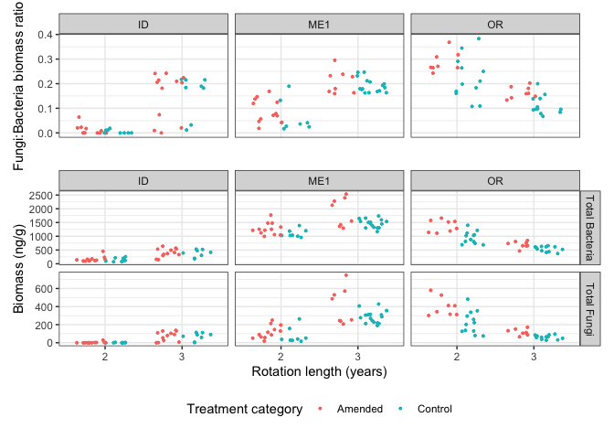
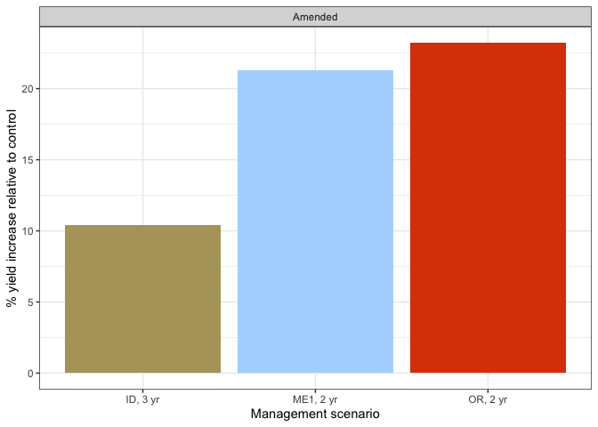
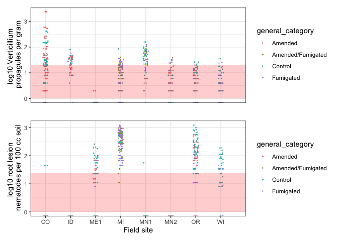
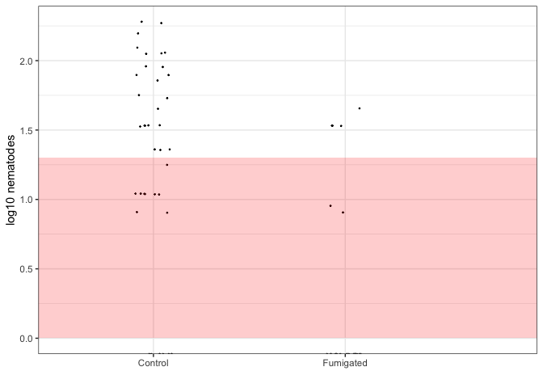

odds & ends
================
Scott Klasek
15 May, 2025

## Purpose

Put together tables and any miscellaneous information for the
treatment/yield ASV manuscript.

## Setup

#### load libraries

``` r
packages <- c("tidyverse", "phyloseq", "speedyseq", "patchwork")
invisible(lapply(packages, require, character.only = TRUE))
```

    ## Loading required package: tidyverse

    ## ── Attaching core tidyverse packages ──────────────────────── tidyverse 2.0.0 ──
    ## ✔ dplyr     1.1.4     ✔ readr     2.1.5
    ## ✔ forcats   1.0.0     ✔ stringr   1.5.1
    ## ✔ ggplot2   3.5.1     ✔ tibble    3.2.1
    ## ✔ lubridate 1.9.4     ✔ tidyr     1.3.1
    ## ✔ purrr     1.0.4     
    ## ── Conflicts ────────────────────────────────────────── tidyverse_conflicts() ──
    ## ✖ dplyr::filter() masks stats::filter()
    ## ✖ dplyr::lag()    masks stats::lag()
    ## ℹ Use the conflicted package (<http://conflicted.r-lib.org/>) to force all conflicts to become errors
    ## Loading required package: phyloseq
    ## 
    ## Loading required package: speedyseq
    ## 
    ## 
    ## Attaching package: 'speedyseq'
    ## 
    ## 
    ## The following objects are masked from 'package:phyloseq':
    ## 
    ##     filter_taxa, plot_bar, plot_heatmap, plot_tree, psmelt, tax_glom,
    ##     tip_glom, transform_sample_counts
    ## 
    ## 
    ## Loading required package: patchwork

#### load data

``` r
# jim's spreadsheet of soil chemical metadata
jim.info <- read.csv(file="/Users/klas0061/Desktop/UMN/jim_info/PSHP_ALL_obj_1_all_data_2024_02_29.csv") # import

# plfa data from doc 10
plfa <- read.csv(file = "/Users/klas0061/Desktop/UMN/PLFA/plfa.ready.for.graphing.9-02-22.csv")
```

## Reformat soil chemical metadata and add into a table with PLFA. For REPRODUCIBILITY :)

``` r
# basic clean-up stuff
colnames(jim.info) <- jim.info[1,] # fix column names (there are two header cols)
jim.info <- jim.info[2:nrow(jim.info),] # omit redundant column name 

for (i in c(2:3,5:6)){jim.info[,i] <- as.numeric(jim.info[,i])} # convert columns that should be numeric into numeric

# remove extraneous year columns that correspond to yield data only
jim.info <- jim.info[,c(1:101,103:129,131:ncol(jim.info))]

# select data columns to merge by, and to add (an example, can always select more later)
jim.info.s <- jim.info %>% dplyr::select(State, Objective, Rotation, Plot, Year, Month,
                                  pH, `Nitrate-N (ppm)`, `NH4-N (ppm)`, `P-Olsen (ppm)`, `P-Bray (ppm)`,
                                  `OM (%)`, `Solvita (ppm)`, `Total C (%)`, `Total organic C (%)`, `POX-C (ppm)`, `Treatment #`, VPPG, `Root Lesion 100 cc`)

for (i in c(7:16, 18:19)){jim.info.s[,i] <- as.numeric(jim.info.s[,i])} # again, convert columns that should be numeric into numeric

# change OR Spring 2020 month to 4 so Cultivar (whether field is in potato or not) is not NA
jim.info.s[which(jim.info.s$State=="OR" & jim.info.s$Year==20 & jim.info.s$Month=="3"),"Month"] <- "4" 

jim.info.s$Month <- as.numeric(jim.info.s$Month) # more character to numeric

# filter 2022 only
jimf <- jim.info.s %>% filter(Year == 22)

# fix summer month for MN (some were 5)
jimf[which(jimf$State == "MN" & jimf$Month == 5),"Month"] <- 6

# make sample_name row
jimf$sample_name <- paste(jimf$State, 1, jimf$Rotation, jimf$Plot, jimf$Year, jimf$Month, sep = "_") 
```

#### reformat plfa data

``` r
# select columns of interest
plfa <- plfa %>% dplyr::select(sample_name, Total.Bacteria.Biomass, Total.Fungi.Biomass, Fungi.Bacteria, 
                       treatment_description, cultivar, general_category)

# replace - with _ in sample_name
plfa$sample_name <- str_replace_all(plfa$sample_name, "-", "_")

# fix MN sample names
plfa$sample_name[startsWith(plfa$sample_name, "MN")] <- paste(plfa$sample_name[startsWith(plfa$sample_name, "MN")], "_22_6", 
                                                              sep = "")
# fix WI sample names
plfa$sample_name[startsWith(plfa$sample_name, "WI")] <- paste(substr(plfa$sample_name[startsWith(plfa$sample_name, "WI")], 1, 7),
                                                              substr(plfa$sample_name[startsWith(plfa$sample_name, "WI")], 9, 16), sep = "")
```

#### merge plfa and soil chem into one df

``` r
# left join
soil.and.plfa <- left_join(jimf, plfa, by = "sample_name")

# reorder and drop a few column names
soil.and.plfa <- soil.and.plfa %>% dplyr::select(sample_name, State, Rotation, Plot, Year, Month, pH,
                                `Nitrate-N (ppm)`, `NH4-N (ppm)`, `P-Bray (ppm)`, `OM (%)`, `Solvita (ppm)`,
                                Total.Bacteria.Biomass, Total.Fungi.Biomass, Fungi.Bacteria, general_category, 
                                treatment_description, cultivar, `Treatment #`, VPPG, `Root Lesion 100 cc`)

# fill treatment info (first across plots, then by treatment #s)
soil.and.plfa <- soil.and.plfa %>% group_by(State, Rotation, Plot, `Treatment #`) %>% 
  fill(general_category, treatment_description, cultivar, .direction = "downup") %>% ungroup()

soil.and.plfa <- soil.and.plfa %>% group_by(State, Rotation, `Treatment #`) %>% 
  fill(general_category, treatment_description, cultivar, .direction = "downup")

# now we can omit treatment #
soil.and.plfa <- soil.and.plfa %>% dplyr::select(-`Treatment #`)
```

    ## Adding missing grouping variables: `Treatment #`

``` r
# write out
write_csv(soil.and.plfa, file = "/Users/klas0061/Desktop/UMN/treatment_variance_modeling/figures_and_tables/supplemental_tables/soil_and_plfa.csv")
```

## Plot PLFA for sites where organic amendments yielded significant models, for all rotation lengths

``` r
soil.plfa.plot.df <- soil.and.plfa %>% ungroup() %>% 
  filter(State %in% c("ID", "OR", "ME") & general_category != "Fumigated" & !is.na(Total.Bacteria.Biomass)) %>% 
  dplyr::select(State, Rotation, general_category, Total.Bacteria.Biomass, Total.Fungi.Biomass, Fungi.Bacteria) %>% 
  mutate(State = case_when(State == "ME" ~ "ME1", .default = State),
         Rotation = as.character(Rotation)) %>% 
  pivot_longer(-c("State", "Rotation", "general_category"), names_to = "biomass_metric", values_to = "biomass")

ratio.gg <- soil.plfa.plot.df %>% 
  filter(biomass_metric == "Fungi.Bacteria") %>% 
  ggplot(aes(Rotation, biomass, color = general_category))+
    geom_point(position=position_jitterdodge(dodge.width=0.7), size = 0.7)+
    scale_y_continuous("Fungi:Bacteria biomass ratio")+
    scale_x_discrete("")+
    facet_grid(~ State, scales = "free")+
    theme_bw()+
    theme(legend.position = "none", axis.text.x = element_blank(), axis.ticks.x = element_blank())

biomass.gg <- soil.plfa.plot.df %>% 
  filter(biomass_metric != "Fungi.Bacteria") %>% 
  mutate(biomass_metric = case_when(biomass_metric == "Total.Bacteria.Biomass" ~ "Total Bacteria", .default = biomass_metric),
         biomass_metric = case_when(biomass_metric == "Total.Fungi.Biomass" ~ "Total Fungi", .default = biomass_metric)) %>% 
  ggplot(aes(Rotation, biomass, color = general_category))+
    geom_point(position=position_jitterdodge(dodge.width=0.7), size = 0.7)+
    scale_y_continuous("Biomass (ng/g)")+
    scale_x_discrete("Rotation length (years)")+
    scale_color_discrete("Treatment category")+
    facet_grid(biomass_metric ~ State, scales = "free")+
    theme_bw()+
    theme(legend.position = "bottom")

plfa.gg <- ratio.gg / biomass.gg + plot_layout(heights = c(1, 1.5))
plfa.gg
```

<!-- -->

It initially appeared that higher biomass and higher fungi/bacteria
ratios were linked to the rotation lengths where organic amendment –\>
microbiome taxa –\> increased yields. But that was because I had plotted
ID and OR only. Now I can see that the opposite trends are true in MI
and ME, so I’ll just drop this point from the discussion. Biomass and
fungi/bacteria ratios don’t seem to change much with treatments anyway,
and I don’t have a good explanation for that either. **shrug** soil is
complicated.

## A final little figure showing the percent change in yield from all microbiome-informed models.

``` r
# make a dataframe it will be easier than importing stuff
Site <- c("ME1", "OR", "ID", "MI", "OR", "OR")
Label <- c("ME1, 2 yr", "OR, 2 yr", "ID, 3 yr", "MI, 3 yr", "OR, 3 yr", "OR, 3 yr")
Treatment <- c(rep("Amended", times = 4), "Fumig.", "Must.")
increase_overall <- c(T, T, T, F, F, F)
pct_yield_increase <- c(21.3, 23.2, 10.4, 23.4, 2.6, -26.4)
df <- data.frame(Site, Treatment, Label, pct_yield_increase)
cols <- c("#B3A369", "#B0D7FF", "#18453B", "#DC4405")

# plot it
change.gg <- ggplot(df, aes(Label, pct_yield_increase, fill = Site))+
  geom_bar(stat = "identity")+
  scale_x_discrete("Management scenario")+
  scale_y_continuous("% yield increase relative to control")+
  scale_fill_manual(values = cols)+
  facet_grid(~Treatment, scales = "free", space = "free")+
  theme_bw()+theme(legend.position = "none")
change.gg
```

<!-- -->

``` r
# you know what, this is a more honest representation
ggplot(df %>% filter(increase_overall == T), aes(Label, pct_yield_increase, fill = Site))+
  geom_bar(stat = "identity")+
  scale_x_discrete("Management scenario")+
  scale_y_continuous("% yield increase relative to control")+
  scale_fill_manual(values = c("#B3A369", "#B0D7FF", "#DC4405"))+
  facet_grid(~Treatment, scales = "free", space = "free")+
  theme_bw()+theme(legend.position = "none")
```

<!-- -->

The second is a more honest representation, because it only includes the
models that showed an overall change with regard to treatment (relative
to control). In the other three, it is true that certain target ASVs
were associated with yields, but we were not modeling OTHER factors that
apparently neutralized the effects of the ASVs. We don’t know what those
other factors are, and finding them would likely be the subject of a
separate study. So I’ll just present the three in the second plot. Since
there are only three, they’re all from the amended treatment, and all
positive, just state it in the text.

## Vert and nematodes by site

Vert and nematode abundances do not separate meaningfully by
general_category. Also don’t seem to vary by sampling time, for the
sites where data is available at planting and 60 days afterwards.

``` r
# fix site labels
sp1 <- soil.and.plfa %>% 
  mutate(State = case_when(State == "ME" ~ "ME1", .default = State),
         State = case_when(State == "MN" ~ "MN1", .default = State),
         State = case_when(State == "ND" ~ "MN2", .default = State))

# plot vppg
vppg.gg <- ggplot(sp1, aes(State, log10(VPPG), color = general_category))+
  geom_jitter(width = 0.1, size = 0.2)+
  scale_y_continuous("log10 Verticillium \n propagules per gram")+
  scale_x_discrete("")+
  theme_bw()+
  annotate('rect', ymin=0, ymax=log10(20), xmin = -Inf, xmax = 9, alpha=.2, fill='red')+
  theme(axis.text.x = element_blank(), axis.ticks.x = element_blank())

# plot nematodes
nema.gg <- ggplot(sp1, aes(State, log10(`Root Lesion 100 cc`), color = general_category))+
  geom_jitter(width = 0.1, size = 0.2)+
  scale_y_continuous("log10 root lesion \n nematodes per 100 cc soil")+
  scale_x_discrete("Field site")+
  theme_bw()+
  annotate('rect', ymin=0, ymax=log10(25), xmin = -Inf, xmax = 9, alpha=.2, fill='red')

vppg.gg / nema.gg
```

    ## Warning: Removed 290 rows containing missing values or values outside the scale range
    ## (`geom_point()`).
    ## Removed 290 rows containing missing values or values outside the scale range
    ## (`geom_point()`).

<!-- -->

``` r
sp1 %>% filter(State == "WI") %>% 
  ggplot(aes(general_category, log10(`Root Lesion 100 cc`)))+
  geom_jitter(width = 0.1, size = 0.2)+
  scale_y_continuous("log10 nematodes")+
  scale_x_discrete("")+
  theme_bw()+
  annotate('rect', ymin=0, ymax=log10(20), xmin = -Inf, xmax = 3, alpha=.2, fill='red')
```

    ## Warning: Removed 62 rows containing missing values or values outside the scale range
    ## (`geom_point()`).

<!-- -->

## Conclusion

All soil chemical data used for modeling, and all PLFA data combined
into a csv as a supplemental table/dataset.

#### session info

``` r
sessionInfo()
```

    ## R version 4.4.3 (2025-02-28)
    ## Platform: x86_64-apple-darwin20
    ## Running under: macOS Sonoma 14.7.5
    ## 
    ## Matrix products: default
    ## BLAS:   /Library/Frameworks/R.framework/Versions/4.4-x86_64/Resources/lib/libRblas.0.dylib 
    ## LAPACK: /Library/Frameworks/R.framework/Versions/4.4-x86_64/Resources/lib/libRlapack.dylib;  LAPACK version 3.12.0
    ## 
    ## locale:
    ## [1] en_US.UTF-8/en_US.UTF-8/en_US.UTF-8/C/en_US.UTF-8/en_US.UTF-8
    ## 
    ## time zone: America/Chicago
    ## tzcode source: internal
    ## 
    ## attached base packages:
    ## [1] stats     graphics  grDevices utils     datasets  methods   base     
    ## 
    ## other attached packages:
    ##  [1] patchwork_1.3.0      speedyseq_0.5.3.9021 phyloseq_1.50.0     
    ##  [4] lubridate_1.9.4      forcats_1.0.0        stringr_1.5.1       
    ##  [7] dplyr_1.1.4          purrr_1.0.4          readr_2.1.5         
    ## [10] tidyr_1.3.1          tibble_3.2.1         ggplot2_3.5.1       
    ## [13] tidyverse_2.0.0     
    ## 
    ## loaded via a namespace (and not attached):
    ##  [1] ade4_1.7-23             tidyselect_1.2.1        farver_2.1.2           
    ##  [4] Biostrings_2.74.1       fastmap_1.2.0           digest_0.6.36          
    ##  [7] timechange_0.3.0        lifecycle_1.0.4         cluster_2.1.8          
    ## [10] survival_3.8-3          magrittr_2.0.3          compiler_4.4.3         
    ## [13] rlang_1.1.4             tools_4.4.3             igraph_2.1.4           
    ## [16] utf8_1.2.4              yaml_2.3.8              data.table_1.17.0      
    ## [19] knitr_1.47              labeling_0.4.3          bit_4.6.0              
    ## [22] plyr_1.8.9              withr_3.0.2             BiocGenerics_0.52.0    
    ## [25] grid_4.4.3              stats4_4.4.3            fansi_1.0.6            
    ## [28] multtest_2.62.0         biomformat_1.34.0       colorspace_2.1-1       
    ## [31] Rhdf5lib_1.28.0         scales_1.3.0            iterators_1.0.14       
    ## [34] MASS_7.3-64             cli_3.6.3               rmarkdown_2.27         
    ## [37] vegan_2.6-10            crayon_1.5.3            generics_0.1.3         
    ## [40] rstudioapi_0.17.1       httr_1.4.7              reshape2_1.4.4         
    ## [43] tzdb_0.4.0              ape_5.8-1               rhdf5_2.50.2           
    ## [46] zlibbioc_1.52.0         splines_4.4.3           parallel_4.4.3         
    ## [49] XVector_0.46.0          vctrs_0.6.5             Matrix_1.7-2           
    ## [52] jsonlite_1.8.8          IRanges_2.40.1          hms_1.1.3              
    ## [55] S4Vectors_0.44.0        bit64_4.6.0-1           foreach_1.5.2          
    ## [58] glue_1.7.0              codetools_0.2-20        stringi_1.8.4          
    ## [61] gtable_0.3.6            GenomeInfoDb_1.42.3     UCSC.utils_1.2.0       
    ## [64] munsell_0.5.1           pillar_1.9.0            htmltools_0.5.8.1      
    ## [67] rhdf5filters_1.18.1     GenomeInfoDbData_1.2.13 R6_2.5.1               
    ## [70] vroom_1.6.5             evaluate_1.0.3          lattice_0.22-6         
    ## [73] Biobase_2.66.0          highr_0.11              Rcpp_1.0.14            
    ## [76] nlme_3.1-167            permute_0.9-7           mgcv_1.9-1             
    ## [79] xfun_0.45               pkgconfig_2.0.3
